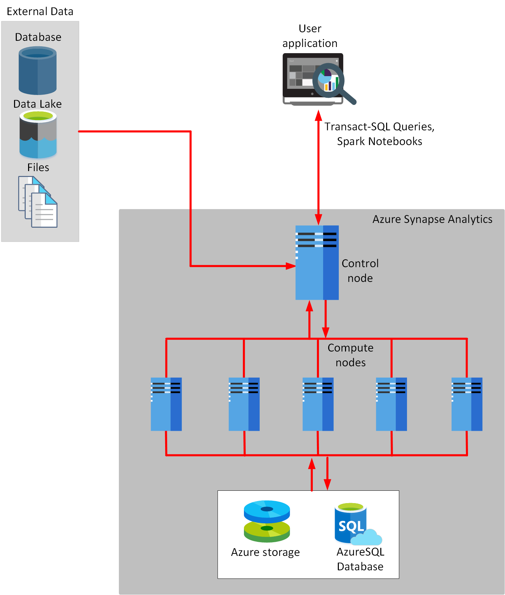
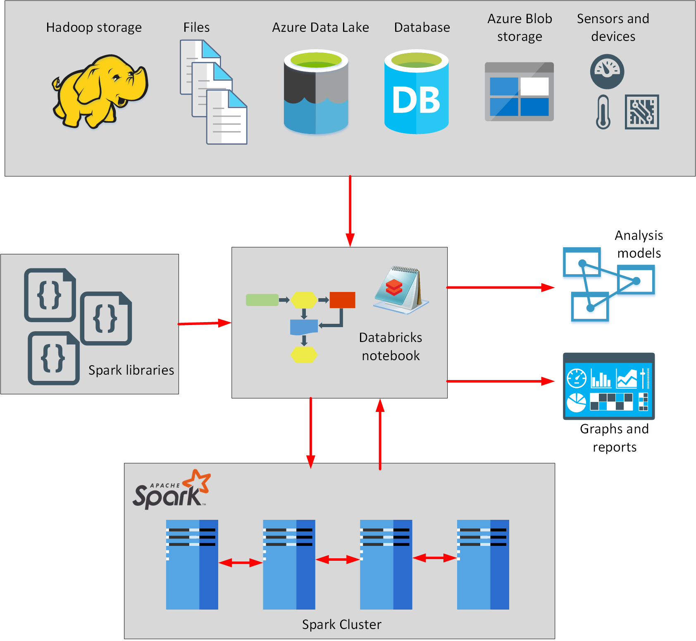
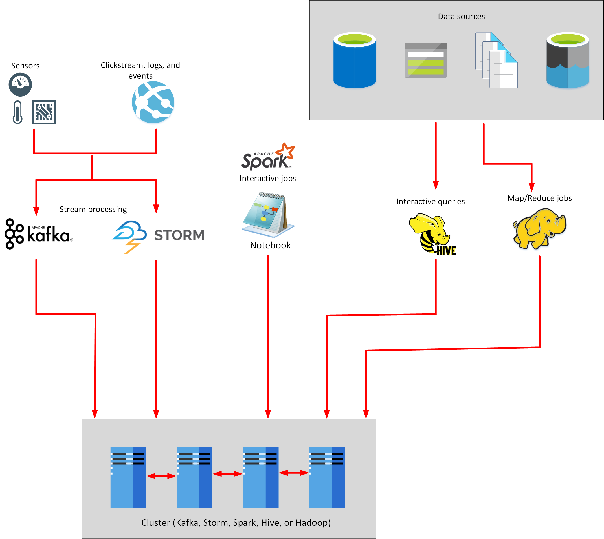
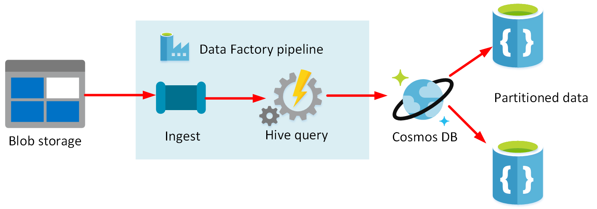

Organizations generate data throughout their business. For analysis purposes, this data can be left in its raw, ingested format, or the data can be processed and saved to a specially designed data store or data warehouse. Azure enables businesses to implement either of these scenarios.

The most common options for processing data in Azure include Azure Databricks, Azure Data Factory, Azure Synapse Analytics, and Azure Data Lake. In this unit, you'll explore these options in more detail.

## What is Azure Synapse Analytics?

Azure Synapse Analytics is a generalized analytics service. You can use it to read data from many sources, process this data, generate various analyses and models, and save the results.

You can select between two technologies to process data:

- *Transact-SQL*. This is the same dialect of SQL used by Azure SQL Database, with some extensions for reading data from external sources, such as databases, files, and Azure Data Lake storage. You can use these extensions to load data quickly, generate aggregations and other analytics, create tables and views, and store information using these tables and views. You can use the results for later reporting and processing.

- *Spark*. This is the same open-source technology used to power Azure Databricks. You write your analytical code using notebooks in a programming language such as C#, Scala, Python, or SQL. The Spark libraries provided with Azure Synapse Analytics enable you to read data from external sources, and also write out data in a variety of different formats if you need to save your results for further analysis.

Azure Synapse Analytics uses a clustered architecture. Each cluster has a *control* node that is used as the entry point to the system. When you run Transact-SQL statements or start Spark jobs from a notebook, the request is sent to the control node. The control node runs a parallel processing engine that splits the operation into a set of tasks that can be run concurrently. Each task performs part of the workload over a subset of the source data. Each task is sent to a *compute* node to actually do the processing. The control node gathers the results from the compute nodes and combines them into an overall result. 

> [!div class="mx-imgBorder"]
> 

The next unit describes the components of Azure Synapse Analytics in more detail.

For further information, read [What is Azure Synapse Analytics?](https://docs.microsoft.com/azure/synapse-analytics/sql-data-warehouse/sql-data-warehouse-overview-what-is)

## What is Azure Databricks?

Azure Databricks is an analytics platform optimized for the Microsoft Azure cloud services platform. Designed with the founders of Apache Spark, Databricks is integrated with Azure to provide one-click setup, streamlined workflows, and an interactive workspace that enables collaboration between data scientists, data engineers, and business analysts.

Databricks can process data held in many different types of storage, including Azure Blob storage, Azure Data Lake Store, Hadoop storage, flat files, databases, and data warehouses. Databricks can also process streaming data. Databricks uses an extensible architecture based on drivers.

> [!NOTE]
> A *driver* is a piece of code that connects to a specific data source and enables you to read and write that source. A driver is typically provided as part of a library that you can load into the Databricks environment. Drivers are available for many Azure services, including Azure SQL Database, Azure Cosmos DB, Azure Blob storage, and Azure Data Lake storage, as well as many services and databases produced by third-parties, such as MySQL and PostgreSQL. 

The processing engine is provided by Apache Spark. Spark is a parallel-processing engine that supports large-scale analytics. You write application code that consumes data from one or more sources, and merge, reformat, filter, and remodel this data, and then store the results. Spark distributes the work across a cluster of computers. Each computer can process its data in parallel with the other computers. The strategy helps to reduce the time required to perform the work. Spark is designed to handle massive quantities of data.

You can write the Spark application code using several languages, such as Python, R, Scala, Java, and SQL. Spark has a number of libraries for these languages, providing complex analytical routines that have been optimized for the clustered environment. These libraries include modules for machine learning, statistical analysis, linear and non-linear modeling, predictive analytics, and graphics.

You write Databricks applications using a *Notebook*. A notebook contains a series of steps (*cells*), each of which contains a block of code. For example, one cell might contain the code that connects to a data source, the next cell reads the data from that source and converts it into a model in-memory, the next cell plots a graph, and a final cell saves the data from the in-memory model to a repository. The first line in the cell is %language. For example, %scala.

> [!div class="mx-imgBorder"]
> 

For more information, read [What is Azure Databricks?](https://docs.microsoft.com/azure/azure-databricks/what-is-azure-databricks)

### What is Azure HDInsight? 

Azure HDInsight is a managed analytics service in the cloud. It's based on Apache Hadoop, a collection of open-source tools and utilities that enable you to run processing tasks over large amounts of data. HDInsight uses a clustered model, similar to that of Synapse Analytics. HDInsight stores data using Azure Data Lake storage. You can use HDInsight to analyze data using frameworks such as Hadoop Map/Reduce, Apache Spark, Apache Hive, Apache Kafka, Apache Storm, R, and more.

Hadoop Map/Reduce uses a simple framework to split a task over a large dataset into a series of smaller tasks over subsets of the data that can be run in parallel, and the results then combined. You write your Map/Reduce code in a language such as Java, and then submit this code as a job to the Hadoop cluster. Hadoop Map/Reduce has largely been replaced by Spark, which offers a more advanced set of operations and a simpler interface.

Like Map/Reduce jobs, Spark jobs are parallelized into a series of subtasks tasks that run on the cluster. You can write Spark jobs as part of an application, or you can use interactive notebooks. These notebooks are the same as those that you can run from Azure Databricks. Spark includes libraries that you can use to read and write data in a wide variety of data stores (not just HDFS). For example, you can connect to relational databases such as Azure SQL Database, and other services such as Azure Cosmos DB.

Apache Hive provides interactive SQL-like facilities for querying, aggregating, and summarizing data. The data can come from many different sources. Queries are converted into tasks, and parallelized. Each task can run on a separate node in the HDInsight cluster, and the results are combined before being returned to the user.

Apache Kafka is a clustered streaming service that can ingest data in real time. It's a highly scalable solution that offers publish and subscribe features.

Apache Storm is a scalable, fault tolerant platform for running real-time data processing applications. Storm can process high volumes of streaming data using comparatively modest computational requirements. Storm is designed for reliability, so that events shouldn't be lost. Storm solutions can also provide guaranteed processing of data, with the ability to replay data that wasn't successfully processed the first time. Storm can interoperate with a variety of event sources, including Azure Event Hubs, Azure IoT Hub, Apache Kafka, and RabbitMQ (a message queuing service). Storm can also write to data stores such as HDFS, Hive, HBase, Redis, and SQL databases. You write a Storm application using the APIs provided by Apache. 

> [!div class="mx-imgBorder"]
> 

For more information, read [What is Azure HDInsight?](https://docs.microsoft.com/azure/hdinsight/hdinsight-overview).

## What is Azure Data Factory?

Azure Data Factory is a service that can ingest large amounts of raw, unorganized data from relational and non-relational systems, and convert this data into meaningful information. Data Factory provides a scalable and programmable ingestion engine that you can use to implement complex hybrid extract-transform-load (ETL), extract-load-transform (ELT), and data integration projects.

For example, imagine a gaming company that collects petabytes of game logs that are produced by games in the cloud. The company wants to analyze these logs to gain insights into customer preferences, demographics, and usage behavior. It also wants to identify up-sell and cross-sell opportunities, develop compelling new features, drive business growth, and provide a better experience to its customers.

To analyze these logs, the company needs to use reference data such as customer information, game information, and marketing campaign information that is in an on-premises data store. The company wants to utilize this data from the on-premises data store, combining it with additional log data that it has in a cloud data store.

To extract insights, the company wants to process the joined data by using a Spark cluster in the cloud (using Azure HDInsight), and publish the transformed data into a cloud data warehouse such as Azure Synapse Analytics. The company can use the information in the data warehouse to generate and publish reports. They want to automate this workflow, and monitor and manage it on a daily schedule. They also want to execute it when files land in a blob store container.

Using Azure Data Factory, you can create and schedule data-driven workflows (called pipelines) that can ingest data from the disparate data stores used by the gaming company. You can build complex ETL processes that transform data visually with data flows or by using compute services such as Azure HDInsight, Azure Databricks, and Azure SQL Database. You can then publish the transformed data to Azure Synapse Analytics for business intelligence applications to consume. 

A pipeline is a logical grouping of activities that performs a unit of work. Together, the activities in a pipeline perform a task. For example, a pipeline might contain a series of activities that ingests raw data from Azure Blob storage, and then runs a Hive query on an HDInsight cluster to partition the data and store the results in a Cosmos DB database.

> [!div class="mx-imgBorder"]
> 


## What is Azure Data Lake?

Azure Data Lake is a collection of analytics and storage services that you can combine to implement a big data solution. It comprises three main elements:

- Data Lake Store
- Data Lake Analytics
- HDInsight

### What is Data Lake Store?

Data Lake Store provides a file system that can store near limitless quantities of data. It uses a hierarchical organization (like the Windows and Linux file systems), but you can hold massive amounts of raw data (blobs) and structured data. It is optimized for analytics workloads.

Azure Data Lake Store is compatible with the Hadoop Distributed File System (HDFS). You can run Hadoop jobs using Azure HDInsight (see below) that can read and write data in Data Lake Store efficiently.

Azure Data Lake Store provides granular security over data, using Access Control Lists. An Access Control List specifies which accounts can access which files and folders in the store. If you are more familiar with Linux, you can use POSIX-style permissions to grant read, write, and search access based on file ownership and group membership of users.

Services such as Azure Data Factory, Azure Databricks, Azure HDInsight, Azure Data Lake Analytics, and Azure Stream Analytics can read and write Data Lake Store directly.

### What is Data Lake Analytics?

Azure Data Lake Analytics is an on-demand analytics job service that you can use to process big data. It provides a framework and set of tools that you use to analyze data held in Microsoft Azure Data Lake Store, and other repositories. You write jobs that contain queries to transform data and extract insights.

You define a job using a language called U-SQL. This is a hybrid language that takes features from both SQL and C#, and provides declarative and procedural capabilities that you can use to process data. 

The example U-SQL block below reads data from a file named *StockPrices.csv*, which is held in a folder named *StockMarket* in Data Lake Storage. This is a text file that contains stock market information (tickers, and prices, and possibly other data), held in comma-separated format. The **EXTRACT** statement reads the file line by line and pulls out the data in the *Ticker*, and *Price* fields (it skips the first line, where a CSV file typically holds field name information rather than data). The **SELECT** statement calculates that maximum price for each ticker. The **OUTPUT** statement stores the results to another file in Data Lake Storage.

> [!NOTE]
> In a CSV file, each line consists of one or more fields, and each field is separated by a comma. The first line of the file typically contains the names of the fields.

```u-sql
@priceData =
    EXTRACT Ticker string,
            Price int
    FROM "/StockMarket/StockPrices.csv"
    USING Extractors.Csv(skipFirstNRows: 1);

@maxPrices =
    SELECT Ticker, MAX(Price) AS MaxPrice
    FROM @priceData
    GROUP BY Ticker;

OUTPUT @maxPrices   
    TO "/output/MaxPrices.csv"
    USING Outputters.Csv(outputHeader: true);
```

It's important to understand that the U-SQL code only provides a description of the work to be performed. Azure Data Lake Analytics determines how best to actually carry out this work. Data Lake Analytics takes the U-SQL description of a job, parses it to make sure it is syntactically correct, and then compiles it into an internal representation. Data Lake Analytics then breaks down this internal representation into stages of execution. Each stage performs a task, such as extracting the data from a specified source, dividing the data into partitions, processing the data in each partition, aggregating the results in a partition, and then combining the results from across all partitions. Partitioning is used to improve parallelization, and the processing for different partitions is performed concurrently on different processing nodes. The data for each partition is determined by the U-SQL compiler, according to the way in which the job retrieves and processes the data.

A U-SQL job can output results to a single CSV file, partition the results across multiple files, or can write to other destinations. For example, Data Lake Analytics enables you to create custom outputters if you want to save data in a particular format (such as XML or HTML). You can also write data to the Data Lake Catalog. The catalog provides a SQL-like interface to Data Lake Storage, enabling you to create tables, and views, and run INSERT, UPDATE, and DELETE statements against these tables and views.
