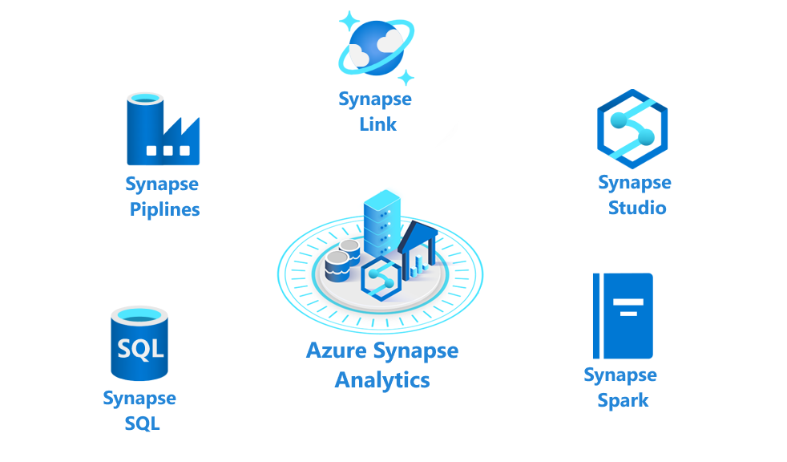

Azure Synapse Analytics provides a suite of tools to analyze and process an organization's data. It incorporates SQL technologies, Transact-SQL query capabilities, and open-source Spark tools to enable you to quickly process very large amounts of data.
        
In this unit, you'll look more closely at the features of Synapse Analytics, and when you should consider using it.

## What are the components of Azure Synapse Analytics?

Azure Synapse Analytics is an integrated analytics service that allows organizations to gain insights quickly from all their data at any hyperscale, from both data warehouses and big data analytics systems​.

Azure Synapse is composed of the following elements:

- **Synapse SQL pool**: This is a collection of servers running Transact-SQL. Transact-SQL is the dialect of SQL used by Azure SQL Database, and Microsoft SQL Server. You write your data processing logic using Transact-SQL.
- **Synapse Spark pool**: This is a cluster of servers running Apache Spark to process data. You write your data processing logic using one of the four supported languages: Python, Scala, SQL, and C# (via .NET for Apache Spark). Spark pools support Azure Machine Learning through integration with the SparkML and AzureML packages. 
- **Synapse Pipelines**: A Synapse pipeline is a logical grouping of activities that together perform a task. The activities in a pipeline define actions to perform on your data. For example, you might use a copy activity to transform data from a source dataset to a destination dataset. You could include activities that transform the data as it is transferred, or you might combine data from multiple sources together. 
- **Synapse Link**: This component allows you to connect to Cosmos DB. You can use it to perform near real-time analytics over the operational data stored in a Cosmos DB database. 
- **Synapse Studio**: This is a web user interface that enables data engineers to access all the Synapse Analytics tools. You can use Synapse Studio to create SQL and Spark pools, define and run pipelines, and configure links to external data sources.

> [!div class="mx-imgBorder"]
> 

>[!NOTE]
> Any data stored in Azure Synapse Analytics can be used to build and train models with Azure Machine Learning.

The following sections describe each of these elements in more detail.

## What are SQL pools?

When you use Synapse SQL, your analytics workload runs using a SQL pool. In a SQL pool, the Control and Compute nodes in the cluster run a version of Azure SQL Database that supports distributed queries. You define your logic using Transact-SQL statements. You send your Transact-SQL statements to the control node, which splits up the work into queries that operate over a subset of the data, and then sends these smaller queries to the compute nodes. The data is split into chunks called *distributions*. A distribution is the basic unit of storage and processing for parallel queries that run on distributed data. Each of the smaller queries runs on one of the data distributions.

The control and compute nodes use the Data Movement Service (DMS) to move data across the nodes as necessary to run queries in parallel and return accurate results. 

Synapse Analytics uses a technology called *PolyBase* to make external data look like SQL tables. You can run queries against these tables directly, or you can transfer the data into a series of SQL tables managed by Synapse Analytics for querying later. Synapse uses Azure Storage to manage your data while it's being processed. 

By default, an on-demand SQL pool is created in each Azure Synapse Analytics workspace. You can then provision additional pools, either on-demand or provisioned.

> [!NOTE]
> On-demand pools only allow you to query data held in external files. If you want to ingest and load the data into Synapse Analytics, you must create your own SQL pool.

Azure Synapse Analytics is designed to run queries over massive datasets. You can manually scale the SQL pool up to 60 nodes. You can also *pause* a SQL pool if you don't require it for a while. Pausing releases the resources associated with the pool. You aren't charged for these resources until you manually *resume* the pool. However, you can't run any queries until the pool is resumed. Resuming a pool can take several minutes.

> [!div class="mx-imgBorder"]
> 

Use SQL pools in Synapse Analytics for the following scenarios:

- *Complex reporting*. You can use the full power of Transact-SQL to run complex SQL statements that summarize and aggregate data.

- *Data ingestion*. PolyBase enables you to retrieve data from many external sources and convert it into a tabular format. You can reformat this data and save it as tables and materialized views in Azure Synapse.

## What are Spark pools?

Synapse Spark runs clusters based on Apache Spark rather than Azure SQL Database. You write your analytics jobs as notebooks, using code written in Python, Scala, C#, or Spark SQL (this is a different dialect from Transact-SQL). You can combine code written in multiple languages in the same notebook.

> [!NOTE]
> Spark pools and SQL pools can coexist in the same Azure Synapse Analytics instance.

Notebooks also allow you to visualize data through graphs, and transform data as it's loaded. The data can then be used by Spark Machine Learning (SparkML) and [Azure Machine Learning (AzureML)](https://azure.microsoft.com/services/machine-learning/) to train machine learning models that support artificial intelligence.

Spark pools enable you to process data held in many formats, such as csv, json, xml, parquet, orc, and avro. Spark can be extended to support many more formats with external data sources. 

Spark pools provide the basic building blocks for performing in-memory cluster computing. A Spark job can load and cache data into memory and query it repeatedly. In-memory computing is much faster than disk-based applications. Spark pools in Azure Synapse are compatible with Azure Storage and Azure Data Lake Storage, so you can use Spark pools to process your data stored in Azure.

Spark pools can have autoscaling enabled, so that pools scale by adding or removing nodes as needed. Also, Spark pools can be shut down with no loss of data since all the data is stored in Azure Storage or Data Lake Storage.

Spark pools in Synapse Analytics are especially suitable for the following scenarios:

- *Data Engineering/Data Preparation*. Apache Spark includes many language features to support preparation and processing of large volumes of data so that it can be made more valuable and then consumed by other services within Synapse Analytics. This is enabled through the Spark libraries that support processing and connectivity.

- *Machine Learning*. Apache Spark comes with MLlib, a machine learning library built on top of Spark that you can use from a Spark pool in Synapse Analytics. Spark pools in Synapse Analytics also include Anaconda, a Python distribution with a variety of packages for data science including machine learning. When combined with built-in support for notebooks, you have an environment for creating machine learning applications.

## What are Synapse pipelines?

A pipeline is a logical grouping of activities that together perform a task. For example, a pipeline could contain a set of activities that ingest and clean log data, and then kick off a mapping data flow to analyze the log data. The pipeline allows you to manage the activities as a set instead of each one individually. You deploy and schedule the pipeline instead of the activities independently.

The activities in a pipeline define actions to perform on your data. For example, you may use a copy activity to copy data from Azure Blob Storage into Azure Synapse using a SQL pool. Then, use a data flow activity or a notebook activity using a Spark pool to process and generate a machine learning model.

Synapse pipelines use the same Data Integration engine used by Azure Data Factory. This gives you the power in Synapse Studio to create pipelines that can connect to over 90 sources from flat files, databases, or online services. You can create codeless data flows that let you do complex mappings and transformations on data as it flows into your analytic solutions. The example below shows a pipeline with three activities. The pipeline ingests data, and then uses a Spark notebook to generate a machine learning model. The Azure function at the end of the pipeline tests the machine learning model to validate it.

> [!div class="mx-imgBorder"]
> 

For more information, read [Pipelines and activities in Azure Data Factory](https://docs.microsoft.com/azure/data-factory/concepts-pipelines-activities).

### What is Synapse Link?

Azure Synapse Link for Azure Cosmos DB is a cloud-native hybrid transactional and analytical processing (HTAP) capability that enables you to run near real-time analytics over operational data stored in Azure Cosmos DB.

Synapse link uses a feature of Cosmos DB named *Cosmos DB Analytical Store*. Cosmos DB Analytical Store contains a copy of the data in a Cosmos DB container, but organized as a column store. Column stores group data by column rather than by row. Column stores are a more optimal format for running analytical workloads that need to aggregate data down a column rather than across a row, such as generating sum totals, averages, maximum or minimum values for a column. Cosmos DB automatically keeps the data in its containers synchronized with the copies in the column store.

Azure Synapse Link enables you to run workloads that retrieve data directly from Cosmos DB and run analytics workloads using Azure Synapse Analytics. The data doesn't have to go through an ETL (extract, transform, and load) process because the data isn't copied into Synapse Analytics; it remains in the Cosmos DB analytical store.

Business analysts, data engineers, and data scientists can now use Synapse Spark pools or Synapse SQL pools to run near real-time business intelligence, analytics, and machine learning pipelines. You can achieve this without impacting the performance of your transactional workloads on Azure Cosmos DB.

Synapse link has a wide range of uses, including:

- *Supply chain analytics and forecasting*. You can query operational data directly and use it to build machine learning models. You can use the results generated by these models back into Cosmos DB for near-real-time scoring. You can use these assessments to successively refine the models and generate more accurate forecasts.

- *Operational reporting*. You can use Synapse Analytics to query operational data using Transact-SQL running in a SQL pool. You can publish the results to dashboards using the support provided to familiar tools such as Microsoft Power BI.

- *Batch data integration and orchestration*. With supply chains getting more complex, supply chain data platforms need to integrate with a variety of data sources and formats. The Azure Synapse data integration engine allows data engineers to create rich data pipelines without requiring a separate orchestration engine.

- *Real-time personalization*. You can build engaging ecommerce solutions that allow retailers to generate personalized recommendations and special offers for customers in real time.

- *IoT maintenance*. Industrial IoT innovations have drastically reduced downtimes of machinery and increased overall efficiency across all fields of industry. One such innovation is predictive maintenance analytics for machinery at the edge of the cloud. The historical operational data from IoT device sensors could be used to train predictive models such as anomaly detectors. These anomaly detectors are then deployed back to the edge for real-time monitoring. Looping back allows for continuous retraining of the predictive models.

## What is Synapse Studio?

Synapse Studio is a web interface that enables you to create pools and pipelines interactively. With Synapse Studio you can develop, test, and debug Spark notebooks and Transact-SQL jobs. You can monitor the performance of operations that are currently running, and you can manage the serverless or provisioned resources. All of these capabilities are accessed via the web-native Synapse Studio that allows for model management, monitoring, coding, and security.

> [!div class="mx-imgBorder"]
> 

You can access Synapse Studio directly from the Azure portal.