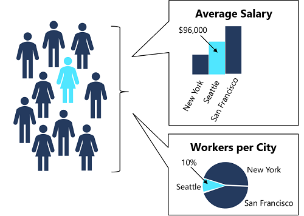

Data science projects, including machine learning projects, involve analysis of data; and often that data includes sensitive personal details that should be kept private.
In practice, most reports that are published from the data include aggregations of the data, which you may think would provide some privacy – after all, the aggregated results do not reveal the individual data values.

However, consider a case where multiple analyses of the data result in reported aggregations that when combined, could be used to  work out information about individuals in the source dataset. Suppose 10 participants share data about their location and salary, from which two reports are produced:

- An aggregated salary report that tells us the average salaries in New York, San Francisco, and Seattle
- A worker location report that tells us that 10% of the study participants (in other words, a single person) is based in Seattle.

From these two reports, we can easily determine the specific salary of the Seattle-based participant. Anyone reviewing both studies who happens to know a person from Seattle that participated, now knows that person's salary.

In this module, you'll explore *differential privacy*, a technique that can help protect an individual's data against this kind of exposure.

## Learning objectives

In this module, you will learn how to:

- Articulate the problem of data privacy
- Describe how differential privacy works
- Configure parameters for differential privacy
- Perform differentially private data analysis
