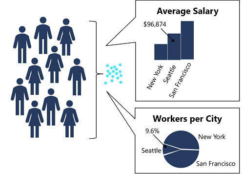

Differential privacy seeks to protect individual data values by adding statistical "noise" to the analysis process. The math involved in adding the noise is complex, but the principle is fairly intuitive – the noise ensures that data aggregations stay statistically consistent with the actual data values allowing for some random variation, but make it impossible to work out the individual values from the aggregated data. In addition, the noise is different for each analysis, so the results are non-deterministic – in other words, two analyses that perform the same aggregation may produce slightly different results.

