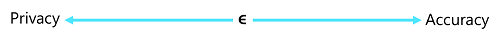

One way that an individual can protect their personal data is simply to not participate in a study – this is known as their "opt-out" option. However, there are a few considerations for this as a solution:

- Even if you decide to opt out a study may still produce results that affect you. For example, you may choose to opt-out of a study that compares the heart disease diagnoses across a group of people on the basis that doing so may reveal a heart disease diagnosis that causes your health insurance premiums to rise. If the study finds a correlation between people who drink coffee and higher risk of heart disease, and your insurance company knows that you are a coffee drinker, your rate may rise even though you didn’t personally participate in the study.
- The benefits of participation in the study may outweigh any negative impact. For example, if you're paid $100 to participate in a study that results in your health insurance rate rising by $10 per year, it will be more than 10 years before you make a net loss. This may be a worthwhile tradeoff to you (particularly if your rate may rise as a result of the study even if you don’t participate!)
- The only way for the opt-out option to work for every individual, is for every individual not to take part – which makes the whole study pointless!

The amount of variation caused by adding noise is configurable through a parameter called epsilon. This value governs the amount of additional risk that your personal data can be identified through rejecting the opt-out option and participating in a study. The key thing is that it applies this privacy principle for everyone participating in the study. A low epsilon value provides the most privacy, at the expense of less accuracy when aggregating the data. A higher epsilon value results in aggregations that are more true to the actual data distribution, but in which the individual contribution of a single individual to the aggregated value is less obscured by noise.

