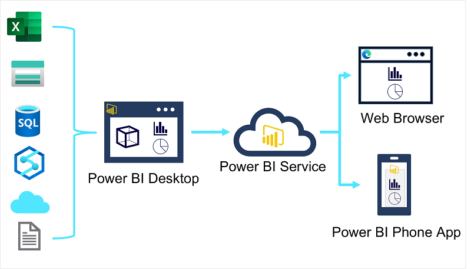

There are many data visualization tools that data analysts can use to explore data and summarize insights visually; including chart support in productivity tools like Microsoft Excel and built-in data visualization widgets in notebooks used to explore data in services such as Azure Synapse Analytics and Azure Databricks. However, for enterprise-scale business analytics, an integrated solution that can support complex data modeling, interactive reporting, and secure sharing is often required.

## Microsoft Power BI

Microsoft Power BI is a suite of tools and services that data analysts can use to build interactive data visualizations for business users to consume.

A typical workflow for creating a data visualization solution starts with **Power BI Desktop**, a Microsoft Windows application in which you can import data from a wide range of data sources, combine and organize the data from these sources in an analytics data model, and create reports that contain interactive visualizations of the data.

After you've created data models and reports, you can publish them to the **Power BI service**; a cloud service in which reports can be published and interacted with by business users. You can also do some basic data modeling and report editing directly in the service using a web browser, but the functionality for this is limited compared to the Power BI Desktop tool. You can use the service to schedule refreshes of the data sources on which your reports are based, and to share reports with other users. You can also define dashboards and apps that combine related reports in a single, easy to consume location.

Users can consume reports, dashboards, and apps in the Power BI service through a web browser, or on mobile devices by using the **Power BI phone app**.
