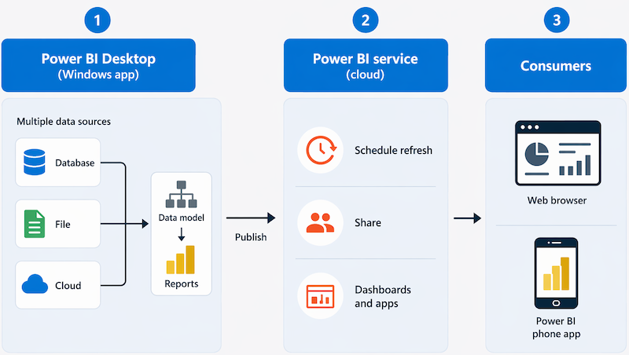

There are many data visualization tools that data analysts can use to explore data and summarize insights visually; including chart support in productivity tools like Microsoft Excel and built-in data visualization widgets in notebooks used to explore data in services such as Microsoft Fabric and Azure Databricks. However, for enterprise-scale business analytics, an integrated solution that can support complex data modeling, interactive reporting, and secure sharing is often required.

## Microsoft Power BI

Microsoft Power BI is a suite of tools and services that forms a core workload of Microsoft Fabric, which data analysts can use to build interactive data visualizations for business users to consume.

A typical workflow for creating a data visualization solution starts with **Power BI Desktop**, a Microsoft Windows application in which you can import data from a wide range of data sources, combine and organize the data from these sources in an analytics data model, and create reports that contain interactive visualizations of the data.

After you've created data models and reports, you can publish them to the **Power BI service**; a cloud service in which reports can be published and interacted with by business users. You can also do some basic data modeling and report editing directly in the service using a web browser, but the functionality for this is limited compared to the Power BI Desktop tool. You can use the service to schedule refreshes of the data sources on which your reports are based, and to share reports with other users. You can also define dashboards and apps that combine related reports in a single, easy to consume location.

Users can consume reports, dashboards, and apps in the Power BI service through a web browser, or on mobile devices by using the **Power BI phone app**.

## Power BI in Microsoft Fabric

Power BI is fully integrated into **Microsoft Fabric**, Microsoft's unified analytics platform. Within Fabric, Power BI content lives in shared **workspaces** alongside other data engineering and analytics items, all backed by the same **OneLake** storage layer. Key Fabric-specific capabilities include:

- **Workspaces**: shared environments where teams collaborate on reports and **semantic models** in a browser, without needing desktop software.

- **Semantic models**: a semantic model defines the measures, relationships, and hierarchies that reports are built on, and can be shared across multiple reports.

- **Direct Lake mode**: a storage mode that lets Power BI query data directly from OneLake files, combining the speed of in-memory analysis with the scale of a data lake—without requiring a separate data import or refresh cycle.

- **Web-based report editing**: analysts can create and update reports entirely in the browser, making Power BI accessible without installing Power BI Desktop.

## AI assistance in Power BI

Power BI includes built-in AI features that help analysts work more efficiently.

### Copilot in Power BI

Copilot capabilities require Fabric capacity (F2 or higher) or Power BI Premium (P1 or higher) and are available in both Power BI Desktop and the Power BI service:

- **Summarize a report**: Copilot generates a plain-language summary of what a report shows.
- **Create report pages**: Copilot creates report pages and selects appropriate chart types based on your data and prompt.
- **Generate DAX measures**: Copilot writes DAX measure expressions from a natural-language description.

### Other AI features

The following AI-powered features are available without a Copilot license:

- **Smart narrative visual**: automatically generates a text summary that describes what the data in a report shows, and updates dynamically as data changes.

These features make AI a natural part of the analyst's day-to-day workflow within Power BI and Microsoft Fabric.
