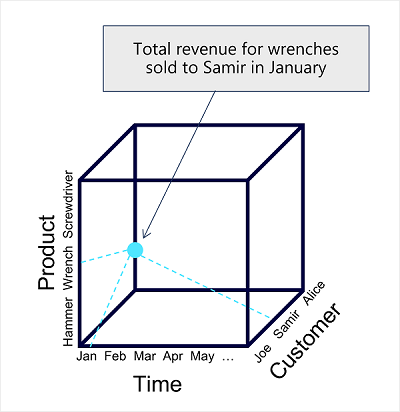
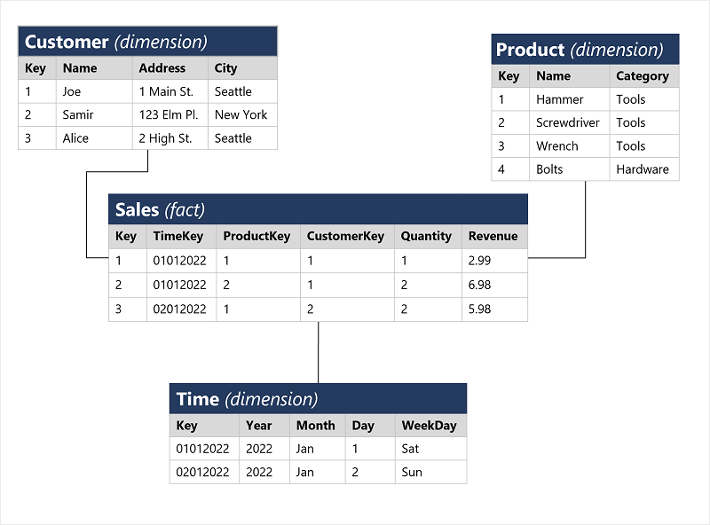
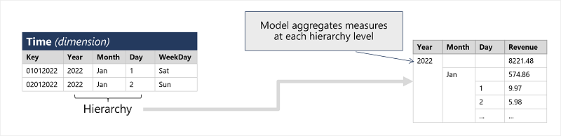
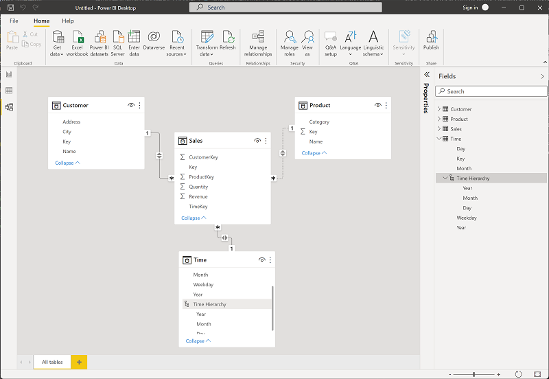

Analytical models enable you to structure data to support analysis. Models are based on related tables of data and define the numeric values that you want to analyze or report (known as *measures*) and the entities by which you want to aggregate them (known as *dimensions*). For example, a model might include a table containing numeric measures for sales (such as revenue or quantity) and dimensions for products, customers, and time. This would enable you aggregate sale measures across one or more dimensions (for example, to identify total revenue by customer, or total items sold by product per month). Conceptually, the model forms a multidimensional structure, which is commonly referred to as a *cube*, in which any point where the dimensions intersect represents an aggregated measure for those dimensions.

> [!NOTE]
> Although we commonly refer to an analytical model as a *cube*, there can be more (or fewer) than three dimensions – it’s just not easy for us to visualize more than three!

## Tables and schema

*Dimension* tables represent the entities by which you want to aggregate numeric measures – for example product or customer. Each entity is represented by a row with a unique key value. The remaining columns represent attributes of an entity – for example, products have names and categories, and customers have addresses and cities. It’s common in most analytical models to include a *Time* dimension so that you can aggregate numeric measures associated with events over time.

The numeric measures that will be aggregated by the various dimensions in the model are stored in *Fact* tables. Each row in a fact table represents a recorded event that has numeric measures associated with it. For example, the **Sales** table in the schema below represents sales transactions for individual items, and includes numeric values for quantity sold and revenue.

This type of schema, where a fact table is related to one or more dimension tables, is referred to as a star schema (imagine there are five dimensions related to a single fact table – the schema would form a five-pointed star!). You can also define more a complex schema in which dimension tables are related to additional tables containing more details (for example, you could represent attributes of product categories in a separate **Category** table that is related to the **Product** table – in which case the design is referred to as a snowflake schema. The schema of fact and dimension tables is used to create an analytical model, in which measure aggregations across all dimensions are pre-calculated; making performance of analysis and reporting activities much faster than calculating the aggregations each time.

## Attribute hierarchies

One final thing worth considering about analytical models is the creation of attribute *hierarchies* that enable you to quickly *drill-up* or *drill-down* to find aggregated values at different levels in a hierarchical dimension. For example, consider the attributes in the dimension tables we’ve discussed so far. In the **Product** table, you can form a hierarchy in which each category might include multiple named products. Similarly, in the **Customer** table, a hierarchy could be formed to represent multiple named customers in each city. Finally, in the **Time** table, you can form a hierarchy of year, month, and day. The model can be built with pre-aggregated values for each level of a hierarchy, enabling you to quickly change the scope of your analysis – for example, by viewing total sales by year, and then drilling down to see a more detailed breakdown of total sales by month.

## Analytical modeling in Microsoft Power BI

You can use Power BI to define an analytical model from tables of data, which can be imported from one or more data source. You can then use the data modeling interface on the **Model** tab of Power BI Desktop to define your analytical model by creating relationships between fact and dimension tables, defining hierarchies, setting data types and display formats for fields in the tables, and managing other properties of your data that help define a rich model for analysis.

