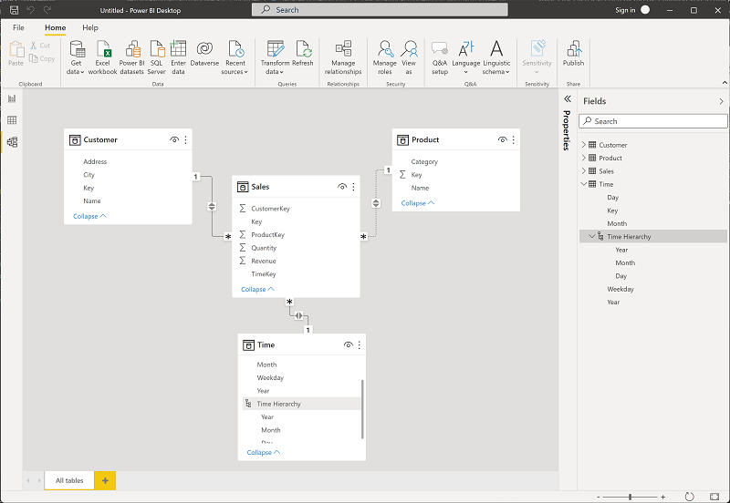

::: zone pivot="video"

>[!VIDEO https://learn-video.azurefd.net/vod/player?id=453a230e-f868-412d-b24e-f2fc7eeba222]

> [!TIP]
> See the **Text and images** tab for more details!

::: zone-end

::: zone pivot="text"

Analytical models—also called **semantic models** in Microsoft Fabric and Power BI—structure data to support analysis. A model is built from related tables of data. It defines the numeric values you want to analyze or report, known as **measures**, and the entities you use to aggregate them by, known as **dimensions**.

For example, a model might include numeric measures for sales (such as revenue or quantity) and dimensions for products, customers, and time. This lets you aggregate measures across one or more dimensions—for example, to identify total revenue by customer, or total items sold by product per month.

## Tables and schema

**Dimension** tables represent the entities you want to group or filter by—for example, product or customer. Each row has a unique key value, and the remaining columns store attributes such as product names, categories, or customer cities. Most analytical models include a **Time** dimension so you can aggregate measures across time periods.

**Fact** tables store the numeric measures you want to analyze. Each row represents a recorded event—for example, a sales transaction with values for quantity sold and revenue.

When a fact table relates to one or more dimension tables, the design is called a **star schema**. If dimension tables further relate to additional detail tables—for example, a **Category** table linked to a **Product** table—the design is called a **snowflake schema**.

When you load data into a semantic model, Power BI stores it in an efficient in-memory columnar store using the VertiPaq engine. Aggregations are calculated at query time, which delivers fast analysis and reporting.

## Attribute hierarchies

**Hierarchies** let you drill up or drill down through aggregated values at different levels of a dimension. For example:

- In the **Product** table, a hierarchy might group products under categories.
- In the **Customer** table, a hierarchy might group customers by city.
- In the **Time** table, a hierarchy might group days into months, and months into years.

When you view total sales by year and then drill down to see a monthly breakdown, the VertiPaq engine computes aggregated values at each level at query time.

## Analytical modeling in Microsoft Power BI

In Power BI, you define a semantic model from tables imported from one or more data sources. Use the **Model view** in Power BI Desktop to create relationships between fact and dimension tables, define hierarchies, set data types and display formats, and configure other properties that shape your model for analysis.

If your data is stored in **OneLake**—Microsoft Fabric's shared data lake—use **Direct Lake** storage mode to connect your semantic model directly to the lake files. This gives you in-memory query performance without a separate data import step.

::: zone-end
