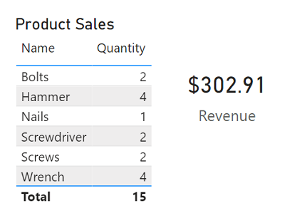
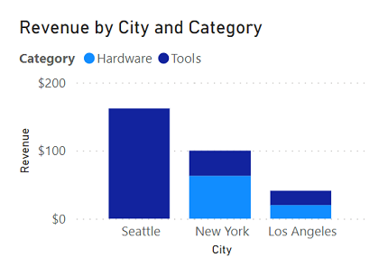
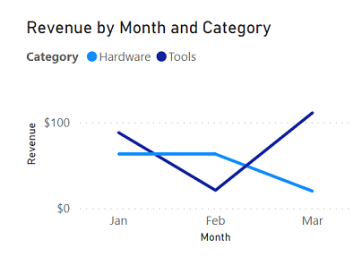
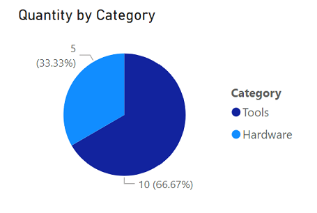
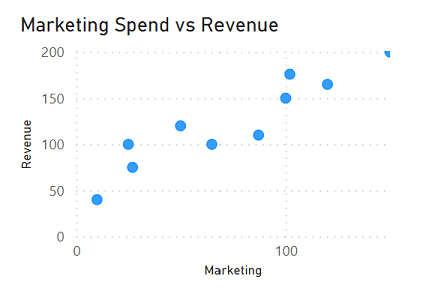
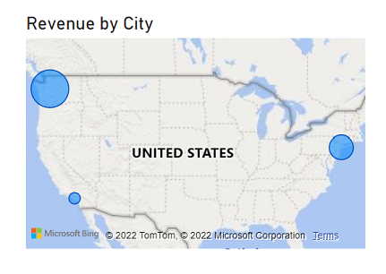
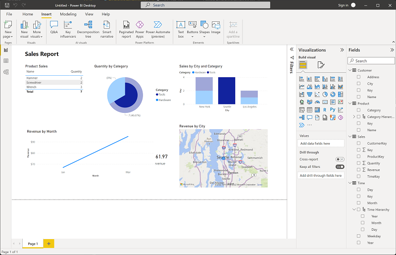

After you've created a model, you can use it to generate data visualizations that can be included in a report.

There are many kinds of data visualization, some commonly used and some more specialized. Power BI includes an extensive set of built-in visualizations, which can be extended with custom and third-party visualizations. The rest of this unit discusses some common data visualizations but is by no means a complete list.

## Tables and text

Tables and text are often the simplest way to communicate data. Tables are useful when numerous related values must be displayed, and individual text values in cards can be a useful way to show important figures or metrics.

## Bar and column charts

Bar and column charts are a good way to visually compare numeric values for discrete categories.

## Line charts

Line charts can also be used to compare categorized values and are useful when you need to examine trends, often over time.

## Pie charts

Pie charts are often used in business reports to visually compare categorized values as proportions of a total.

## Scatter plots

Scatter plots are useful when you want to compare two numeric measures and identify a relationship or correlation between them.

## Maps

Maps are a great way to visually compare values for different geographic areas or locations.

## Interactive reports in Power BI

In Power BI, the visual elements for related data in a report are automatically linked to one another and provide interactivity. For example, selecting an individual category in one visualization will automatically filter and highlight that category in other related visualizations in the report. In the image above, the city *Seattle* has been selected in the **Sales by City and Category** column chart, and the other visualizations are filtered to reflect values for Seattle only.
