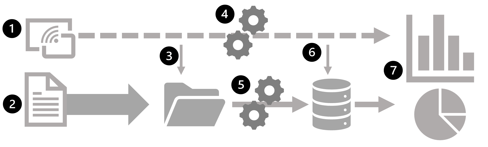

Data processing is simply the conversion of raw data to meaningful information through a process. There are two general ways to process data:

- *Batch processing*, in which multiple data records are collected and stored before being processed together in a single operation.
- *Stream processing*, in which a source of data is constantly monitored and processed in real time as new data events occur.

## Understand batch processing

In batch processing, newly arriving data elements are collected and stored, and the whole group is processed together as a batch. Exactly when each group is processed can be determined in a number of ways. For example, you can process data based on a scheduled time interval (for example, every hour), or it could be triggered when a certain amount of data has arrived, or as the result of some other event.

For example, suppose you want to analyze road traffic by counting the number of cars on a stretch of road. A batch processing approach to this would require that you collect the cars in a parking lot, and then count them in a single operation while they're at rest.

If the road is busy, with a large number of cars driving along at frequent intervals, this approach may be impractical; and note that you don't get any results until you have parked a batch of cars and counted them.

A real world example of batch processing is the way that credit card companies handle billing. The customer doesn't receive a bill for each separate credit card purchase but one monthly bill for all of that month's purchases.

Advantages of batch processing include:

- Large volumes of data can be processed at a convenient time.
- It can be scheduled to run at a time when computers or systems might otherwise be idle, such as overnight, or during off-peak hours.

Disadvantages of batch processing include:

- The time delay between ingesting the data and getting the results.
- All of a batch job's input data must be ready before a batch can be processed. This means data must be carefully checked. Problems with data, errors, and program crashes that occur during batch jobs bring the whole process to a halt. The input data must be carefully checked before the job can be run again. Even minor data errors can prevent a batch job from running.

## Understand stream processing

In stream processing, each new piece of data is processed when it arrives. Unlike batch processing, there's no waiting until the next batch processing interval - data is processed as individual units in real-time rather than being processed a batch at a time. Stream data processing is beneficial in scenarios where new, dynamic data is generated on a continual basis.

For example, a better approach to our hypothetical car counting problem might be to apply a *streaming* approach, by counting the cars in real-time as they pass:

In this approach, you don't need to wait until all of the cars have parked to start processing them, and you can aggregate the data over time intervals; for example, by counting the number of cars that pass each minute.

Real world examples of streaming data include:

- A financial institution tracks changes in the stock market in real time, computes value-at-risk, and automatically rebalances portfolios based on stock price movements.
- An online gaming company collects real-time data about player-game interactions, and feeds the data into its gaming platform. It then analyzes the data in real time, offers incentives and dynamic experiences to engage its players.
- A real-estate website that tracks a subset of data from mobile devices, and makes real-time property recommendations of properties to visit based on their geo-location.

Stream processing is ideal for time-critical operations that require an instant real-time response. For example, a system that monitors a building for smoke and heat needs to trigger alarms and unlock doors to allow residents to escape immediately in the event of a fire.

## Understand differences between batch and streaming data

Apart from the way in which batch processing and streaming processing handle data, there are other differences:

- *Data scope*: Batch processing can process all the data in the dataset. Stream processing typically only has access to the most recent data received, or within a rolling time window (the last 30 seconds, for example).

- *Data size*: Batch processing is suitable for handling large datasets efficiently. Stream processing is intended for individual records or *micro batches* consisting of few records.

- *Performance*: *Latency* is the time taken for the data to be received and processed. The latency for batch processing is typically a few hours. Stream processing typically occurs immediately, with latency in the order of seconds or milliseconds.

- *Analysis*: You typically use batch processing to perform complex analytics. Stream processing is used for simple response functions, aggregates, or calculations such as rolling averages.

## Combine batch and stream processing

Many large-scale analytics solutions include a mix of batch and stream processing, enabling both historical and real-time data analysis. It's common for stream processing solutions to capture real-time data, process it by filtering or aggregating it, and present it through real-time dashboards and visualizations (for example, showing the running total of cars that have passed along a road within the current hour), while also persisting the processed results in a data store for historical analysis alongside batch processed data (for example, to enable analysis of traffic volumes over the past year).

Even when real-time analysis or visualization of data is not required, streaming technologies are often used to capture real-time data and store it in a data store for subsequent batch processing (this is the equivalent of redirecting all of the cars that travel along a road into a parking lot before counting them).

The following diagram shows some ways in which batch and stream processing can be combined in a large-scale data analytics architecture.

1. Data events from a streaming data source are captured in real-time.
2. Data from other sources is ingested into a data store (often a *data lake*) for batch processing.
3. If real-time analytics is not required, the captured streaming data is written to the data store for subsequent batch processing.
4. When real-time analytics is required, a stream processing technology is used to prepare the streaming data for real-time analysis or visualization; often by filtering or aggregating the data over temporal windows.
5. The non-streaming data is periodically batch processed to prepare it for analysis, and the results are persisted in an analytical data store (often referred to as a *data warehouse*) for historical analysis.
6. The results of stream processing may also be persisted in the analytical data store to support historical analysis.
7. Analytical and visualization tools are used to present and explore the real-time and historical data.

> [!NOTE]
> Commonly used solution architectures for combined batch and stream data processing include *lambda* and *delta* architectures. Details of these architectures are beyond the scope of this course, but they incorporate technologies for both large-scale batch data processing and real-time stream processing to create an end-to-end analytical solution.
