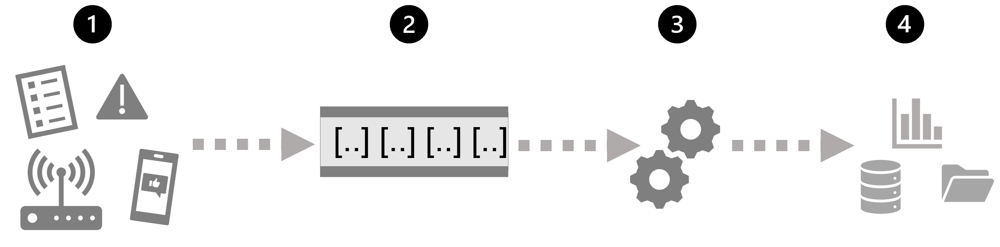

There are many technologies that you can use to implement a stream processing solution, but while specific implementation details may vary, there are common elements to most streaming architectures.

## A general architecture for stream processing

At its simplest, a high-level architecture for stream processing looks like this:

1. An event generates some data. This might be a signal being emitted by a sensor, a social media message being posted, a log file entry being written, or any other occurrence that results in some digital data.
2. The generated data is captured in a streaming *source* for processing. In simple cases, the source may be a folder in a cloud data store or a table in a database. In more robust streaming solutions, the source may be a "queue" that encapsulates logic to ensure that event data is processed in order and that each event is processed only once.
3. The event data is processed, often by a perpetual query that operates on the event data to select data for specific types of events, project data values, or aggregate data values over temporal (time-based) periods (or *windows*) - for example, by counting the number of sensor emissions per minute.
4. The results of the stream processing operation are written to an output (or *sink*), which may be a file, a database table, a real-time visual dashboard, or another queue for further processing by a subsequent downstream query.

## Real-time analytics in Azure

Microsoft Azure supports multiple technologies that you can use to implement real-time analytics of streaming data, including:

- **Azure Stream Analytics**: A platform-as-a-service (PaaS) solution that you can use to define *streaming jobs* that ingest data from a streaming source, apply a perpetual query, and write the results to an output.
- **Spark Structured Streaming**: An open-source library that enables you to develop complex streaming solutions on Apache Spark based services, including **Azure Synapse Analytics**, **Azure Databricks**, and **Azure HDInsight**.
- **Azure Data Explorer**: A high-performance database and analytics service that is optimized for ingesting and querying batch or streaming data with a time-series element, and which can be used as a standalone Azure service or as an **Azure Synapse Data Explorer** runtime in an Azure Synapse Analytics workspace.

### *Sources* for stream processing

The following services are commonly used to ingest data for stream processing on Azure:

- **Azure Event Hubs**: A data ingestion service that you can use to manage queues of event data, ensuring that each event is processed in order, exactly once.
- **Azure IoT Hub**: A data ingestion service that is similar to Azure Event Hubs, but which is optimized for managing event data from *Internet-of-things* (IoT) devices.
- **Azure Data Lake Store Gen 2**: A highly scalable storage service that is often used in *batch processing* scenarios, but which can also be used as a source of streaming data.
- **Apache Kafka**: An open-source data ingestion solution that is commonly used together with Apache Spark. You can use Azure HDInsight to create a Kafka cluster.

### *Sinks* for stream processing

The output from stream processing is often sent to the following services:

- **Azure Event Hubs**: Used to queue the processed data for further downstream processing.
- **Azure Data Lake Store Gen 2** or **Azure blob storage**: Used to persist the processed results as a file.
- **Azure SQL Database** or **Azure Synapse Analytics**, or **Azure Databricks**: Used to persist the processed results in a database table for querying and analysis.
- **Microsoft Power BI**: Used to generate real time data visualizations in reports and dashboards.
