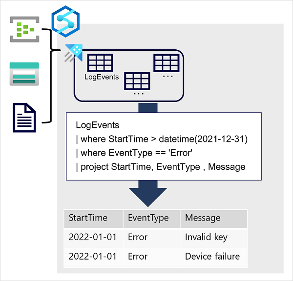

Azure Data Explorer is a standalone Azure service for efficiently analyzing data. You can use the service as the output for analyzing large volumes of diverse data from data sources such as websites, applications, IoT devices, and more. For example, by outputting Azure Stream Analytics logs to Azure Data Explorer, you can complement Stream Analytics low latency alerts handling with Data Explorer's deep investigation capabilities. The service is also encapsulated as a runtime in Azure Synapse Analytics, where it is referred to as Azure Synapse Data Explorer; enabling you to build and manage analytical solutions that combine SQL, Spark, and Data Explorer analytics in a single workspace.



Data is ingested into Data Explorer through one or more connectors or by writing a minimal amount of code. This enables you to quickly ingest data from a wide variety of data sources, including both static and streaming sources. Data Explorer supports batching and streaming in near real time to optimize data ingestion. The ingested data is stored in tables in a Data Explorer database, where automatic indexing enables high-performance queries.

Azure Data Explorer is a great choice of technology when you need to:

- Capture and analyze real-time or batch data that includes a time-series element; such as log telemetry or values emitted by Internet-of-things (IoT) devices.
- Explore, filter, and aggregate data quickly by using the intuitive and powerful Kusto Query Language (KQL).

Azure Synapse Data Explorer is an especially good choice when you need to perform these tasks in a centralized environment used for other kinds of analytics, such as SQL and Spark based queries.

> [!TIP]
> To learn more about Azure Data Explorer and its uses, see the [Introduction to Azure Data Explorer](/learn/modules/intro-to-azure-data-explorer/intro-to-azure-data-explorer/?azure-portal=true) module, which is not part of the official course materials for this course but supports further learning beyond the scope of the Data Fundamentals certification.

## Kusto Query Language (KQL)

To query Data Explorer tables, you can use Kusto Query Language (KQL), a language that is specifically optimized for fast read performance – particularly with telemetry data that includes a timestamp attribute.

The most basic KQL query consists simply of a table name, in which case the query returns all of the data in the table. For example, the following query would return the contents of the **LogEvents** table:

```kusto
LogEvents
```

You can add clauses to a Kusto query to filter, sort, aggregate, and return (*project*) specific columns. Each clause is prefixed by a **|** character. For example, the following query returns the **StartTime**, **EventType**, and **Message** columns from the **LogEvents** table for errors that were recorded after December 31st 2021.

```kusto
LogEvents
| where StartTime > datetime(2021-12-31) 
| where EventType == 'Error'
| project StartTime, EventType , Message
```

Kusto query language is a versatile but intuitive language that enables data analysts to quickly gain insights from data captured and stored in a Data Explorer database.

> [!TIP]
> To learn more about Kusto Query Language, see the [Write your first query with Kusto Query Language](/learn/modules/write-first-query-kusto-query-language/?azure-portal=true) module, which is not part of the official course materials for this course but supports further learning beyond the scope of the Data Fundamentals certification.
