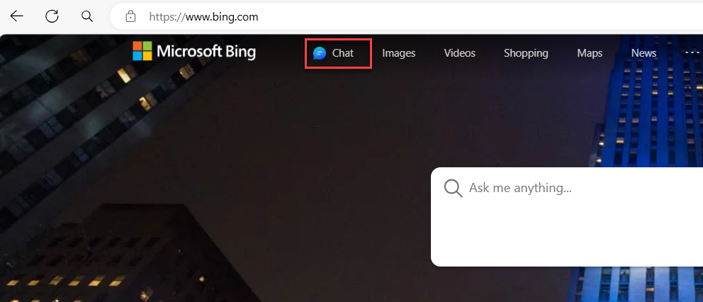

Generative AI can help with all sorts of content creation projects. In this module, learn how to use generative AI to create a story about an imaginary destination from your dreams. Bring your own interests to this endeavor as you reference a place you know well but work to reimagine with a twist. How can you make it unique and exciting? How might it reflect your own interests or passions?

You co-create this vision with AI. Use Copilot in Bing to research, ideate, write copy, and create visuals to bring your idea to life. Each step in this module focuses on a different part of the experience and provides a sample prompt you can copy and edit. The structure of the steps and the prompts are created to highlight specific techniques or functionality. Sample responses are provided to show you examples of the content Copilot creates.  

This module is based on the SkillUp AI Challenge, developed by the Microsoft Garage. The Garage drives a culture of innovation at Microsoft, delivering programs and experiences to employees and customers that enable collaboration, creativity, and experimentation. The SkillUp AI Challenge is so popular with Microsoft employees that we're now offering it as an online learning experience open to anyone. Learn more about [The Microsoft Garage.](https://www.microsoft.com/garage)

**Before you start**

Sign in to Copilot in [Bing](https://www.bing.com/) and select the chat icon. Be sure to use Copilot in Bing in the full browser, not in the sidebar. We recommended you [set up a personal profile in Microsoft Edge.](https://support.microsoft.com/topic/sign-in-and-create-multiple-profiles-in-microsoft-edge-df94e622-2061-49ae-ad1d-6f0e43ce6435)

Sign in to [Image Creator from Designer](https://www.bing.com/images/create) with a personal account.

> [!IMPORTANT]
> In this tutorial you only work in Copilot in Bing. However, you must sign in to Image Creator so the copilot can use it to do the work of calling Image Creator for you. If you get an error from the copilot, it means that Copilot in Bing is unable to call Image Creator because you are not signed in.

**Pull it all together**

As you create everything you need to describe your idea and destination, save it. You can copy your AI-generated content into another format, such as a Microsoft PowerPoint presentation, to further refine and share with others.