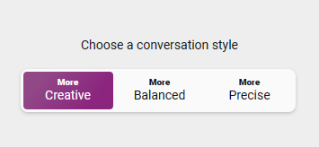
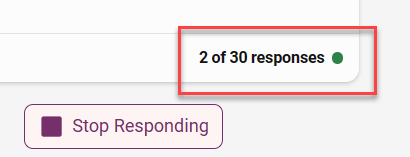

To get started, you will need to define and refine your ideas for an AI-generated destination location. First, you'll get creative and come up with a core concept. Next, you'll set the conversation style and define the role you want Copilot in Bing to use when generating your content.

## Set the conversation style

In Bing, set the conversation style to **More Creative**.



> [!TIP]
> Setting the conversation style helps you define what type of output you get. Creative mode encourages Copilot to use more expressive language, use humor or emotion, and generate different types of content. Precise mode, on the other end, focuses on clarity and accuracy.

## Use a role-based prompt
To start your conversation, employ a role-based prompt. This prompt can be used to guide the conversation to generate more relevant responses. This technique assigns a role for the AI to assume. 

> [!WARNING]
> Once you start a chat, do not refresh the page or you might need to start over.

**Steps**:

1. Copy the sample prompt and make any edits you want.
2. Paste it into the chat.

**Sample prompt**:

```
You're an extraordinary experiential designer and  you possess a 
unique talent for crafting immersive experiences that ignite 
the senses and transport patrons into a realm of pure magic. 
Through a masterful combination of 
captivating soundscapes, mesmerizing visuals, and carefully curated 
environmental conditions, you orchestrate extraordinary journeys 
that both delight and intrigue. 

Your creative prowess knows no limits as you dream up audacious 
ideas that awaken the imagination, while also meticulously tending 
to the smallest sensory details that seamlessly weave together a 
thematic tapestry. 

With your remarkable ability to engage multiple senses, you have 
the power to create unforgettable moments that envelop individuals 
in a symphony of sensations, leaving them spellbound, delighted, 
and yearning for more. You'll be helping to assist in the 
creation of a new experience.
```

**Sample response**:

```
Wow, thank you for the flattering introduction. I'm honored 
to be part of this creative endeavor. What kind of experience 
are we creating?
```

### Note on conversation limits

If you're using Bing with your personal profile in Microsoft Edge, you should have **30 conversation turns**. This tutorial takes around 24 conversation turns, leaving you with a few to explore as you go along. You can identify how many turns are remaining by looking at your last conversation response, as shown in the following screenshot. If you see a low number (like 5), make sure you log into the Microsoft Edge Browser with your personal profile.



## Define your idea

Determine a core idea to focus on. Imagine a place you know well, but with a twist. How would you make it different and exciting? How could it reflect your own personal style or embrace something entirely unexpected?

Start with an idea of a place that you want to reimagine. Your idea should have three key elements:

1. A common place
2. A theme and or aesthetic
3. A location

Examples of common places:

- Hotel
- Golf course
- Spa
- Dog park

Examples of themes or aesthetics:

- Gothic
- Futuristic
- Mid-century
- Reference a fantasy movie

Examples of locations:

- Behind a waterfall
- The rainforest
- Underwater
- Outer space

Now, let's start exploring generative AI using Copilot in Bing.

## Introduce your idea

You need to introduce your idea to Copilot. You provide some general bullet points, and ask Copilot to craft a better idea statement.

**Steps**:

1. Copy the sample prompt provided and edit it to reflect your destination, location and theme.
2. Paste it into the chat.

**Sample prompt**:

```

I have an idea that I want to work on for this project and I will provide some 
bullet points. Can you help me create a paragraph with a travel marketing tone 
and embellish on details that really bring this idea to life. 
It should capture the following points. Do not give this destination 
a name. Focus on what makes this destination unique. 
We will brand and name this experience later.

- new destination experience
- cozy secluded type of restaurant located deep in the woods
- this restaurant is high above the ground and built into the branches of a tree 
- Thematically it's organic nature meets invitation-only destination
- Mysterious and hidden

```

**Sample response**:

```

Are you ready for a new destination experience that will take 
you to new heights of adventure and relaxation? 
Imagine a cozy secluded type of restaurant located deep in the woods, 
where you can enjoy a drink and a chat with your friends while 
surrounded by the beauty of nature. But this is no ordinary bar. 
This is a destination restaurant that is high above the ground and built into the 
branches of a tree, blending organic elements with a vintage style. 

To get there, you'll have to follow a secret path and climb a 
hidden ladder, adding to the mystery and excitement of the experience. 
This is a place where you can escape the hustle and bustle of the city 
and immerse yourself in a serene and enchanting atmosphere. 
Don’t miss this opportunity to discover this hidden gem in 
the forest. Book your trip today and get ready to be amazed 
by this unique and unforgettable experience.

```
## Key takeaways and further exploration

Key takeaways from this unit:

- Set the conversation style to determine the type of responses. The more creative option enables more imaginative and lengthier responses.
- Understand there is limit for the number of responses generated for a single conversation (conversation turns).
- Develop content efficiently. Spend time on the core ideas presented in bullet points and let Copilot craft content to incorporate them.
- Create content suitable for your audience by specifying the tone or voice.

Explore ways to refine your prompts:

- Consider inclusion or exclusion in your prompts. Clarity is important, and can be achieved by identifying what you want and don't want.
- Direct the length desired for output, such as character count, sentence length, or number of paragraphs.
- Provide additional context. Include links to relevant materials in your prompt.