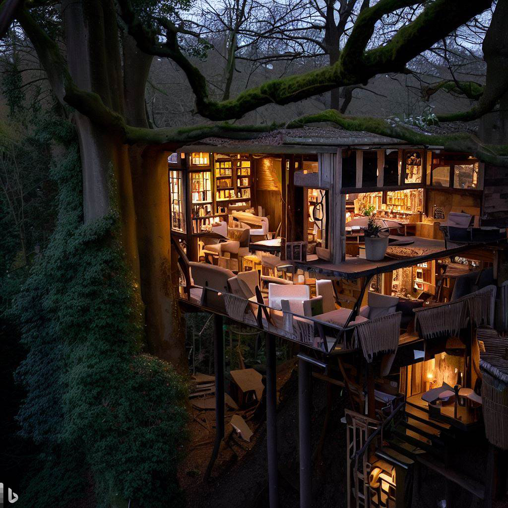

Some Large Language Models (LLMs) like Copilot in Bing are **multimodal**, meaning they can combine text with other types of information such as images. In this exercise, you use the description that you just created to visualize what your destination might look like, using Image Creator.

## Create a hero image

A hero image is the first image someone associates with your destination. A hero image is a large, visually striking graphic intended to catch attention and convey the central message or theme.

Since Copilot in Bing remembers the context of the conversation, you can have it create an image from the description it already wrote. So, try to ask Copilot to create an image for you.

**Steps**:
1. Copy the sample prompt.
2. Paste into the chat.
3. Choose image you like and download it.

> [!IMPORTANT]
> Copilot in Bing uses [Image Creator by Designer](https://www.bing.com/images/create) so you need to log in before continuing.


**Sample prompt**:
``` 
Can you create an image that visualizes the exterior of this destination from a distance? 

```

**Sample response**:

Sample image created.



----
## Key takeaways and further exploration

Key takeaways from this unit:

- Copilot has multimodal capabilities. Copilot can generate and take input from both text and images.
- AI generated images from Copilot have watermarks to help users identify AI generated content.
- Use Copilot to create images from the context of the conversation.

Explore ways to refine your prompts:

- Use descriptive modifiers in your prompt. In the prompt used in this exercise, “exterior” helped provide clarity about the type of perspective for the image. Consider exploring other modifiers.
- Craft your own image prompt. In this exercise, Copilot crafted the prompt from the context of the conversation to create the image. Create your own image prompt and provide more details to refine your output.
