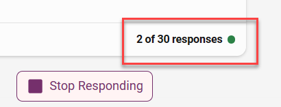

Your destination’s entrance is the first impression you make on your visitors. How can you make it match your theme and stand out in their memory? Let’s design an image and a description for your entrance. To do this, use Copilot to ideate, generate a description, copyedit, and create an image.

## Ideate with Copilot
Return to your conversation in Bing, and start generating ideas.

**Steps**:
1. Copy the sample prompt and edit as needed.
2. Paste it into chat.

**Sample prompt**:
``` 
For this destination I want to think about the entrance. 
It should embrace the theme of this destination and should 
be memorable as it’s the first interaction a visitor will have. 
Can you suggest three ideas for the entrance to this destination 
that fulfill the criteria? This part of the project work is called The Entrance.

```

**Sample response**:

```
Sure, here are three possible ideas for the entrance:
- A hidden door behind a waterfall that leads to a tunnel with glowing 
mushrooms and fairy lights.
- A giant hollow log that serves as a slide that takes visitors to the 
base of the tree, where they can climb up a rope ladder or a spiral 
staircase.
- A secret code that visitors have to enter on a keypad disguised 
as a birdhouse, which opens a trapdoor on the ground 
that reveals an elevator to the bar.
```
> [!TIP]
> You can iterate and ask for more ideas. However, note the number of prompts you have remaining so you don't have to start over in a new chat!
<br/><br/>


## Expand on the idea
Let's explore those ideas.
Select **one of the ideas** proposed and direct Copilot to elaborate on that idea.

**Steps**:
1. Copy the sample prompt and edit it as needed.
2. Paste the prompt into the chat.

**Sample prompt**:
```
I like idea about the hidden door you suggested. Can you elaborate on it? 
```
**Sample response**:
```
The entrance to the restaurant is a giant hollow log that looks like a 
natural part of the forest. Visitors have to crawl inside the 
log and slide down a smooth and curvy path that takes them to 
the base of the tree where the restaurant is located. 

The slide is dark and thrilling, but also safe and comfortable. 
Along the way, visitors can hear sounds of nature and see 
glimpses of light through the cracks in the log. Once they 
reach the bottom, they have two options to climb up to the 
bar: a rope ladder or a spiral staircase. 

Both options are fun and challenging, but also offer stunning 
views of the forest and the bar. The rope ladder is more 
adventurous and requires some physical strength, while the 
spiral staircase is more elegant and relaxing. Visitors can 
choose whichever option suits their mood and preference. 

The entrance is designed to create a sense of wonder and 
excitement, as well as a contrast between the natural and 
the man-made elements of the bar.
```
----

## Edit the description
Now, you need to rewrite this description in a marketing tone.

**Steps**:
1. Copy the sample prompt and edit it as needed.
2. Paste the prompt into the chat.

**Sample prompt**:
```
Can you rewrite that description in a tone that you’d find 
in a travel publication? Please keep it to a single paragraph.
```
**Sample response**:
```
If you are looking for a unique and thrilling way to enter a bar, 
look no further than this hidden gem in the woods. The entrance 
is a giant hollow log that invites you to slide down a dark and 
winding path that leads you to the base of a majestic tree. 

Along the way, you will be immersed in the sounds and sights of 
nature, as you catch glimpses of light and hear birds and insects. 
Once you reach the bottom, you will have to climb up to the bar, 
either by a rope ladder or a spiral staircase. Both options 
will reward you with stunning views of the forest and the bar, 
as well as a sense of accomplishment and adventure. The entrance 
is a perfect blend of nature and artifice, creating a memorable 
experience that will leave you breathless and enchanted.
```

----
## Create an image
You need to create an image to visualize this grand entrance.

**Steps**:
1. Copy the following sample prompt and edit it as needed.
2. Paste the prompt into the chat.
3. Choose image you like and download it.

If it can't generate an image for you, you can go to directly to [Image Creator](https://www.bing.com/images/create). If you have trouble using this prompt, which relies on the context of the conversation, try using the description you created for a prompt.

**Sample prompt**:

```
Can you create an image that visualizes the description of the 
entrance you just wrote?
```

**Sample response**:
Sample image created.


[See the image response](https://www.bing.com/images/create/a-giant-hollow-log-that-invites-you-to-slide-down-/649af228acf04d1cb6c8ae90ebfc82c1?id=QdQNSfkGc3VngXM3tfzyFQ%3d%3d&view=detailv2&idpp=genimg&idpclose=1&FORM=SYDBIC).


## Key takeaways and further exploration

Key takeaways from this unit:

- Use the conversational context for prompts. You can direct Copilot based on the conversation or even the last response.  
- Employ Copilot to copyedit content. Iterate upon generated responses by providing detailed direction.  

Explore ways to refine your prompts:

- Play with the order you present information in your prompt to determine how order influences the responses.
- Build upon the image prompt Copilot created by adding more details or modifiers.
- Transform generated content. Explore how you can put it in different formats or styles.