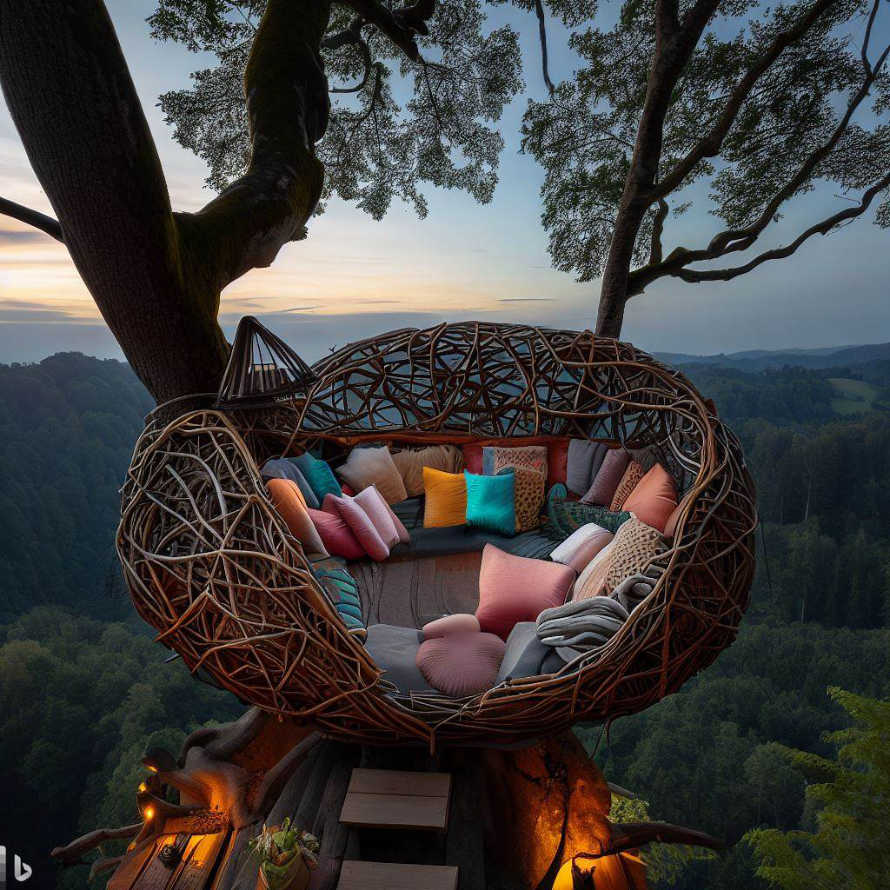

Destination locations have various interior and exterior spaces that are features. Let’s use Copilot in Image Creator to brainstorm and visualize some creative ideas for these spaces.

## Ideate
Return to your conversation in Bing. You start by ideating with your co-creator to think about unique features or spaces within your destination.

**Steps**:
1. Copy the sample prompt and edit as needed.
2. Paste the prompt into the chat.

**Sample prompt**:
``` 
We are now going to work on the part of the project called 
The Features. 
Given what you know about this destination, can you suggest 
5 unique interior or exterior features or spaces that people 
might visit, spend time in, or enjoy? Please list them with the name, 
followed by the description. Follow my formatting example:

## Name ##
Description

```
> [!NOTE]
> **Few Shot Prompt example**. This prompt is an example of a Few Shot prompt, where you provided some guidance or an example of what you wanted it to do and the output to be. Zero-shot gives no guidance.


**Sample response**:
Note the following sample response is in markdown syntax so it doesn't look formatted the way it does in your browser.
```
Sure, here are five possible features or spaces for the destination:
•	The Nest: A cozy and intimate seating area that is shaped 
like a bird’s nest and made of woven branches and cushions. It is 
located on the highest branch of the tree and offers a panoramic 
view of the forest and the sky. It is a perfect spot for couples 
or small groups to enjoy a drink and a conversation.
•	The Swing: A large and sturdy swing that hangs from a thick 
rope on the side of the tree. It can fit up to four people and 
allows them to swing back and forth over the forest floor. It is 
a fun and exhilarating way to experience the thrill of flying and 
the beauty of nature.
•	The Library: A small and quiet room that is filled with books,
 magazines, and board games. It is located inside the trunk of the 
 tree and has a circular window that lets in natural light. It is 
 a great place for visitors who want to relax, read, or play in 
 a peaceful environment.
•	The Lounge: A spacious and stylish room that is decorated with 
vintage furniture, art, and lighting. It is located on the main 
branch of the tree and has a stage for live music and performances. 
It is the heart of the bar, where visitors can mingle, dance, or 
enjoy the entertainment.
•	The Garden: A lush and colorful area that is planted with flowers, 
herbs, and fruits. It is located on the lower branch of the tree 
and has a fountain and a fire pit. It is a lovely place for visitors 
who want to enjoy the fresh air, smell the flowers, or roast marshmallows.

```

## Expand the ideas
Select **two of the ideas** to explore. For each idea, you need to work on creating a description and then creating an image.

**Steps**:
1. Copy the following sample prompt and edit as needed.
2. Paste the prompt into the chat.


**Sample prompt**
```
I want to work on visualizing a few of these ideas. 
Let's work on the first idea called The Nest. Can you 
rewrite that description in a travel publication tone and keep it about the same length. 
Can you also suggest three alternative names for the Nest?
```

> [!NOTE]
> **Complex directive**. You asked the model to do a few things here in a single prompt and it will work to figure out what it needs to do when you issue multiple directives in a single prompt.

**Sample response**:
```
Sure, I can rewrite the description and suggest some names. 
Here is a possible rewrite:
•	The Perch Escape to a cozy and intimate seating area that 
is shaped like a bird’s nest and made of woven branches and cushions. 
Located on the highest branch of the tree, The Perch offers a 
panoramic view of the forest and the sky. It is a perfect spot 
for couples or small groups to enjoy a drink and a conversation 
in a serene setting.
•	The Roost Relax in a cozy and intimate seating area that is 
shaped like a bird’s nest and made of woven branches and cushions. 
Located on the highest branch of the tree, The Roost offers a 
panoramic view of the forest and the sky. It is a perfect spot 
for couples or small groups to enjoy a drink and a conversation 
in a tranquil setting.
•	The Haven Unwind in a cozy and intimate seating area that 
is shaped like a bird’s nest and made of woven branches and 
cushions. Located on the highest branch of the tree, The Haven 
offers a panoramic view of the forest and the sky. It is a 
perfect spot for couples or small groups to enjoy a drink 
and a conversation in a peaceful setting

```

## Create an image
Select one of the options it provided, and ask Copilot to visualize it.

**Steps**:
1. Copy the sample prompt and edit it as needed.
2. Paste the prompt into the chat.
3. Select an image you like.
4. Download that image.

If it can't generate an image for you, you can go to [Image Creator](https://www.bing.com/images/create) to generate images from text. If you have trouble using this prompt, which relies on the context of the conversation, try using the description you created for the prompt.


**Sample prompt**:
```
I like the second idea you proposed. Can you create an 
image to visualize what you called The Roost? 
```
**Sample response**:
Sample image created.



Image created [of the Roost](https://www.bing.com/images/create/a-cozy-and-intimate-seating-area-that-is-shaped-li/649af52aabfe4860ab77aae36dfbb76e?id=he2eTz0FiCnziEwETvpXQQ%3d%3d&view=detailv2&idpp=genimg&idpclose=1&FORM=SYDBIC).


> [!IMPORTANT]
> Repeat the **Expand the ideas** and **Create an image** sections so that you have a name, description, and image for at **least two spaces**.

When you have two spaces complete, you can move to the next unit.

## Key takeaways and further exploration

Key takeaways from this unit:

- Copilot understands complex directives. A single prompt can have several tasks and it can infer what is required.  
- Brainstorming with Copilot can quickly generate ideas that can be iterated upon or expanded.  
- Few shot prompts provide examples to direct output. Providing samples of how you want the output formatted or completed illustrates what is expected in a response. 
- Copilot supports some markdown formatting.

Explore ways to refine your prompts:

- Craft a more detailed few shot prompt that provides several examples for format or organizing content.