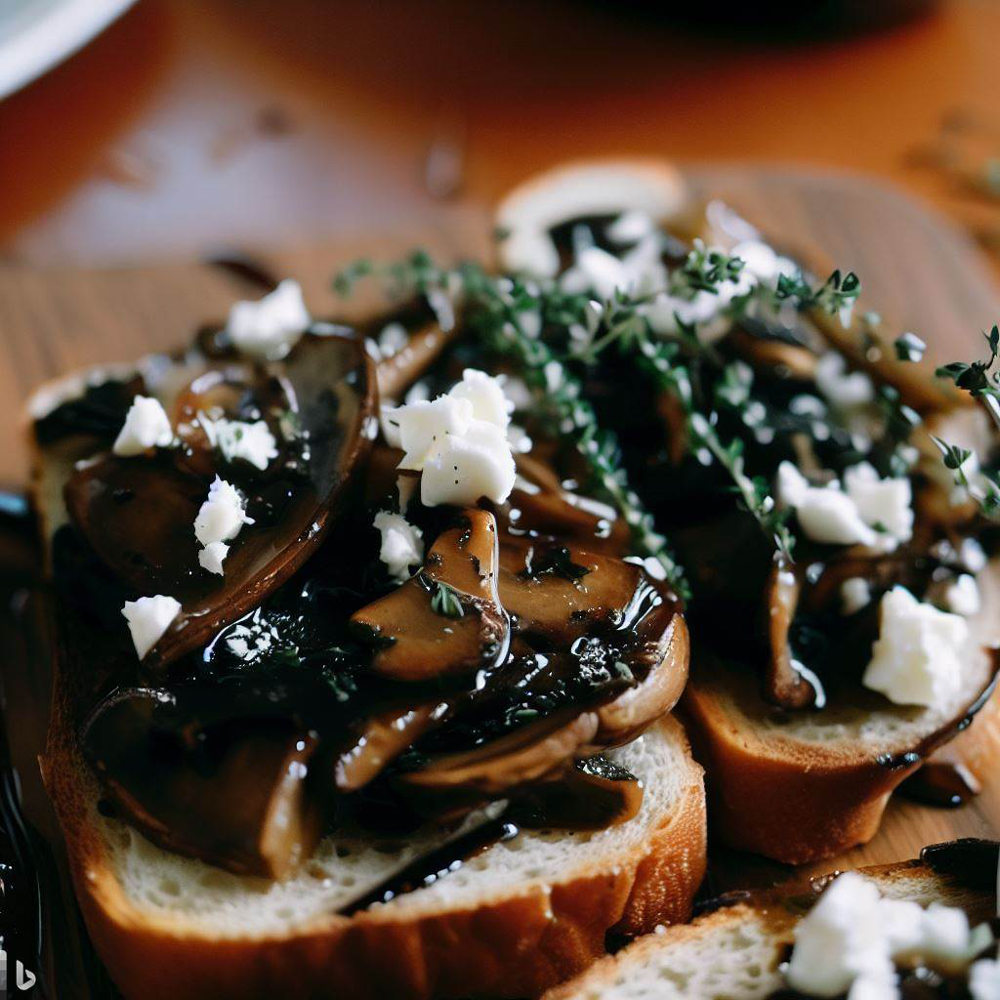
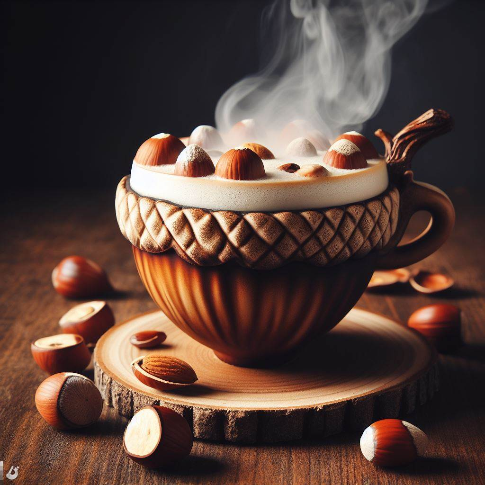

Food and refreshments are an important part of any destination. They can enhance the mood, theme, and experience of the visitors. Whether it’s a spa, a golf course, or something else, let’s think about what kind of food your destination offers. Use Copilot in Bing to do some research, and Image Creator to visualize the menu.

## Ideate

Return to your conversation in Bing. You start by ideating to think about some food options that would match your theme.

**Steps**:
1. Copy the sample prompt and edit as needed. 
2. Paste the prompt into the chat.

**Sample prompt**:
``` 
For this destination we have been working on together, 
I’d like to think about food options available. 
This part of the project is called The Food. 
Could you create me a menu formatted as a table which 
includes the name and the description. The descriptions 
should clearly outline the ingredients and how it's served. 
The name and description should also embrace the theme 
of our destination. Please provide 5 ideas.   

```
> [!TIP]
> **Specifying format**. You specified a "table" format for the output, which makes it very easy for you to copy and paste and put right into something like Microsoft Excel.

**Sample response**:

Note the following sample response is in markdown syntax so it doesn't look formatted like a table the way it does in your browser.
```
| Name       | Description    
|--------------|-----------
| Forest Floor Crostini | A savory and elegant appetizer made 
with toasted bread slices topped with sautéed wild mushrooms, 
garlic, thyme, and goat cheese. Drizzled with truffle oil and 
balsamic vinegar.     
| Sunset Salad     | A colorful and refreshing salad made 
with roasted beets, arugula, orange segments, feta cheese, 
and candied walnuts. Tossed with a citrus-honey dressing.  
| Lobster in the Sky    | A smooth and luxurious soup made with 
lobster meat, onion, celery, carrot, cream, and sherry. 
Garnished with chives and crème fraîche.
| Tree Trunk Steak    | A tender and succulent steak made 
with grass-fed beef, seasoned with salt and pepper, and 
grilled to perfection. Served with garlic mashed potatoes, 
asparagus, and red wine sauce.
| Sparling Star    | A sparkling and festive drink made 
with champagne, brandy, sugar cube, and bitters. 
Served with a lemon twist and a maraschino cherry.

```
> [!NOTE]
> **Iterate as needed!** You can iterate and ask for more ideas. However, pay attention to the number of prompts you have left.

## Generate an image
Select one or two of the menu items and create an image for each of them.

**Steps**:
1. Copy the sample prompt and edit it as you need.
2. Paste the prompt into the chat.
3. Select an image you like and download it.

If it can't generate an image for you, you can go to [Image Creator](https://www.bing.com/images/create) to generate images from text. If you have troubles using this prompt, which relies on the context of the conversation, try using the description you created for the prompt.

**Sample prompt**:
```
Can you create an image for the first menu item suggested?
```
**Sample response**:


Image created for [Forest Floor Crostini.](https://www.bing.com/images/create/toasted-bread-slices-topped-with-sautc3a9ed-wild-mush/649afba929ce4dbda62b311849131d62?id=lht3G5PBU%2fXK%2fF%2b5OpEbfg%3d%3d&view=detailv2&idpp=genimg&idpclose=1&FORM=SYDBIC)

You need at least one image for food, but you're welcome to make more.  

## Ideate a signature drink
A signature drink is a drink that reflects your personality or your destination’s theme. It should feel special. It could be anything, as long as it suits your destination.

### Research for inspiration
Use Copilot to do some research. Copilot can search the internet and bring back links, so let's ask it to gather inspiration for us. If you find an image from researching that you like because of the colors, or the shape of a glass, save a link to that image. Later, you can use that image to influence your outcomes.

**Steps**:
1. Copy the sample prompt and edit it as needed to reflect what you want.
2. Paste this prompt into the chat.
3. Explore the response it gave you.
4. Save the URL to an image you like. Later, we share a neat trick.

**Sample prompt**:
```
A signature drink is a refreshment that truly embodies the theme of the destination. It should be unique and an experience it itself. It might embrace local ingredients, culture or cues from the theme that influence how they look, how they are served or how they are made. They delight customers. We need to find some photo inspiration to help generate ideas for refreshments that would be fun to enjoy. Can you provide some photo inspiration of unique refreshments that are highly creative - it could be their colors, their ingredients, the container they are served in, how they are made or how someone needs to enjoy it.
```

**Sample response**:
```
Sure, I can help you with that. I searched the web for some photos of unique refreshments that might inspire you. Here are some examples:
•	A drink served in a light bulb, with a straw and a colorful garnish. This is a fun and quirky way to present a drink, and it also creates a nice contrast between the glass and the liquid.
•	A drink made with dry ice, which creates a smoky and dramatic effect. This is a great way to add some flair and excitement to a drink, and it also enhances the sensory experience.
•	A drink served in a coconut, with a straw and a tropical umbrella. This is a simple and natural way to serve a drink, and it also evokes a sense of freshness and exoticism.
•	A drink served in a hollowed-out pineapple, with a straw and a flower. This is another way to use a fruit as a container, and it also adds some sweetness and flavor to the drink.
•	A drink served in a martini glass, with a cotton candy cloud on top. This is a whimsical and playful way to serve a drink, and it also creates a contrast between the soft and fluffy cotton candy and the liquid.

```
----

## Ideate with Copilot in Bing

Ask Copilot to imagine three signature drink ideas that would embrace the theme of your destination. Remember to give any details to help craft the right results - consider the container, accessories, regional flavors or anything else that make it special.
Steps:
1. Copy the sample prompt and edit it as needed.
2. Paste the prompt into the chat.

**Sample prompt**:
```
We need to ideate about a signature drink. It should embrace the theme of the 
destination and should surprise 
and delight people. What it is served in matters, 
the glass or container should be really unique and it
should embrace the theme of the destination. 
Can you give me three ideas for signature refreshments or drinks, but please be inclusive and include something in your suggestions for everyone. Please also name them something clever that reflects the theme. 
```

**Sample response**:

```
Sure, I can help you with that. Here are three possible ideas for signature refreshments or drinks that match the theme of your destination, along with some clever names:
- **The Acorn**: A drink made with almond milk, coffee, and hazelnut liqueur, served in a ceramic cup shaped like an acorn. This drink is nutty and smooth, and it also resembles the food of the forest animals.
- **The Leaf**: A drink made with green tea, lime juice, and honey, served in a glass that has a leaf-shaped rim. This drink is refreshing and soothing, and it also creates a nice green color that matches the foliage of the trees.
- **The Owl**: A drink made with chocolate milk, whipped cream, and Oreo cookies, served in a glass that has two Oreo cookies as eyes. This drink is sweet and creamy, and it also looks like the face of an owl, the nocturnal bird of the forest.
```

## Generate an image
Now you generate an image for one of the drink ideas.

**Steps**:
1. Copy the sample prompt and edit it as you need.
2. Paste the prompt into the chat.
3. Select an image you like.
4. Download that image.

**Sample prompt**:
```
Can you create an image to visualize the first drink you 
suggested called The Acorn?
```
**Sample response**:
Sample image created.


Image created for Acorn drink.


## Optional: Iterate on image with reference

This step is optional, but it's fun.

Remember those images you looked at earlier for inspiration? Let's explore if you can use them to influence your output. Select something you liked about your inspiration photo, like the colors or the shape of the glass, and tell Copilot what to do.

Use Copilot Image input as shown in the following screenshot to upload or share a link to an image.


**Steps**:
1. Copy the sample prompt and edit it needed.
2. When you paste it into the chat, select the image icon to the right of the chat box.
3. Upload a reference photo or use the URL of an image you want to reference.
4. Submit the prompt to the chat.
5. Decide if this image is more interesting to you!

**Sample prompt**:
```
Could you take The Acorn image just created and add some of the smoke shown in this image?
<put your image url here or add it via the 
Image icon on the input box >

```
This sample is how it applied that reference image to create a new one.


> [!TIP]
> This prompt relies on the context of the conversation. If Copilot can't generate an image for you, try including the the description of the image you created in the prompt.

## Key takeaways and further exploration

Key takeaways from this unit:

- Research, ideate, and create in one place. Copilot for Bing can search the web and provide links to references.  
- The multimodal capabilities in Copilot for Bing enable images as input.  

Explore ways to refine your prompts:

- Try speech as an input.  
- Discover the computer vision capabilities by using images as input. Ask what is in an image, or reference something in the image.