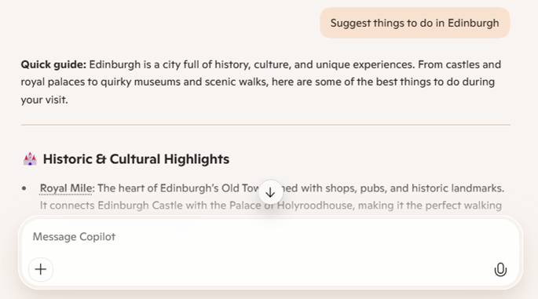
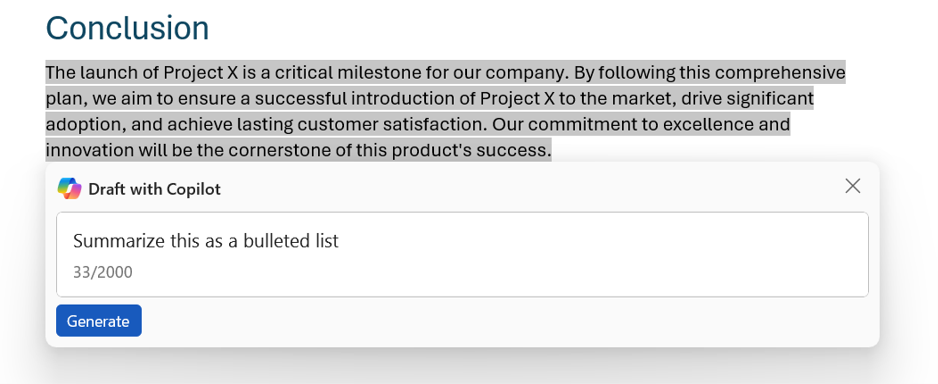

Microsoft Copilot is an AI-powered assistant for personal and work use. Using Copilot is like having a helpful partner working alongside you to help you research, find information, and create content. Depending on your specific needs, there are multiple Microsoft Copilot services that you can use.

## Microsoft Copilot for individuals

For individuals, Copilot is an AI companion that can help you with personal tasks such as finding information on the web, writing content, and generating images.

### Microsoft Copilot

Microsoft Copilot is available without subscription for personal use. You can use Microsoft Copilot for free by:

- Using the [Microsoft Copilot web site](https://copilot.microsoft.com).
- Using the [**Copilot** pane in Microsoft Edge](https://www.microsoft.com/edge/features/copilot).
- Downloading the [Microsoft Copilot mobile app](https://www.microsoft.com/microsoft-copilot/for-individuals/copilot-app).

### Microsoft Copilot Pro

Microsoft Copilot Pro is a subscription-based service that offers all the capabilities of Microsoft Copilot with access to the latest AI models and integration with Microsoft 365 applications like Word, Excel, Outlook, and PowerPoint.

> [!NOTE]
> To learn more about Microsoft Copilot Pro and compare features and capabilities, see [Microsoft Copilot Pro](https://www.microsoft.com/store/b/copilotpro) in the Microsoft Store web site.

## Microsoft 365 Copilot for organizations

Microsoft 365 Copilot is an AI-powered assistant for business organizations, integrating Copilot into apps and services like Word, Excel, Outlook, PowerPoint, Teams, OneNote, and others. By connecting to your organization's data through the Microsoft Graph and providing a centralized Copilot portal through Microsoft 365 Copilot Business Chat (BizChat), Microsoft 365 Copilot makes it easy to find relevant documents and information, summarize email threads and meeting transcripts, and streamline business processes and collaboration.

> [!NOTE]
> To learn more about Microsoft 365 Copilot, see the [Microsoft 365 Copilot](https://www.microsoft.com/microsoft-365/copilot/copilot-for-work) page.