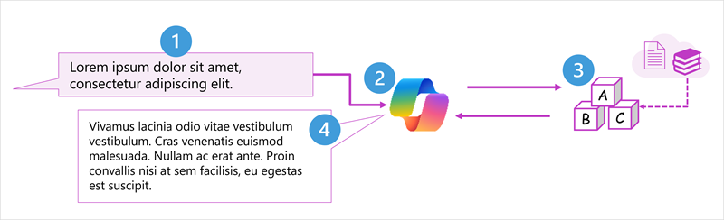

Microsoft Copilot uses the power of *generative artificial intelligence (AI)* to respond to natural language queries and instructions to create new content. Although Copilot's responses can seem humanlike, they're generated by an AI model, which has been trained with a vast amount of data.

This diagram shows (at a high level) how Copilot works:

1. You submit a natural language question or instruction, known as a ***prompt***.
1. Microsoft Copilot prepares the prompt, augmenting it with additional contextual information (such as rules about the kinds of response that should be generated and a summary of the conversation history to this point)
1. The prompt is sent to a ***large language model (LLM)***, which interprets the request and generates a response based on the large volume of data with which the model was trained.
1. Copilot responds with the output from the model.

For example, suppose you submit the following prompt to Microsoft Copilot:

> Create an agenda for next week’s budget meeting.

Copilot uses its large language model to generate a response, which might be similar to this:

> Sure, I can help with that! Here's a draft agenda for next week's budget meeting:
>
> **Budget Meeting Agenda**
>
> **Date**: [Insert Date]
>
> **Time**: [Insert Time]
>
> **Location**: [Insert Location] / Virtual Meeting Link: [Insert Link]
> 
> **1. Welcome and Introductions** (5 minutes)
> 
> - Opening remarks
> - Introduction of attendees
>
> **2. Review of Previous Meeting Minutes** (10 minutes)
>
> - Summary of key points
> - Approval of minutes
>
> **3. Current Financial Status** (15 minutes)
>
> - Presentation of current budget
> - Discussion of financial reports
>
> **4. Budget Proposals for Next Quarter** (20 minutes)
>
> - Presentation of new budget proposals
> - Q&A session
>
> **5. Cost-Saving Strategies** (15 minutes)
>
> - Discussion of potential cost-saving measures
> - Evaluation of current strategies
>
> **6. Departmental Budget Requests** (20 minutes)
>
> - Review of requests from various departments
> - Prioritization and allocation
>
> **7. Open Discussion** (10 minutes)
>
> - Addressing any additional concerns or questions
>
> **8. Action Items and Next Steps** (10 minutes)
>
> - Summary of decisions made
> - Assignment of tasks and deadlines
>
> **9. Closing Remarks** (5 minutes)
>
> - Final thoughts
> - Schedule next meeting
>
> Feel free to adjust the timings and topics as needed. Is there anything specific you'd like to add or change?

The response can vary depending on context. This example is based on an actual response from Microsoft Copilot to the specified prompt.

> [!NOTE]
> Copilot's responses are generated by AI, which can make mistakes. Be careful to validate responses to check for accuracy and relevance to your specific requirement.
