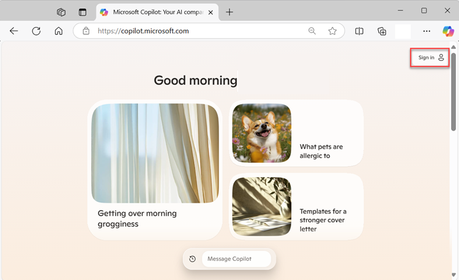

Now it's time for you to explore Microsoft Copilot for yourself.

> [!NOTE]
> There are two variations of the exercise: one for learners who have access to Microsoft 365 Copilot, and an alternative for learners who don't. **Launch and complete one or the other to explore Microsoft Copilot.**

#### Option 1: Explore Microsoft Copilot in your browser

If you don't have access to Microsoft 365 Copilot, launch this version to explore Microsoft Copilot in your browser.

This exercise requires a free Microsoft account (for example an *outlook.com*, *live.com*, or *hotmail.com* account).

1. In your browser, navigate to [copilot.microsoft.com](https://copilot.microsoft.com?azure-portal=true). For this tutorial you need to use Copilot in the **full browser**, not in the browser sidebar. If you don't already have a browser installed, download and install Microsoft Edge for free from https://www.microsoft.com/edge/download.

2. Sign in to Copilot with your [personal Microsoft Account](https://signup.live.com?azure-portal=true) (such as an outlook.com account).

#### Option 2: Explore Microsoft 365 Copilot

If you have access to Microsoft 365 Copilot, launch this version of the exercise and follow the instructions.

> [!NOTE]
> To complete this version, you need a Microsoft 365 account with a subscription for Microsoft 365 Copilot.

