Azure Table Storage implements the NoSQL key-value model. In this model, the data for an item is stored as a set of fields, and the item is identified by a unique key. 

> [!div class="mx-imgBorder"]
> 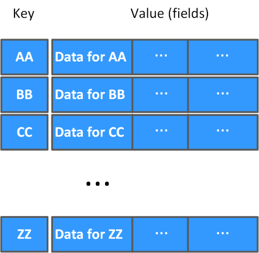

## What is Azure Table Storage?

Azure Table Storage is a scalable key-value store held in the cloud. You create a table using an Azure storage account. 

In an Azure Table Storage table, items are referred to as *rows*, and fields are known as *columns*. However, don't let this terminology confuse you by thinking that an Azure Table Storage table is like a table in a relational database. An Azure table enables you to store semi-structured data. All rows in a table must have a key, but apart from that the columns in each row can vary. Unlike traditional relational databases, Azure Table Storage tables have no concept of relationships, stored procedures, secondary indexes, or foreign keys. Data will usually be denormalized, with each row holding the entire data for a logical entity. For example, a table holding customer information might store the forename, lastname, one or more telephone numbers, and one or more addresses for each customer. The number of fields in each row can be different, depending on the number of telephone numbers and addresses for each customer, and the details recorded for each address. In a relational database, this information would be split across multiple rows in several tables. In this example, using Azure Table Storage provides much faster access to the details of a customer because the data is available in a single row, without requiring that you perform joins across relationships. 

> [!div class="mx-imgBorder"]
> 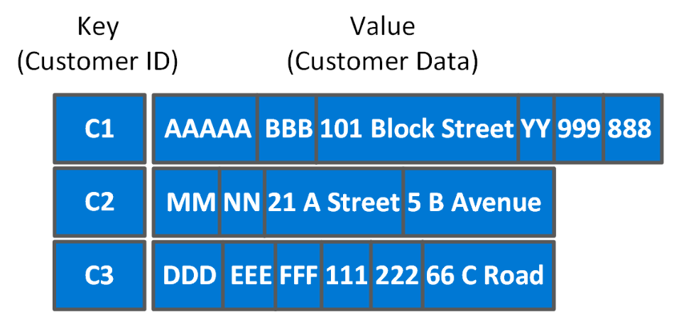

To help ensure fast access, Azure Table Storage splits a table into partitions. Partitioning is a mechanism for grouping related rows, based on a common property or *partition key*. Rows that share the same partition key will be stored together. Partitioning not only helps to organize data, it can also improve scalability and performance:

- Partitions are independent from each other, and can grow or shrink as rows are added to, or removed from, a partition. A table can contain any number of partitions.

- When you search for data, you can include the partition key in the search criteria. This helps to narrow down the volume of data to be examined, and improves performance by reducing the amount of I/O (reads and writes) needed to locate the data.

The key in an Azure Table Storage table comprises two elements; the partition key that identifies the partition containing the row (as described above), and a row key that is unique to each row in the same partition. Items in the same partition are stored in row key order. If an application adds a new row to a table, Azure ensures that the row is placed in the correct position in the table. In the example below, taken from an IoT scenario, the row key is a date and time value.

> [!div class="mx-imgBorder"]
> 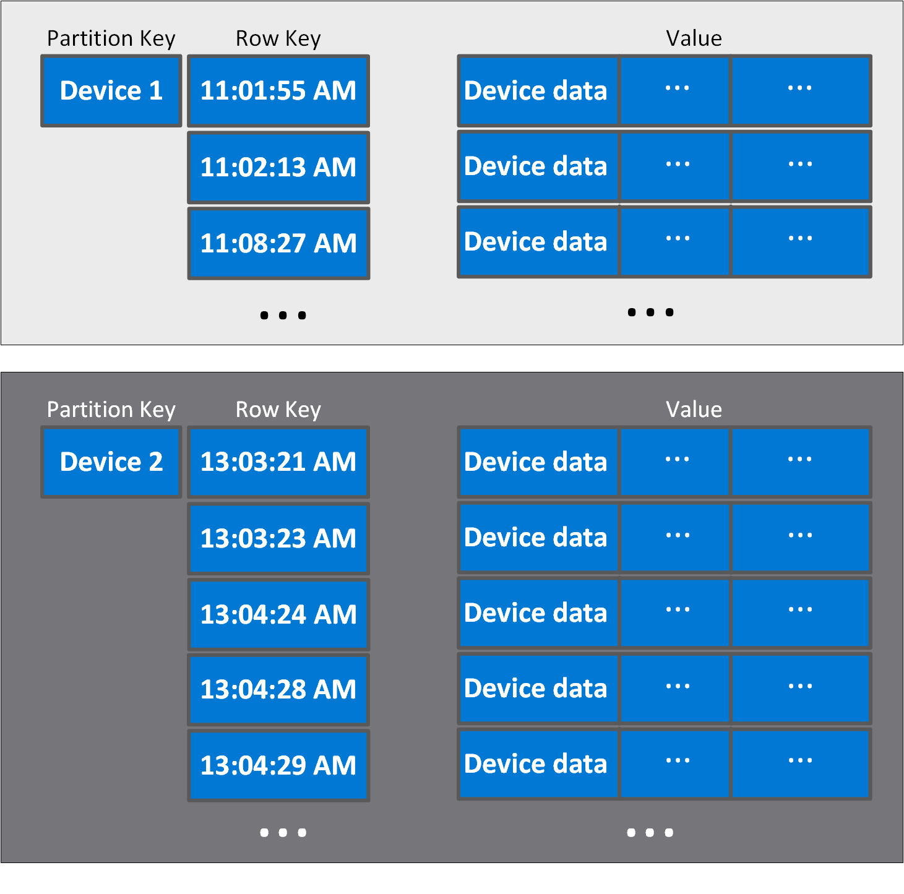

This scheme enables an application to quickly perform *Point queries* that identify a single row, and *Range queries* that fetch a contiguous block of rows in a partition. 

In a point query, when an application retrieves a single row, the partition key enables Azure to quickly hone in on the correct partition, and the row key lets Azure identify the row in that partition. You might have hundreds of millions of rows, but if you've defined the partition and row keys carefully when you designed your application, data retrieval can be very quick. The partition key and row key effectively define a clustered index over the data.

> [!div class="mx-imgBorder"]
> 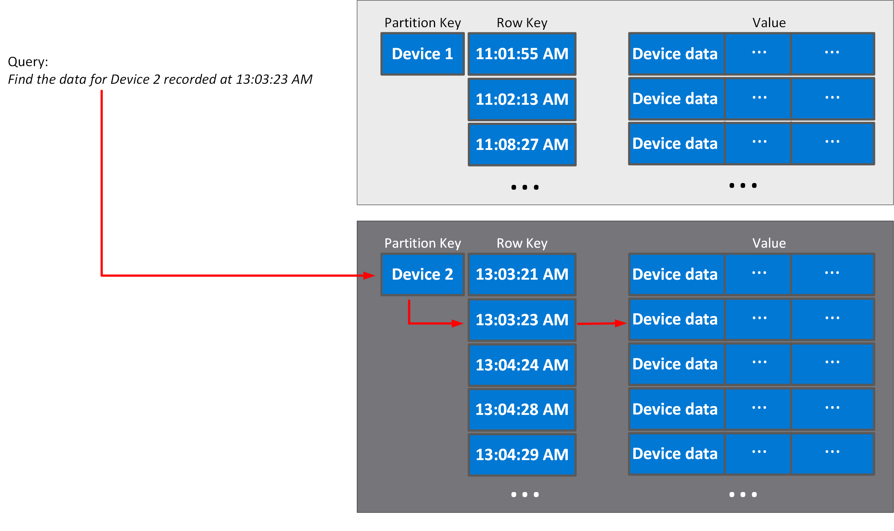

In a range query, the application searches for a set of rows in a partition, specifying the start and end point of the set as row keys. This type of query is also very quick, as long as you have designed your row keys according to the requirements of the queries performed by your application.

> [!div class="mx-imgBorder"]
> 

The columns in a table can hold numeric, string, or binary data up to 64 KB in size. A table can have up to 252 columns, apart from the partition and row keys. The maximum row size is 1 MB. For more information, read [Understanding the Table service data model](https://docs.microsoft.com/rest/api/storageservices/Understanding-the-Table-Service-Data-Model).

## Use cases and management benefits of using Azure Table Storage

Azure Table Storage tables are schemaless. It's easy to adapt your data as the needs of your application evolve. You can use tables to hold flexible datasets such as user data for web applications, address books, device information, or other types of metadata your service requires. The important part is to choose the partition and row keys carefully.

The primary advantages of using Azure Table Storage tables over other ways of storing data include:

- It's simpler to scale. It takes the same time to insert data in an empty table, or a table with billions of entries. An Azure storage account can hold up to 500 TB of data. 
- A table can hold semi-structured data
- There's no need to map and maintain the complex relationships typically required by a normalized relational database.
- Row insertion is fast
- Data retrieval is fast, if you specify the partition and row keys as query criteria

There are disadvantages to storing data this way though, including:

- Consistency needs to be given consideration as transactional updates across multiple entities aren't guaranteed
- There's no referential integrity; any relationships between rows need to be maintained externally to the table
- It's difficult to filter and sort on non-key data. Queries that search based on non-key fields could result in full table scans

Azure Table Storage is an excellent mechanism for:

- Storing TBs of structured data capable of serving web scale applications. Examples include product catalogs for eCommerce applications, and customer information, where the data can be quickly identified and ordered by a composite key. In the case of a product catalog, the partition key could be the product category (such as footwear), and the row key identifies the specific product in that category (such as climbing boots).
- Storing datasets that don't require complex joins, foreign keys, or stored procedures, and that can be denormalized for fast access. In an IoT system, you might use Azure Table Storage to capture device sensor data. Each device could have its own partition, and the data could be ordered by the date and time each measurement was captured.
- Capturing event logging and performance monitoring data. Event log and performance information typically contain data that is structured according to the type of event or performance measure being recorded. The data could be partitioned by event or performance measurement type, and ordered by the date and time it was recorded. Alternatively, you could partition data by date, if you need to analyze an ordered series of events and performance measures chronologically. If you want to analyze data by type and date/time, then consider storing the data twice, partitioned by type, and again by date. Writing data is fast, and the data is static once it has been recorded.

Azure Table Storage is intended to support very large volumes of data, up to several hundred TBs in size. As you add rows to a table, Azure Table Storage automatically manages the partitions in a table and allocates storage as necessary. You don't need to take any additional steps yourself.

Azure Table Storage provides high-availability guarantees in a single region. The data for each table is replicated three times within an Azure region. For increased availability, but at additional cost, you can create tables in geo-redundant storage. In this case, the data for each table is replicated a further three times in another region several hundred miles away. If a replica in the local region becomes unavailable, Azure will transparently switch to a working replica while the failed replica is recovered. If an entire region is hit by an outage, your tables are safe in a remote region, and you can quickly switch your application to connect to that remote region.

Azure Table Storage helps to protect your data. You can configure security and role-based access control to ensure that only the people or applications that need to see your data can actually retrieve it.

## Create and view a table using the Azure portal

The simplest way to create a table in Azure Table Storage is to use the Azure portal. Follow these steps:

1. Sign into the Azure portal using your Azure account.

2. On the home page of the Azure portal, select **+Create a resource**.

    > [!div class="mx-imgBorder"]
    > 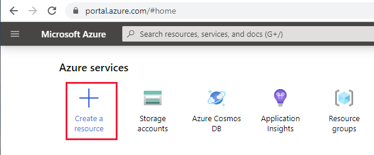

3. On the **New** page, select **Storage account - blob, file, table, queue**

    > [!div class="mx-imgBorder"]
    > 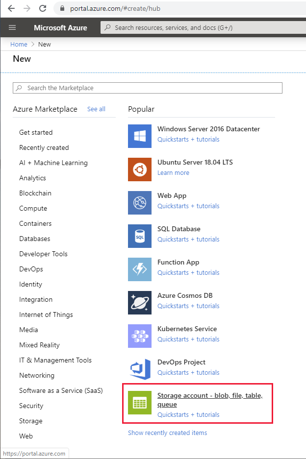

4. On the **Create storage account** page, enter the following details, and then select **Review + create**.

    | Field | Value |
    |-|-|
    | Subscription | Select your Azure subscription |
    | Resource group | Select **Create new**, and specify the name of a new Azure resource group. Use a name of your choice, such as *mystoragegroup* |
    | Storage account name | Enter a name of your choice for the storage account. The name must be unique though |
    | Location | Select your nearest location |
    | Performance | Standard |
    | Account kind | StorageV2 (general purpose v2) |
    | Replication | Read-access geo-redundant storage (RA-GRS) |
    | Access tier | Hot |

    > [!div class="mx-imgBorder"]
    > 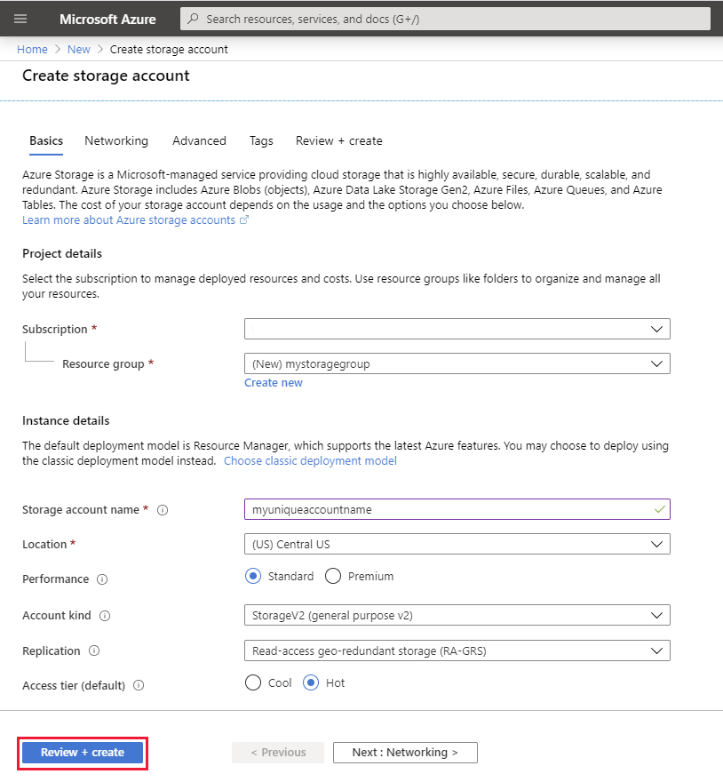

5. On the validation page, click **Create**, and wait while the new storage account is configured.

6. When the **Your deployment is complete** page appears, select **Go to resource**.

    > [!div class="mx-imgBorder"]
    > 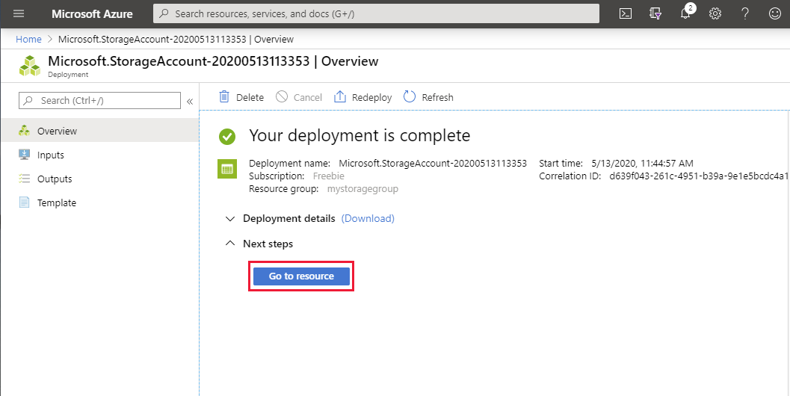

7. On the **Overview** page for the new storage account, select **Tables**.

    > [!div class="mx-imgBorder"]
    > 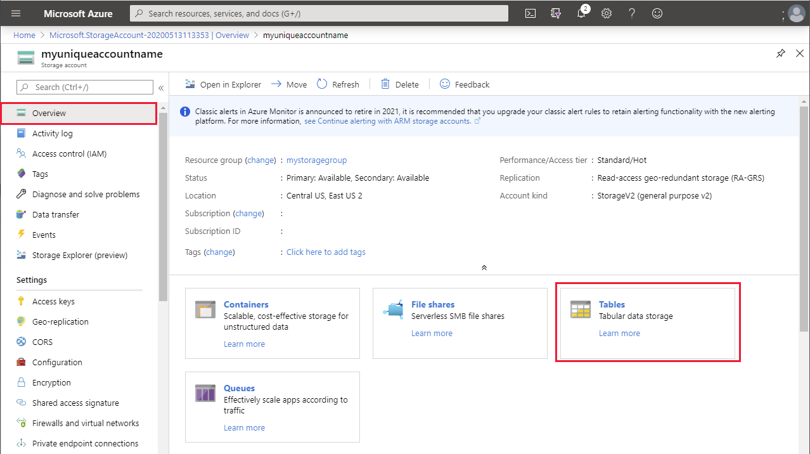

8. On the **Tables** page, select **+ Table**.

    > [!div class="mx-imgBorder"]
    > 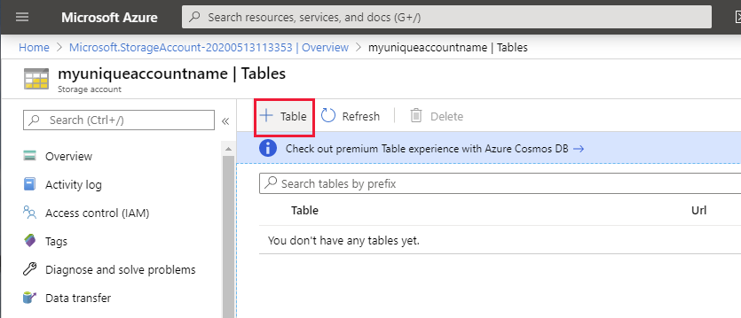

9. In the **Add table** dialog box, enter **testtable** for the name of the table, and then select **OK**.

    > [!div class="mx-imgBorder"]
    > 

10. When the new table has been created, select **Storage Explorer**.

    > [!div class="mx-imgBorder"]
    > 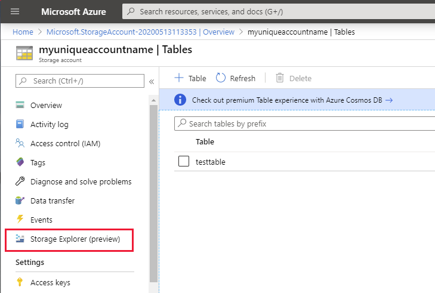

11. On the **Storage Explorer** page, expand **Tables**, and then select **testtable**. Select **Add** to insert a new entity into the table.

    > [!NOTE]
    > In **Storage Explorer**, rows are also called *entities*.

    > [!div class="mx-imgBorder"]
    > 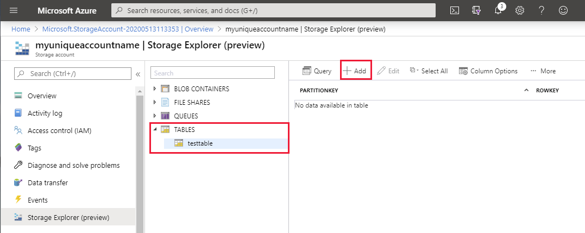

12. In the **Add Entity** dialog box, enter your own values for the **PartitionKey** and **RowKey** properties, and then select **Add Property**. Add a String property called **Name** and set the value to your name. Select **Add Property** again, and add a Double property (this is numeric) named **Age**, and set the value to your age. Select **Insert** to save the entity.

    > [!div class="mx-imgBorder"]
    > 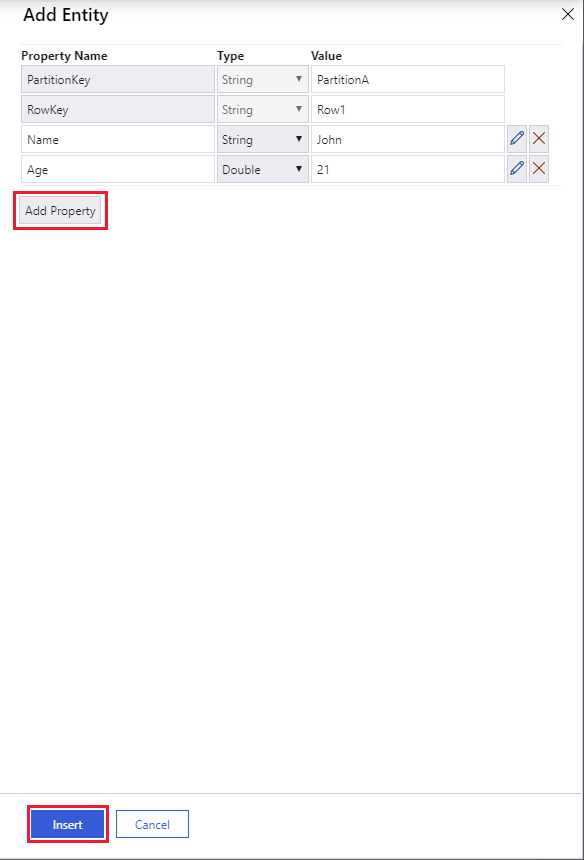

13. Verify that the new entity has been created. The entity should contain the values you specified, together with a timestamp that contains the date and time that the entity was created.

    > [!div class="mx-imgBorder"]
    > 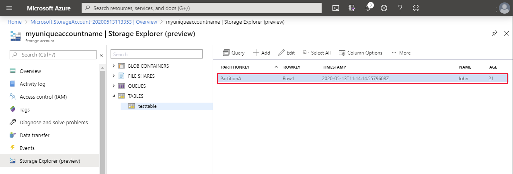

14. If time allows, experiment with creating additional entities. Not all entities must have the same properties. You can use the **Edit** function to modify the values in entity, and add or remove properties. The **Query** function enables you to find entities that have properties with a specified set of values. 