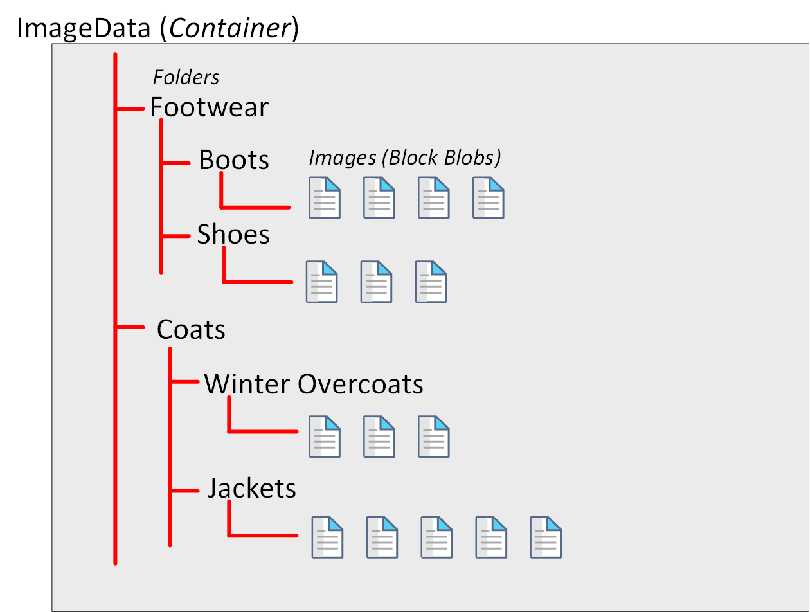
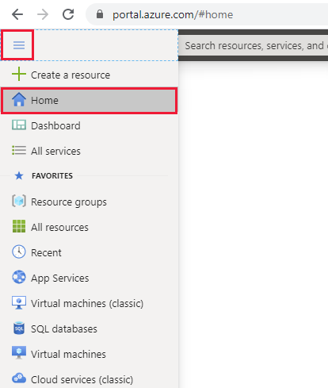
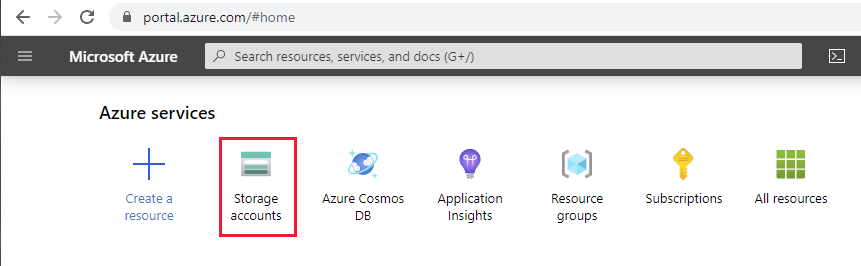
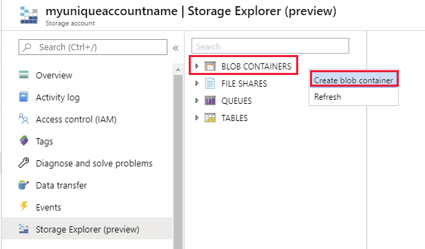
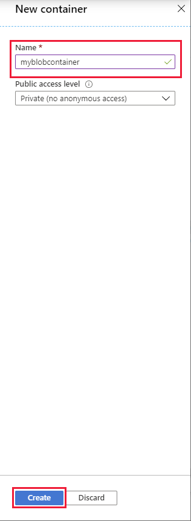
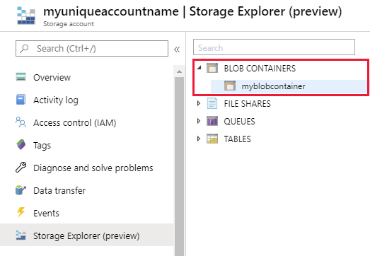
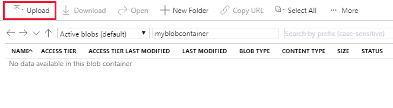
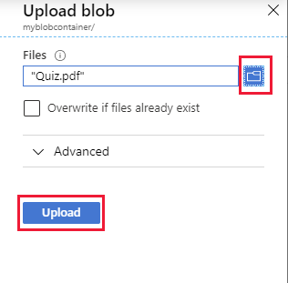

Many applications need to store large, binary data objects, such as images and video streams. Microsoft Azure virtual machines use blob storage for holding virtual machine disk images. These objects can be several hundreds of GB in size. 

> [!NOTE]
> The term *blob* is an acronym for *Binary Large OBject*.

## What is Azure Blob storage?

Azure Blob storage is a service that enables you to store massive amounts of unstructured data, or *blobs*, in the cloud. Like Azure Table storage, you create blobs using an Azure storage account.

Azure currently supports three different types of blob:

- *Block blobs*. A block blob is handled as a set of blocks. Each block can vary in size, up to 100 MB. A block blob can contain up to 50,000 blocks, giving a maximum size of over 4.7 TB. The block is the smallest amount of data that can be read or written as an individual unit. Block blobs are best used to store discrete, large, binary objects that change infrequently.

- *Page blobs*. A page blob is organized as a collection of fixed size 512-byte pages. A page blob is optimized to support random read and write operations; you can fetch and store data for a single page if necessary. A page blob can hold up to 8 TB of data. Azure uses page blobs to implement virtual disk storage for virtual machines.

- *Append blobs*. An append blob is a block blob optimized to support append operations. You can only add blocks to the end of an append blob; updating or deleting existing blocks isn't supported. Each block can vary in size, up to 4 MB. The maximum size of an append blob is just over 195 GB.

Inside an Azure storage account, you create blobs inside *containers*. A container provides a convenient way of grouping related blobs together, and you can organize blobs in a hierarchy of folders, similar to files in a file system on disk. You control who can read and write blobs inside a container at the container level.

> [!div class="mx-imgBorder"]
> 

Blob storage provides three access tiers, which help to balance access latency and storage cost:

- The *Hot* tier is the default. You use this tier for blobs that are accessed frequently. The blob data is stored on high-performance media.

- The *Cool* tier. This tier has lower performance and incurs reduced storage charges compared to the Hot tier. Use the Cool tier for data that is accessed infrequently. It's common for newly created blobs to be accessed frequently initially, but less so as time passes. In these situations, you can create the blob in the Hot tier, but migrate it to the Cool tier later. You can migrate a blob from the Cool tier back to the Hot tier.

- The *Archive* tier. This tier provides the lowest storage cost, but with increased latency. The Archive tier is intended for historical data that mustn't be lost, but is required only rarely. Blobs in the Archive tier are effectively stored in an offline state. Typical reading latency for the Hot and Cool tiers is a few milliseconds, but for the Archive tier, it can take hours for the data to become available. To retrieve a blob from the Archive tier, you must change the access tier to Hot or Cool. The blob will then be *rehydrated*. You can read the blob only when the rehydration process is complete.

You can create lifecycle management policies for blobs in a storage account. A lifecycle management policy can automatically move a blob from Hot to Cool, and then to the Archive tier, as it ages and is used less frequently (policy is based on the number of days since modification). A lifecycle management policy can also arrange to delete outdated blobs.

## Use cases and management benefits of using Azure Blob Storage

Common uses of Azure Blob Storage include:

- Serving images or documents directly to a browser, in the form of a static website. Visit [Static website hosting in Azure storage](https://docs.microsoft.com/azure/storage/blobs/storage-blob-static-website) for detailed information.
- Storing files for distributed access
- Streaming video and audio
- Storing data for backup and restore, disaster recovery, and archiving
- Storing data for analysis by an on-premises or Azure-hosted service

> [!NOTE]
> Azure Blob storage is also used as the basis for Azure Data Lake storage. You can use Azure Data Lake storage for performing *big data analytics*. For more information, visit [Introduction to Azure Data Lake Storage Gen2.](https://docs.microsoft.com/azure/storage/blobs/data-lake-storage-introduction)

To ensure availability, Azure Blob storage provides redundancy. Blobs are always replicated three times in the region in which you created your account, but you can also select geo-redundancy, which replicates your data in a second region (at additional cost).

Other features available with Azure Blob storage include:

- *Versioning*. You can maintain and restore earlier versions of a blob.
- *Soft delete*. This feature enables you to recover a blob that has been removed or overwritten, by accident or otherwise.
- *Snapshots*. A snapshot is a read-only version of a blob at a particular point in time.
- *Change Feed*. The change feed for a blob provides an ordered, read-only, record of the updates made to a blob. You can use the change feed to monitor these changes, and perform operations such as:

    - Update a secondary index, synchronize with a cache, search-engine, or any other content-management scenarios.
    - Extract business analytics insights and metrics, based on changes that occur to your objects, either in a streaming manner or batched mode.
    - Store, audit, and analyze changes to your objects, over any period of time, for security, compliance or intelligence for enterprise data management.
    - Build solutions to back up, mirror, or replicate object state in your account for disaster management or compliance.
    - Build connected application pipelines that react to change events or schedule executions based on created or changed objects.

## Create and view a block blob using the Azure portal

You can create block blobs using the Azure portal. Remember that blobs are stored in containers, and you create a container using a storage account. The following steps assume you've created the storage account described in the previous unit.

1. In the Azure portal, on the left-hand navigation menu, select **Home**.

    > [!div class="mx-imgBorder"]
    > 

2. On the home page, select **Storage accounts**.

    > [!div class="mx-imgBorder"]
    > 

3. On the **Storage accounts** page, select the storage account you created in the previous unit.

4. On the **Overview** page for your storage account, select **Storage Explorer**.

5. On the **Storage Explorer** page, right-click **BLOB CONTAINERS**, and then select **Create blob container**.

    > [!div class="mx-imgBorder"]
    > 

6. In the **New Container** dialog box, give your container a name, accept the default public access level, and then select **Create**.

    > [!div class="mx-imgBorder"]
    > 

7. In the **Storage Explorer** window, expand **BLOB CONTAINERS**, and then select your new blob container.

    > [!div class="mx-imgBorder"]
    > 

8. In the blobs window, select **Upload**.

    > [!div class="mx-imgBorder"]
    > 

9. In the **Upload blob** dialog box, use the files button to pick a file of your choice on your computer, and then select **Upload**

    > [!div class="mx-imgBorder"]
    > 

10. When the upload has completed, close the **Upload blob** dialog box. Verify that the block blob appears in your container.

    > [!div class="mx-imgBorder"]
    > 

11. If you have time, you can experiment uploading other files as block blobs. You can also download blobs back to your computer using the **Download** button.