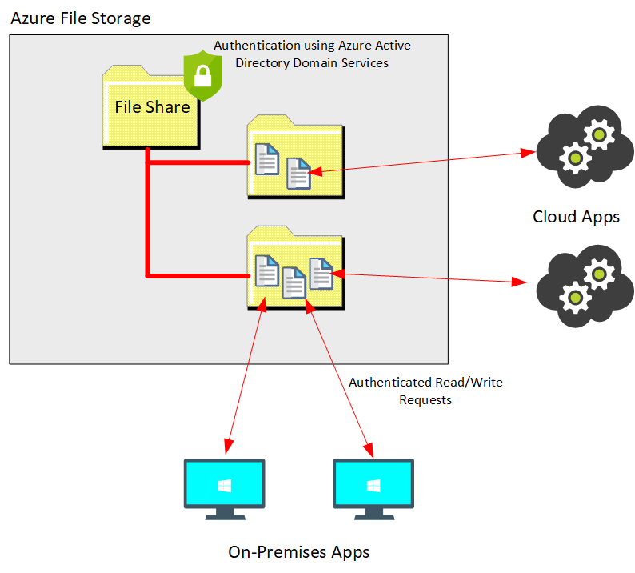
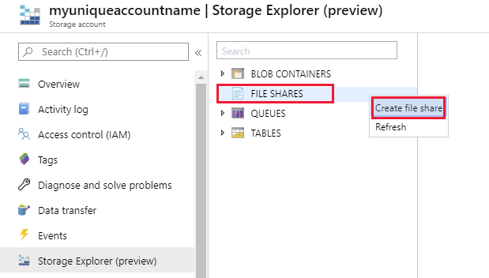
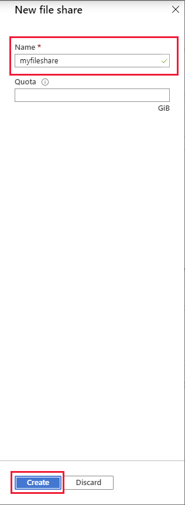
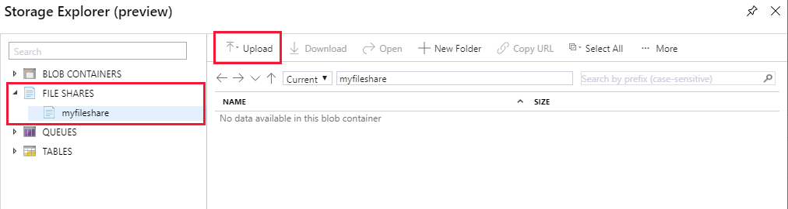
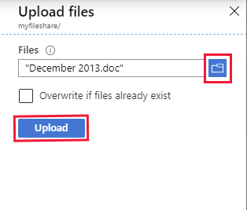
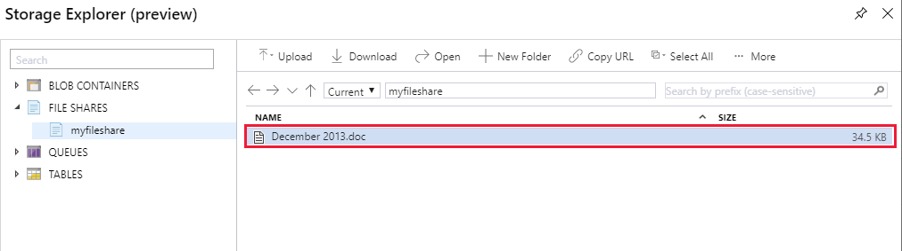

Many on-premises systems comprising a network of in-house computers make use of file shares. A file share enables you to store a file on one computer, and grant access to that file to users and applications running on other computers. This strategy can work well for computers in the same local area network, but doesn't scale well as the number of users increases, or if users are located at different sites.

## What is Azure File Storage?

Azure File Storage enables you to create files shares in the cloud, and access these file shares from anywhere with an internet connection. Azure File Storage exposes file shares using the Server Message Block 3.0 (SMB) protocol. This is the same file sharing protocol used by many existing on-premises applications. These applications should continue to work unchanged if you migrate your file shares to the cloud. The applications can be running on-premises, or in the cloud. You can control access to shares in Azure File Storage using authentication and authorization services available through Azure Active Directory Domain Services.

> [!div class="mx-imgBorder"]
> 

You create Azure File storage in a storage account. Azure File Storage enables you to share up to 100 TB of data in a single storage account. This data can be distributed across any number of file shares in the account. The maximum size of a single file is 1 TiB, but you can set quotas to limit the size of each share below this figure. Currently, Azure File Storage supports up to 2000 concurrent connections per shared file.

Once you've created a storage account, you can upload files to Azure File Storage using the Azure portal, or tools such as the *AzCopy* utility. You can also use the Azure File Sync service to synchronize locally cached copies of shared files with the data in Azure File Storage.

Azure File Storage offers two performance tiers. The *Standard* tier uses hard disk-based hardware in a datacenter, and the *Premium* tier uses solid-state disks. The *Premium* tier offers greater throughput, but is charged at a higher rate.

## Use cases and management benefits of using Azure File Storage

Azure File Storage is designed to support many scenarios, including the following:

- Migrate existing applications to the cloud.

    Many existing applications access data using file-based APIs, and are designed to share data using SMB file shares. Azure File Storage enables you to migrate your on-premises file or file share-based applications to Azure without having to provision or manage highly available file server virtual machines.

- Share server data across on-premises and cloud.

    Customers can now store server data such as log files, event data, and backups in the cloud to leverage the availability, durability, scalability, and geo redundancy built into the Azure storage platform. With encryption in SMB 3.0, you can securely mount Azure File Storage shares from anywhere. Applications running in the cloud can share data with on-premises applications using the same consistency guarantees implemented by on-premises SMB servers.

- Integrate modern applications with Azure File Storage.

    By leveraging the modern REST API that Azure File Storage implements in addition to SMB 3.0, you can integrate legacy applications with modern cloud applications, or develop new file or file share-based applications.

- Simplify hosting High Availability (HA) workload data.

    Azure File Storage delivers continuous availability so it simplifies the effort to host HA workload data in the cloud. The persistent handles enabled in SMB 3.0 increase availability of the file share, which makes it possible to host applications such as SQL Server and IIS in Azure with data stored in shared file storage.

> [!NOTE] 
> Don't use Azure File Storage for files that can be written by multiple concurrent processes simultaneously. Multiple writers require careful synchronization, otherwise the changes made by one process can be overwritten by another. The alternative solution is to lock the file as it is written, and then release the lock when the write operation is complete. However, this approach can severely impact concurrency and limit performance.

Azure Files Storage is a fully managed service. Your shared data is replicated locally within a region, but can also be geo-replicated to a second region.

Azure aims to provide up to 300 MB/second of throughput for a single Standard file share, but you can increase throughput capacity by creating a Premium file share, for additional cost.

All data is encrypted at rest, and you can enable encryption for data in-transit between Azure File Storage and your applications.

For additional information on managing and planning to use Azure File Storage, read [Planning for an Azure Files deployment](https://docs.microsoft.com/azure/storage/files/storage-files-planning).

## Create an Azure storage file share using the Azure portal

You can create Azure storage file shares using the Azure portal. The following steps assume you've created the storage account described in unit 2.

1. In the Azure portal, on the hamburger menu, select **Home**.

2. On the home page, select **Storage accounts**.

3. On the **Storage accounts** page, select the storage account you created in the unit 2.

4. On the **Overview** page for your storage account, select **Storage Explorer**.

5. On the **Storage Explorer** page, right-click **FILE SHARES**, and then select **Create file share**.

    > [!div class="mx-imgBorder"]
    > 

6. In the **New file share** dialog box, enter a name for your file share, leave **Quota** empty, and then select **Create**.

    > [!div class="mx-imgBorder"]
    > 

7. In the **Storage Explorer** window, expand **FILE SHARES**, and select your new file share, and then select **Upload**.

    > [!TIP]
    > If your new file share doesn't appear, right-click **FILE SHARES**, and then select **Refresh**.

    > [!div class="mx-imgBorder"]
    > 

8. In the **Upload files** dialog box, use the files button to pick a file of your choice on your computer, and then select **Upload**

    > [!div class="mx-imgBorder"]
    > 

9. When the upload has completed, close the **Upload files** dialog box. Verify that the file appears in file share.

    > [!TIP]
    > If the file doesn't appear, right-click **FILE SHARES**, and then select **Refresh**.

    > [!div class="mx-imgBorder"]
    > 