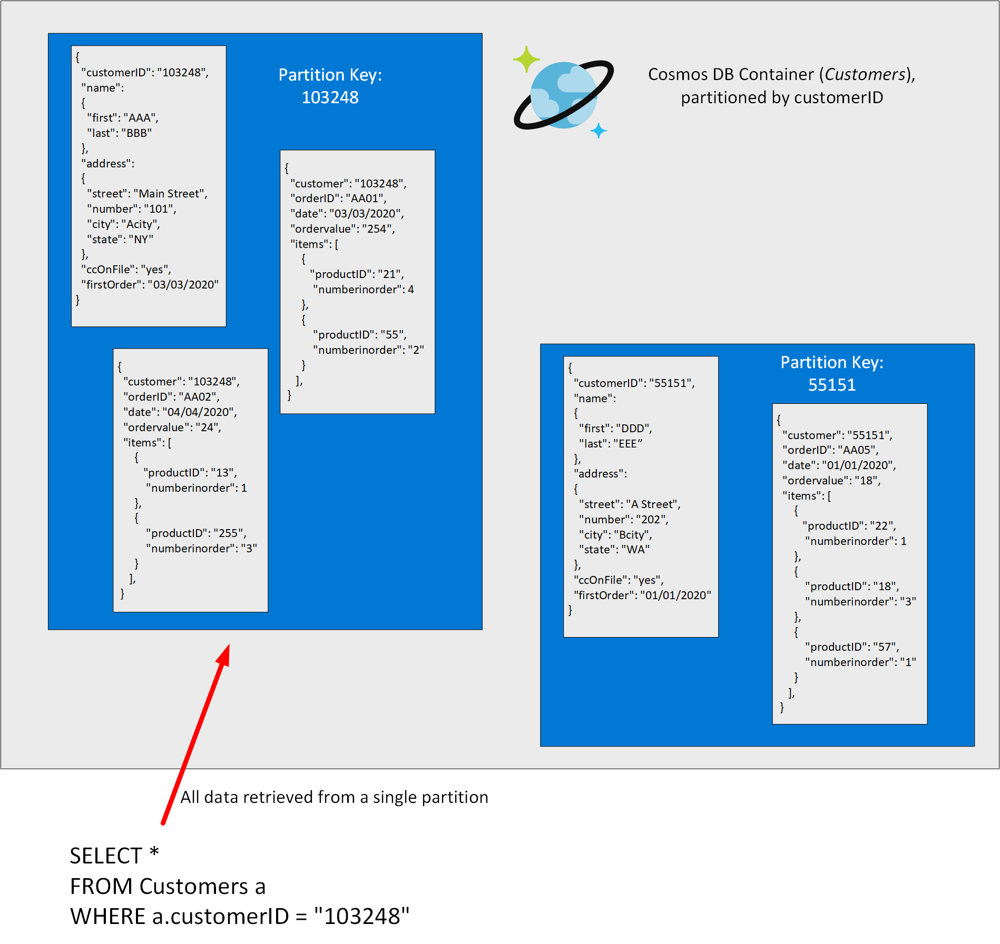

Tables, blobs, and files are all specialized types of storage, aimed at helping to solve specific problems. Reading and writing a table is a significantly different task from storing data in a blob, or processing a file. Sometimes you require a more generalized solution, that enables you to store and query data more easily, without having to worry about the exact mechanism for performing these operations. This is where a database management system proves useful.

Relational databases store data in relational tables, but sometimes the structure imposed by this model can be too rigid, and often leads to poor performance unless you spend time implementing detailed tuning. Other models, collectively known as *NoSQL* databases exist. These models store data in other structures, such as documents, graphs, key-value stores, and column family stores.

## What is Azure Cosmos DB?

Azure Cosmos DB is a multi-model NoSQL database management system. Cosmos DB manages data as a partitioned set of documents. A document is a collection of fields, identified by a key. The fields in each document can vary, and a field can contain child documents. Many document databases use JSON (JavaScript Object Notation) to represent the document structure. In this format, the fields in a document are enclosed between braces, { and }, and each field is prefixed with its name. The example below shows a pair of documents representing customer information. In both cases, each customer document includes child documents containing the name and address, but the fields in these child documents vary between customers.

```json
## Document 1 ##
{
  "customerID": "103248",
  "name": 
  { 
    "first": "AAA", 
    "last": "BBB" 
  },
  "address": 
  {
    "street": "Main Street",
    "number": "101",
    "city": "Acity",
    "state": "NY" 
  },
  "ccOnFile": "yes",
  "firstOrder": "02/28/2003"
}

## Document 2 ##
{
  "customerID": "103249",
  "name": 
  { 
    "title": "Mr",
    "forename": "AAA", 
    "lastname": "BBB" 
  },
  "address": 
  {
    "street": "Another Street",
    "number": "202",
    "city": "Bcity",
    "county": "Gloucestershire",
    "country-region": "UK" 
  },
  "ccOnFile": "yes"
}
```

A document can hold up to 2 MB of data, including small binary objects. If you need to store larger blobs as part of a document, use Azure Blob storage, and add a reference to the blob in the document.

Cosmos DB provides APIs that enable you to access these documents using a set of well-known interfaces. 

> [!NOTE]
> An *API* is an *Application Programming Interface*. Database management systems (and other software frameworks) provide a set of APIs that developers can use to write programs that need to access data. The APIs will often be different for different database management systems.

The APIs that Cosmos DB currently supports include:

- *SQL API*. This interface provides a SQL-like query language over documents, enable to identify and retrieve documents using *SELECT* statements. The example below finds the address for customer 103248 in the documents shown above:

    ```SQL
    SELECT a.address 
    FROM customers a
    WHERE a.customerID = "103248"
    ```
- *Table API*. This interface enables you to use the Azure Table Storage API to store and retrieve documents. The purpose of this interface is to enable you to switch from Table Storage to Cosmos DB without requiring that you modify your existing applications.

- *MongoDB API*. MongoDB is another well-known document database, with its own programmatic interface. Many organizations run MongoDB on-premises. You can use the MongoDB API for Cosmos DB to enable a MongoDB application to run unchanged against a Cosmos DB database. You can migrate the data in the MongoDB database to Cosmos DB running in the cloud, but continue to run your existing applications to access this data.

- *Cassandra API*. Cassandra is a column family database management system. This is another database management system that many organizations run on-premises. The Cassandra API for Cosmos DB provides a Cassandra-like programmatic interface for Cosmos DB. Cassandra API requests are mapped to Cosmos DB document requests. As with the MongoDB API, the primary purpose of the Cassandra API is to enable you to quickly migrate Cassandra databases and applications to Cosmos DB.

- *Gremlin API*. The Gremlin API implements a graph database interface to Cosmos DB. A graph is a collection of data objects and directed relationships. Data is still held as a set of documents in Cosmos DB, but the Gremlin API enables you to perform graph queries over data. Using the Gremlin API you can walk through the objects and relationships in the graph to discover all manner of complex relationships, such as "What is the name of the pet of Sam's landlord?" in the graph shown below.

    > [!div class="mx-imgBorder"]
    > 

> [!NOTE]
> The primary purpose of the Table, MongoDB, Cassandra, and Gremlin APIs is to support existing applications. If you are building a new application and database, you should use the SQL API.

Documents in a Cosmos DB database are organized into containers. The documents in a container are grouped together into partitions. A partition holds a set of documents that share a common partition key. You designate one of the fields in your documents as the partition key. You should select a partition key that collects all related documents together. This approach helps to reduce the amount of I/O (disk reads) that queries might need to perform when retrieving a set of documents for a given entity. For example, in a document database for an ecommerce system recording the details of customers and the orders they've placed, you could partition the data by customer ID, and store the customer and order details for each customer in the same partition. To find all the information and orders for a customer, you simply need to query that single partition:

> [!div class="mx-imgBorder"]
> 

There's a superficial similarity between a Cosmos DB container and a table in Azure Table storage: in both cases, data is partitioned and documents (rows in a table) are identified by a unique ID within a partition. However, the similarity ends there. Unlike Azure Table storage, documents in a Cosmos DB partition aren't sorted by ID. Instead, Cosmos DB maintains a separate index. This index contains not only the document IDs, but also tracks the value of every other field in each document. This index is created and maintained automatically. This index enables you to perform queries that specify criteria referencing any fields in a container, without incurring the need to scan the entire partition to find that data. For a detailed description of how Cosmos DB indexing works, read [Indexing in Azure Cosmos DB - Overview.](https://docs.microsoft.com/azure/cosmos-db/index-overview)

## Use cases and management benefits of using Azure Cosmos DB

Cosmos DB is a highly scalable database management system. Cosmos DB automatically allocates space in a container for your partitions, and each partition can grow up to 10 GB in size. Indexes are created and maintained automatically. There's virtually no administrative overhead.

To ensure availability, all databases are replicated within a single region. This replication is transparent, and failover from a failed replica is automatic. Cosmos DB guarantees 99.99% high availability. 

Additionally, you can choose to replicate data across regions, at additional cost. This feature enables you to place copies of data anywhere in the world, and enable applications to connect to the copy of the data that happens to be the closest, reducing query latency. All replicas are synchronized, although there may be a small window while updates are transmitted and applied. The multi-master replication protocol supports five well-defined consistency choices - strong, bounded staleness, session, consistent prefix, and eventual. For more information, see [Consistency levels in Azure Cosmos DB](https://docs.microsoft.com/azure/cosmos-db/consistency-levels).

Cosmos DB guarantees less than 10-ms latencies for both reads (indexed) and writes at the 99th percentile, all around the world. This capability enables sustained ingestion of data and fast queries for highly responsive apps.

Cosmos DB is certified for a wide array of compliance standards. Additionally, all data in Cosmos DB is encrypted at rest and in motion. Cosmos DB provides row level authorization and adheres to strict security standards.

Cosmos DB is a foundational service in Azure. Cosmos DB has been used by many of Microsoft's products for mission critical applications at global scale, including Skype, Xbox, Microsoft 365, Azure, and many others. Cosmos DB is highly suitable for the following scenarios:

- *IoT and telematics*. These systems typically ingest large amounts of data in frequent bursts of activity. Cosmos DB can accept and store this information very quickly. The data can then be used by analytics services, such as Azure Machine Learning, Azure HDInsight, and Power BI. Additionally, you can process the data in real-time using Azure Functions that are triggered as data arrives in the database.

- *Retail and marketing*. Microsoft uses CosmosDB for its own e-commerce platforms that run as part of Windows Store and Xbox Live. It's also used in the retail industry for storing catalog data and for event sourcing in order processing pipelines.

- *Gaming*. The database tier is a crucial component of gaming applications. Modern games perform graphical processing on mobile/console clients, but rely on the cloud to deliver customized and personalized content like in-game stats, social media integration, and high-score leaderboards. Games often require single-millisecond latencies for reads and write to provide an engaging in-game experience. A game database needs to be fast and be able to handle massive spikes in request rates during new game launches and feature updates.

- *Web and mobile applications*. Azure Cosmos DB is commonly used within web and mobile applications, and is well suited for modeling social interactions, integrating with third-party services, and for building rich personalized experiences. The Cosmos DB SDKs can be used to build rich iOS and Android applications using the popular Xamarin framework.

For additional information about uses for Cosmos DB, read [Common Azure Cosmos DB use cases](https://docs.microsoft.com/azure/cosmos-db/use-cases).