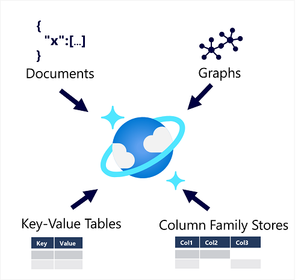

Azure Cosmos DB supports multiple application programming interfaces (APIs) that enable developers to use the programming semantics of many common kinds of data store to work with data in a Cosmos DB database. The internal data structure is abstracted, enabling developers to use Cosmos DB to store and query data using APIs with which they're already familiar.

> [!NOTE]
> An *API* is an *Application Programming Interface*. Database management systems (and other software frameworks) provide a set of APIs that developers can use to write programs that need to access data. The APIs vary for different database management systems.

Cosmos DB uses indexes and partitioning to provide fast read and write performance and can scale to massive volumes of data. You can enable multi-region writes, adding the Azure regions of your choice to your Cosmos DB account so that globally distributed users can each work with data in their local replica.

## When to use Cosmos DB

Cosmos DB is a highly scalable database management system. Cosmos DB automatically allocates space in a container for your partitions, and each partition can grow up to 10 GB in size. Indexes are created and maintained automatically. There's virtually no administrative overhead.

Cosmos DB is a foundational service in Azure. Cosmos DB has been used by many of Microsoft's products for mission critical applications at global scale, including Skype, Xbox, Microsoft 365, Azure, and many others. Cosmos DB is highly suitable for the following scenarios:

- *IoT and telematics*. These systems typically ingest large amounts of data in frequent bursts of activity. Cosmos DB can accept and store this information quickly. The data can then be used by analytics services, such as Azure Machine Learning, Azure HDInsight, and Power BI. Additionally, you can process the data in real-time using Azure Functions that are triggered as data arrives in the database.

- *Retail and marketing*. Microsoft uses Cosmos DB for its own e-commerce platforms that run as part of Windows Store and Xbox Live. It's also used in the retail industry for storing catalog data and for event sourcing in order processing pipelines.

- *Gaming*. The database tier is a crucial component of gaming applications. Modern games perform graphical processing on mobile/console clients, but rely on the cloud to deliver customized and personalized content like in-game stats, social media integration, and high-score leaderboards. Games often require single-millisecond latencies for reads and write to provide an engaging in-game experience. A game database needs to be fast and be able to handle massive spikes in request rates during new game launches and feature updates.

- *Web and mobile applications*. Azure Cosmos DB is commonly used within web and mobile applications, and is well suited for modeling social interactions, integrating with third-party services, and for building rich personalized experiences. The Cosmos DB SDKs can be used to build rich iOS and Android applications using the popular Xamarin framework.

For additional information about uses for Cosmos DB, read [Common Azure Cosmos DB use cases](/azure/cosmos-db/use-cases).
