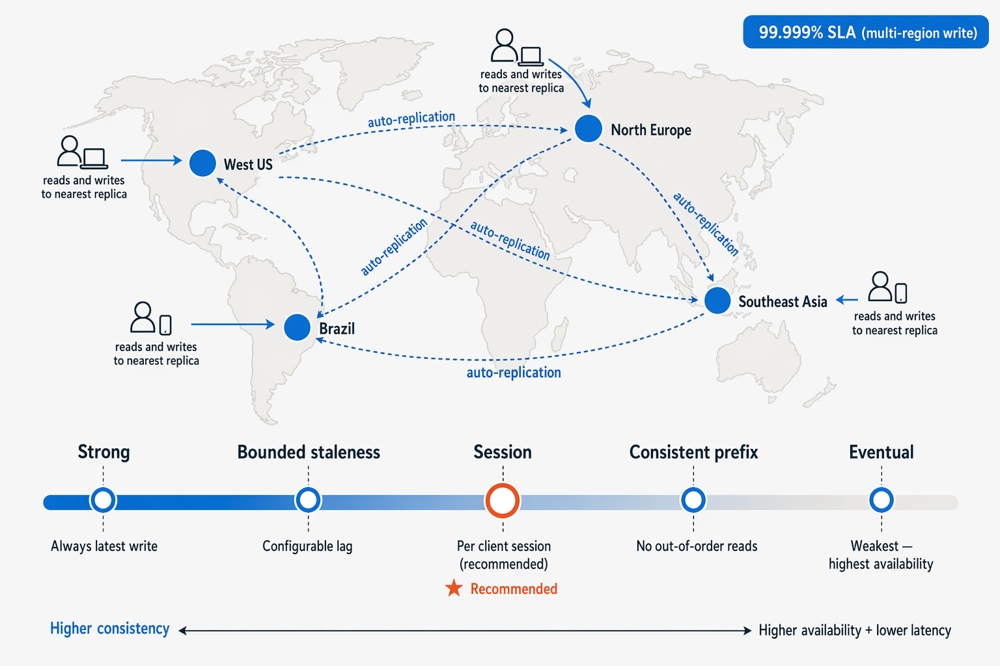
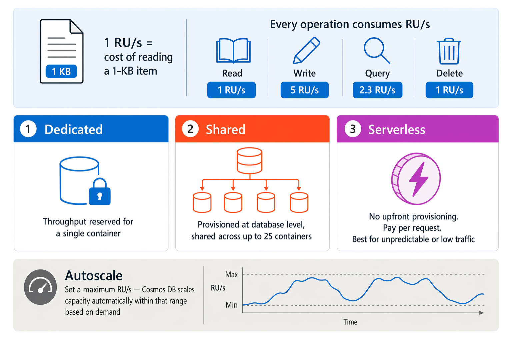

::: zone pivot="video"

>[!VIDEO https://learn-video.azurefd.net/vod/player?id=b9f3e01c-056b-4c50-86e0-35b10d43ae01]

> [!TIP]
> See the **Text and images** tab for more details!

::: zone-end

::: zone pivot="text"

In the previous unit, you learned that Azure Cosmos DB is a highly scalable cloud database service for NoSQL data. In this unit, you'll explore what makes it different from traditional relational databases, how it organizes data internally, and when it's the right choice for your application.

## What is Azure Cosmos DB?

**Azure Cosmos DB** is a fully managed NoSQL database service on Azure—a platform-as-a-service (PaaS) offering. Microsoft handles all of the underlying infrastructure: server provisioning, patching, updates, and backups. You focus on your application logic while Cosmos DB handles the operational overhead.

Cosmos DB is **schema-agnostic**. Items stored in the same container don't need to share the same structure. One item might have five properties; another in the same container could have 15 entirely different ones. This flexibility makes Cosmos DB well suited to applications where data shapes change over time or vary between records.

Microsoft uses Cosmos DB internally for some of its most demanding services, including Xbox Live, Microsoft 365, and core parts of Azure. Those services collectively handle billions of operations per day, which gives you a sense of the scale Cosmos DB is built for.

## How Azure Cosmos DB organizes data

Cosmos DB uses a four-level resource hierarchy to organize your data:

- **Account**: The top-level Azure resource. A single account can contain unlimited databases.
- **Database**: A logical namespace that groups related containers together.
- **Container**: The primary unit of storage and scaling. You configure the partition key, throughput, indexing policy, and an optional time-to-live (TTL) at the container level.
- **Items**: Individual data entities stored inside a container. Depending on which API you use, items may be called documents, rows, nodes, or edges.

The **partition key** is a property you choose to distribute data across logical partitions. Each logical partition can hold up to 20 GB of data. A well-chosen partition key—one with many distinct values and an even spread of data across those values—is important for keeping throughput balanced as the database grows.

Cosmos DB automatically creates and maintains indexes on all item properties by default. You don't need to define a schema upfront or manage indexes manually; the service handles both.

## Global distribution and performance

Cosmos DB is built for global distribution. Add Azure regions to your account at any time, and the service automatically replicates your data to each one. Users in different locations read from and write to the nearest regional replica, which keeps latency low no matter where they are.

Multi-region write accounts provide high availability guarantees. At the 99th percentile, reads typically complete in around 4 milliseconds and writes in around 5 milliseconds.

Because replicas exist in multiple regions, you need to decide how consistent those replicas must be with each other. Cosmos DB offers five **consistency levels** so you can tune that trade-off:

| Consistency level     | Description                                                                                   |
| --------------------- | --------------------------------------------------------------------------------------------- |
| **Strong**            | Every read reflects the most recent write.                                                    |
| **Bounded staleness** | Reads lag behind writes by a configurable interval (time or version count).                   |
| **Session**           | Consistency is guaranteed within a single client session. This is the most widely used level. |
| **Consistent prefix** | Reads never see out-of-order writes but may see stale data.                                   |
| **Eventual**          | Replicas converge over time; the weakest guarantee but the highest availability.              |

For most transactional applications, Session consistency is the recommended starting point.

## Throughput modes and pricing

Cosmos DB measures capacity in **Request Units per second (RU/s)**. One RU/s roughly equals the cost of reading a 1-KB item. Every operation—reads, writes, queries, and deletes—consumes some number of RU/s, giving you a single metric to reason about both performance and cost.

Three throughput modes are available:

| Throughput mode | Description                                                                                                    |
| --------------- | -------------------------------------------------------------------------------------------------------------- |
| **Dedicated**   | Throughput is reserved exclusively for a single container.                                                     |
| **Shared**      | Throughput is provisioned at the database level and shared across up to 25 containers.                         |
| **Serverless**  | No throughput to provision upfront; you pay per request. Best for workloads with unpredictable or low traffic. |

> [!NOTE]
> Serverless accounts are limited to a single Azure region. If your application requires global distribution across multiple regions, use a provisioned throughput account instead.

The **autoscale** option lets you set a maximum RU/s, and Cosmos DB adjusts capacity automatically within that range based on actual demand.

## When to use Cosmos DB

Cosmos DB is a strong fit for applications that need flexible schema, global reach, and consistent low latency:

- **IoT and telemetry**: Fast ingestion of high-frequency device data, available for near-real-time processing.
- **Gaming**: Player profiles, leaderboards, and in-game stats that require single-digit millisecond response times.
- **Retail and e-commerce**: Product catalogs, shopping carts, and order pipelines at any scale.
- **Web and mobile apps**: Personalized user experiences, social features, and third-party integrations.

Some workloads aren't a good fit. If your application depends on complex multi-table joins, Azure SQL Database is better suited. For large-scale historical analytics, consider Microsoft Fabric or Azure Synapse Analytics instead.

In the next unit, you'll look at the different APIs Cosmos DB supports and how each one lets you work with your data using familiar tools and query languages.

::: zone-end
