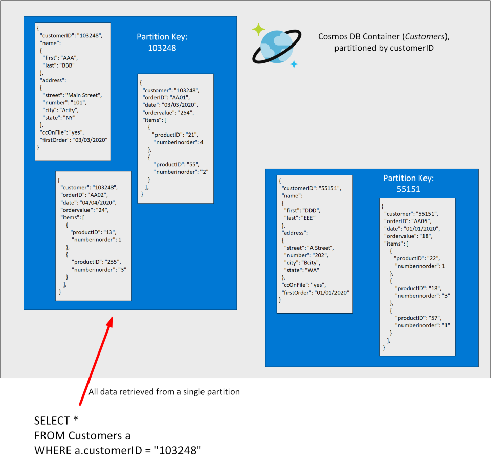
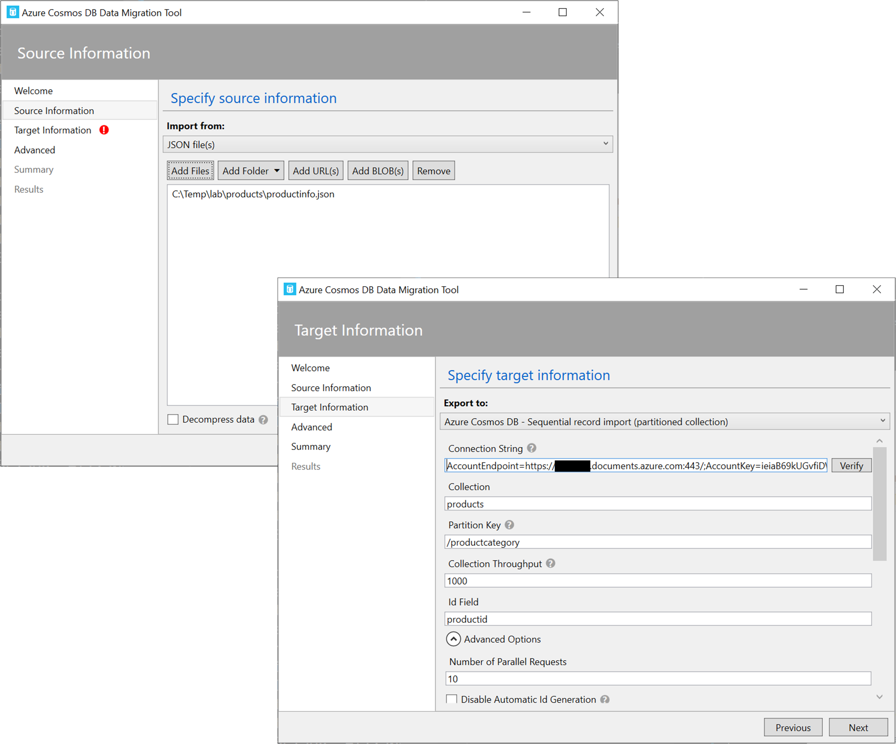
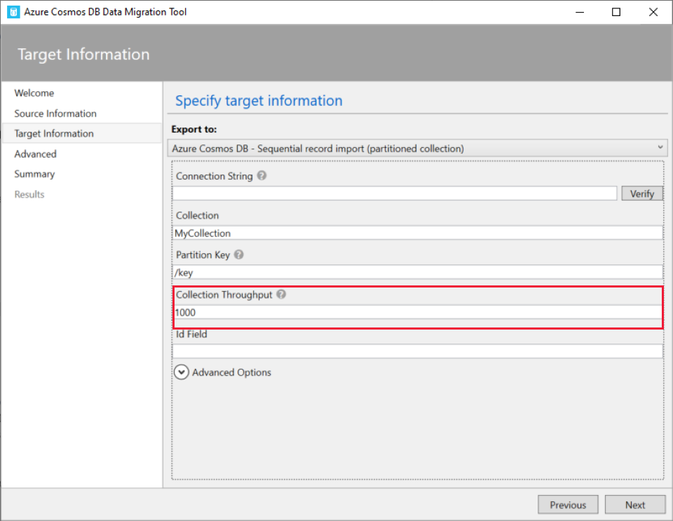
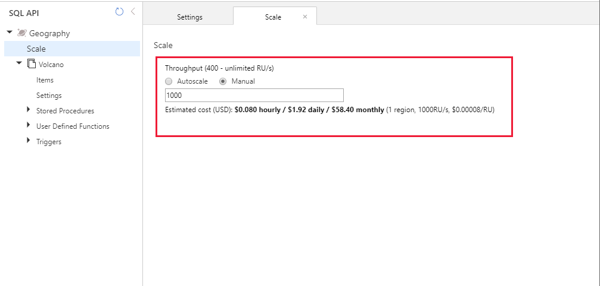

Azure Cosmos DB is a NoSQL database management system. It's compatible with some existing NoSQL systems, including MongoDB and Cassandra. In the Contoso scenario, you've created a Cosmos DB database for holding information about the quantity of items in stock. You now need to understand how to populate this database, and how to query it.

In this unit, you'll review how Cosmos DB stores data. Then you'll learn how to upload data to a Cosmos DB database, and configure Cosmos DB to support bulk loading.

## What is Azure Cosmos DB?

Cosmos DB manages data as set of documents. A document is a collection of fields, identified by a key. The fields in each document can vary, and a field can contain child documents. Cosmos DB uses JSON (JavaScript Object Notation) to represent the document structure. In this format, the fields in a document are enclosed between braces, { and }, and each field is prefixed with its name. The example below shows a pair of documents representing customer information. In both cases, each customer document includes child documents containing the name and address, but the fields in these child documents vary between customers.

```json
## Document 1 ##
{
  "customerID": "103248",
  "name": 
  { 
    "first": "AAA", 
    "last": "BBB" 
  },
  "address": 
  {
    "street": "Main Street",
    "number": "101",
    "city": "Acity",
    "state": "NY" 
  },
  "ccOnFile": "yes",
  "firstOrder": "02/28/2003"
}

## Document 2 ##
{
  "customerID": "55151",
  "name": 
  { 
    "title": "Mr",
    "forename": "DDD", 
    "lastname": "EEE" 
  },
  "address": 
  {
    "street": "Another Street",
    "number": "202",
    "city": "Bcity",
    "county": "Gloucestershire",
    "country-region": "UK" 
  },
  "ccOnFile": "yes"
}
```

Documents in a Cosmos DB database are organized into containers. The documents in a container are grouped together into partitions. A partition holds a set of documents that share a common partition key. You designate one of the fields in your documents as the partition key. Select a partition key that collects all related documents together. This approach helps to reduce the amount of disk read operations that queries use when retrieving a set of documents for a given entity. For example, in a document database for an ecommerce system recording the details of customers and the orders they've placed, you could partition the data by customer ID, and store the customer and order details for each customer in the same partition. To find all the information and orders for a customer, you simply need to query that single partition:

> [!div class="mx-imgBorder"]
> 

Cosmos DB is a foundational service in Azure. Cosmos DB is used by many of Microsoft's products for mission critical applications running at global scale, including Skype, Xbox, Microsoft 365, and Azure. Cosmos DB is highly suitable for IoT and telematics, Retail and marketing, Gaming, and Web and mobile applications. For additional information about uses for Cosmos DB, read [Common Azure Cosmos DB use cases](https://docs.microsoft.com/azure/cosmos-db/use-cases).

## What are Cosmos DB APIs?

You access the data in a Cosmos DB database through a set of commands and operations, collectively known as an *API*, or *Application Programming Interface*. Cosmos DB provides its own native API, called the *SQL API*. This API provides a SQL-like query language over documents, that enables you to retrieve documents using *SELECT* statements. The example below finds the address for customer 103248 in the documents shown above:

```SQL
SELECT c.address 
FROM customers c
WHERE c.customerID = "103248"
```

Cosmos DB also provides other APIs that enable you to access these documents using the command sets of other NoSQL database management systems. These APIs are: 

- *Table API*. This interface enables you to use the Azure Table Storage API to store and retrieve documents. The purpose of this interface is to enable you to switch from Table Storage to Cosmos DB without requiring that you modify your existing applications.

- *MongoDB API*. MongoDB is another well-known document database, with its own programmatic interface. Many organizations use on-premises. You can use the MongoDB API for Cosmos DB to enable a MongoDB application to run unchanged against a Cosmos DB database. You can migrate the data in the MongoDB database to Cosmos DB running in the cloud, but continue to run your existing applications to access this data.

- *Cassandra API*. Cassandra is a column family database management system. This is another database management system that many organizations run on-premises. The Cassandra API for Cosmos DB provides a Cassandra-like programmatic interface for Cosmos DB. Cassandra API requests are mapped to Cosmos DB document requests. As with the MongoDB API, the primary purpose of the Cassandra API is to enable you to quickly migrate Cassandra databases and applications to Cosmos DB.

- *Gremlin API*. The Gremlin API implements a graph database interface to Cosmos DB. A graph is a collection of data objects and directed relationships. Data is still held as a set of documents in Cosmos DB, but the Gremlin API enables you to perform graph queries over the data. Using the Gremlin API you can walk through the objects and relationships in the graph to discover all manner of complex relationships, such as "What is the name of the pet of Sam's landlord?" in the graph shown below.

    > [!div class="mx-imgBorder"]
    > 

The principal use of the Table, MongoDB, and Cassandra APIs is to support existing applications written using these data stores. If you're building a new application and database, you should use the SQL API or Gremlin API.

## Perform data operations in Cosmos DB

Cosmos DB provides several options for uploading data to a Cosmos DB database, and querying that data. You can:

- Use **Data Explorer** in the Azure portal to run ad-hoc queries. You can also use this tool to load data, but you can only load one document at a time. The data load functionality is primarily aimed at uploading a small number of documents (up to 2 MB in total size) for test purposes, rather than importing large quantities of data.
- Use the [Cosmos DB Data Migration tool](https://docs.microsoft.com/azure/cosmos-db/import-data) to perform a bulk-load or transfer of data from another data source.
- Use [Azure Data Factory](https://docs.microsoft.com/azure/data-factory/connector-azure-cosmos-db) to import data from another source.
- Write a custom application that imports data using the Cosmos DB [BulkExecutor](https://docs.microsoft.com/azure/cosmos-db/tutorial-sql-api-dotnet-bulk-import) library. This strategy is beyond the scope of this module.
- Create your own application that uses the functions available through the [Cosmos DB SQL API client library](https://docs.microsoft.com/azure/cosmos-db/create-sql-api-dotnet-v4) to store data. This approach is also beyond the scope of this module.

### Load data using the Cosmos DB Data Migration tool

You can use the Data Migration tool to import data to Azure Cosmos DB from a variety of sources, including:

- JSON files
- MongoDB
- SQL Server
- CSV files
- Azure Table storage
- Amazon DynamoDB
- HBase
- Azure Cosmos containers

The Data Migration tool is available as a [download from GitHub](https://aka.ms/csdmtool). The tool guides you through the process of migrating data into a Cosmos DB database. You're prompted for the source of the data (one of the items listed above), and the destination (the Cosmos DB database and container). The tool can either populate an existing container, or create a new one if the specified container doesn't already exist.

> [!NOTE]
> You can also use the Data Migration tool to export data from a Cosmos DB container to a JSON file, either held locally or in Azure Blob storage

> [!div class="mx-imgBorder"]
> 

### Configure Cosmos DB to support bulk loading

If you have a large amount of data, the Data Migration Tool can make use of multiple concurrent threads to batch your data into chunks and load the chunks in parallel. Each thread acts as a separate client connection to the database. Bulk loading can become a write-intensive task.

When you upload data to a container, if you have insufficient throughput capacity configured to support the volume of write operations occurring concurrently, some of the upload requests will fail. Cosmos DB reports an HTTP 429 error (Request rate is large). Therefore, if you're planning on performing a large data import, you should increase the throughput resources available to the target Cosmos container. If you're using the Data Migration Tool to create the container as well as populate it, the **Target information** page enables you to specify the throughput resources to allocate.

> [!div class="mx-imgBorder"]
> 

If you've already created the container, use the **Scale** settings of the database in the Data Explorer page for your database in the Azure portal to specify the maximum throughput, or set the throughput to **Autoscale**.


> [!div class="mx-imgBorder"]
> 

Once the data has been loaded, you may be able to reduce the throughput resources to lower the costs of the database.


