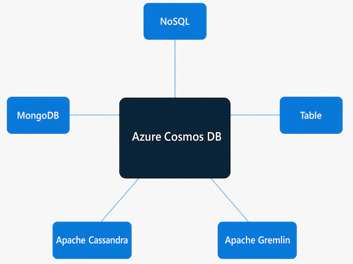

In the previous unit, you explored what Azure Cosmos DB is and how it organizes data. One of its most practical characteristics is that it doesn't lock you into a single query language or data model. Instead, Cosmos DB exposes multiple wire-protocol-compatible APIs so developers use familiar tools, libraries, and syntax to work with their data — even when migrating an existing application.

## Why Cosmos DB supports multiple APIs

When you create a Cosmos DB account, you choose which API to use. That choice determines how your application interacts with the database: what data format it sends, what query language it uses, and which client libraries it works with. Internally, Cosmos DB stores data in its own format; the API acts as an abstraction layer on top.

The main benefit is portability. If your team already has an application built on MongoDB or Apache Cassandra, you can point it at Cosmos DB with minimal code changes — and gain global distribution, managed throughput, and a 99.999% multi-region availability SLA in the process.

The five supported APIs are: **NoSQL**, **MongoDB**, **Table**, **Apache Cassandra**, and **Apache Gremlin**. Each is designed for a different type of data or use case.



## Cosmos DB for NoSQL

**Azure Cosmos DB for NoSQL** is the native Cosmos DB API. It stores data as JSON documents and lets you query with a SQL-like syntax.

> [!NOTE]
> This API was previously called the SQL API. It was renamed to the NoSQL API in 2023. If you see older documentation that refers to the "SQL API," it's the same service.

The NoSQL API is recommended for new applications. It also supports **vector search**, which lets you store AI embeddings alongside your operational data. That capability is the foundation for retrieval-augmented generation (RAG) scenarios — for example, a chatbot that searches your product documents to ground its responses before replying.

A query looks like this:

```sql
SELECT *
FROM customers c
WHERE c.id = "joe@litware.com"
```

The result is a JSON document:

```json
{
   "id": "joe@litware.com",
   "name": "Joe Jones",
   "address": {
        "street": "1 Main St.",
        "city": "Seattle"
    }
}
```

> [!TIP]
> Cosmos DB for NoSQL supports Fabric mirroring, which replicates your operational data into Microsoft Fabric automatically — no pipeline required. This makes it easy to run analytics on live data without affecting your transactional workload.

## Cosmos DB for MongoDB

**Azure Cosmos DB for MongoDB** is wire-protocol compatible with MongoDB, so your existing MongoDB applications and client libraries connect to Cosmos DB without significant code changes.

Data is stored in BSON (Binary JSON) format, and queries use the MongoDB Query Language (MQL) — a compact, object-oriented syntax where you call methods on collection objects. To find a product by ID:

```javascript
db.products.find({id: 123})
```

The result:

```json
{
   "id": 123,
   "name": "Hammer",
   "price": 2.99
}
```

This API is a natural choice when your team already has MongoDB expertise or when you're migrating an existing MongoDB workload to a managed cloud service.

## Cosmos DB for Table

**Azure Cosmos DB for Table** stores data as key-value pairs in tables, using the same programming model as Azure Table Storage. If you already have an Azure Table Storage application, it can connect to Cosmos DB for Table with minimal code changes.

What you gain compared to Azure Table Storage includes greater scalability, global distribution, automatic secondary indexes, and instant autoscale. A table might look like this:

| PartitionKey | RowKey | Name        | Email               |
| ------------ | ------ | ----------- | ------------------- |
| 1            | 123    | Joe Jones   | joe@litware.com     |
| 1            | 124    | Samir Nadoy | samir@northwind.com |

Each row is identified by a **PartitionKey** and **RowKey** combination. You retrieve a specific row through a REST-style endpoint:

```text
https://endpoint/Customers(PartitionKey='1',RowKey='124')
```

> [!TIP]
> Azure Table Storage is still available and supported, but Cosmos DB for Table is the recommended choice for new workloads that need key-value storage at scale.

## Cosmos DB for Apache Cassandra

**Azure Cosmos DB for Apache Cassandra** is compatible with Apache Cassandra, an open-source database that uses a column-family storage model. In column-family tables, rows don't have to contain the same columns — unlike a relational table where the schema is fixed for all rows.

For example, an **Employees** table might look like this:

| ID  | Name      | Manager   |
| --- | --------- | --------- |
| 1   | Sue Smith |           |
| 2   | Ben Chan  | Sue Smith |

Cassandra uses CQL (Cassandra Query Language), which has a syntax similar to SQL. To retrieve a specific record:

```sql
SELECT * FROM Employees WHERE ID = 2
```

This API is a good fit for teams migrating an Apache Cassandra workload to a fully managed cloud database.

## Cosmos DB for Apache Gremlin

**Azure Cosmos DB for Apache Gremlin** is designed for **graph data** — a model where entities are represented as **vertices** (nodes) and relationships as **edges**. Graph databases are useful when the connections between your data are as important as the data itself: think social networks, recommendation engines, fraud detection, and organizational hierarchies.

:::image type="content" source="../media/graph.png" alt-text="Graph diagram showing employee vertices connected by edges representing reporting relationships and department membership.":::

In the example above, employee and department vertices are connected by edges that represent reporting relationships and department membership.

Gremlin is the query language used to traverse and manipulate graph data. To add an employee vertex and connect it to an existing one:

```apache
g.addV('employee').property('id', '3').property('firstName', 'Alice')
g.V('3').addE('reports to').to(g.V('1'))
```

To retrieve all employee vertices in order of ID:

```apache
g.V().hasLabel('employee').order().by('id')
```

With five APIs to choose from, you can match Cosmos DB's interface to your data model, your team's existing skills, and your application code. In the next unit, you'll get hands-on experience with Cosmos DB directly.