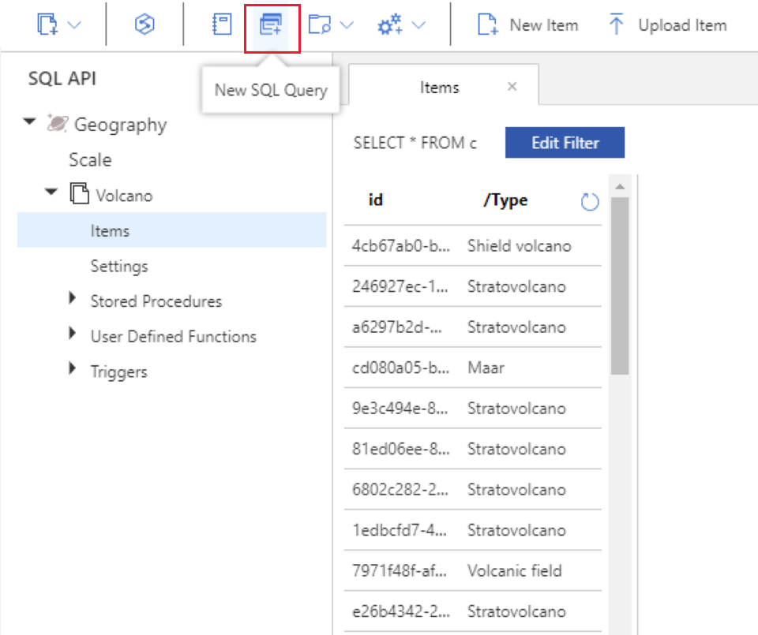
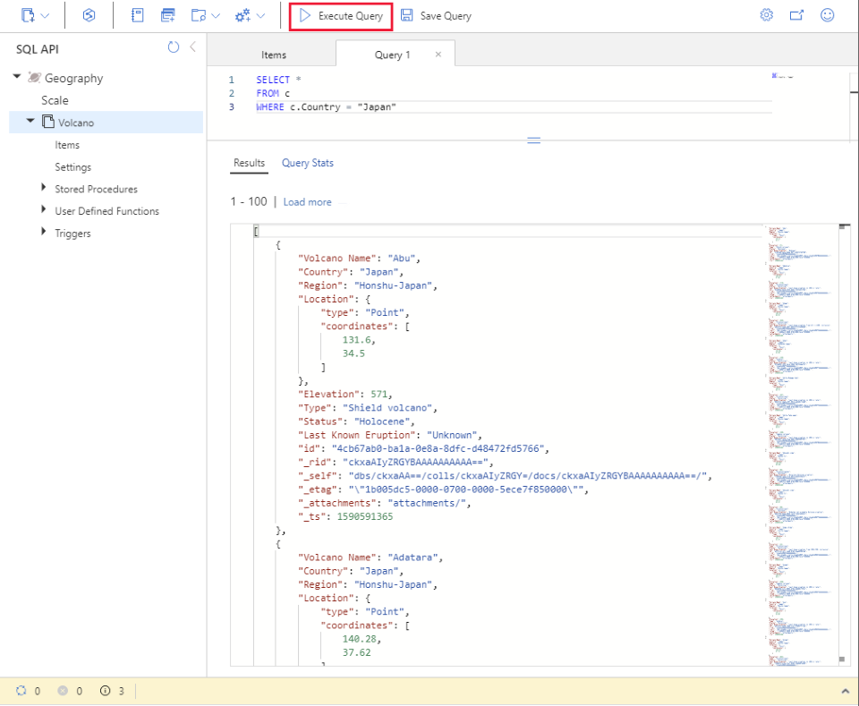
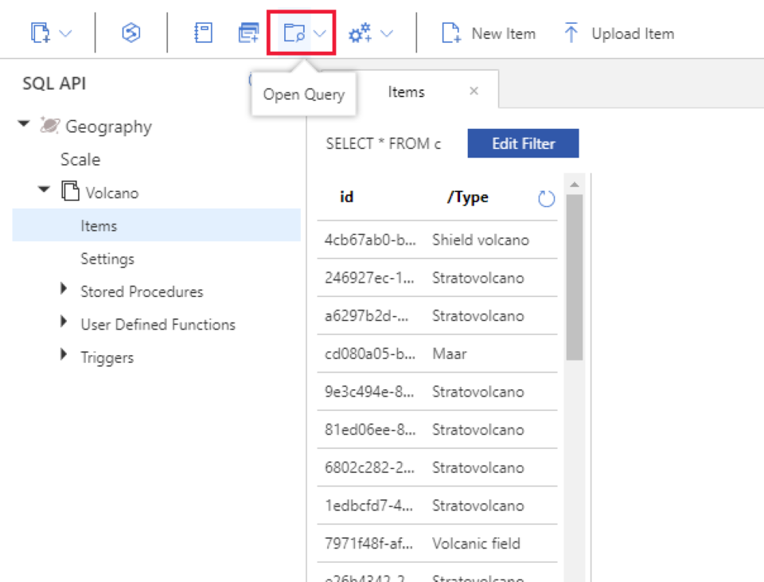
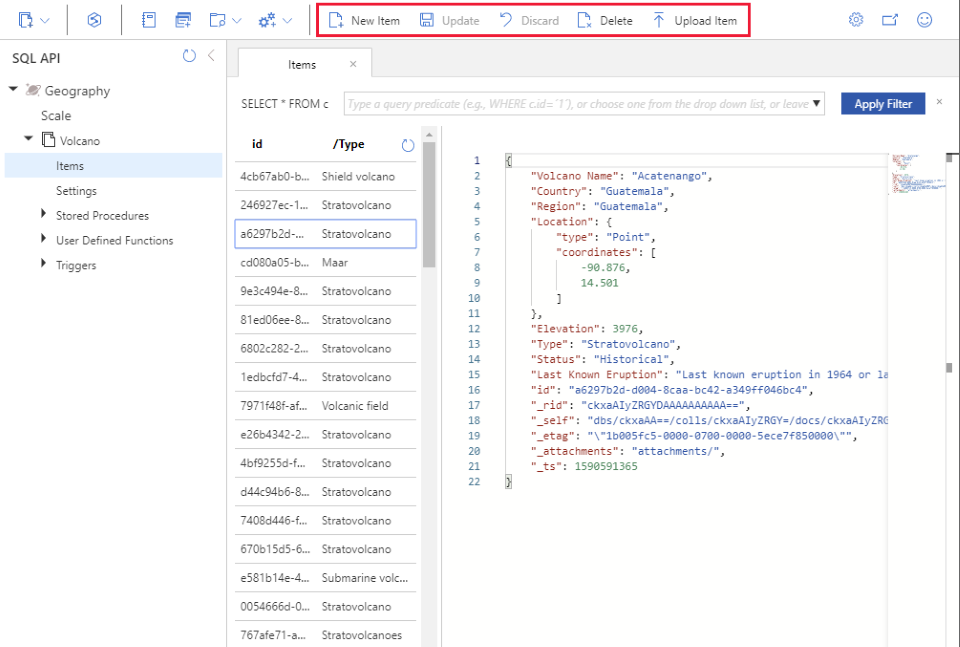

Although Azure Cosmos DB is described as a NoSQL database management system, the SQL API enables you to run *SQL-like* queries against Cosmos DB databases. These queries use a syntax similar to that of SQL, but there are some differences. This is because the data in a Cosmos DB is structured as documents rather than tables.

In this lesson, you'll learn about the dialect of SQL implemented by the SQL API. You'll see how to use the **Data Explorer** in the Azure portal to run queries.

## Use the SQL API to query documents

The Cosmos DB SQL API supports a dialect of SQL for querying documents using SELECT statements that will be familiar if you have written SELECT statements in a relational database using an ANSI SQL compliant database engine. The SQL API returns results in the form of JSON documents. All queries are executed in the context of a single container.

### Understand a SQL API query

A SQL API SELECT query includes the following clauses:

1. **SELECT clause**. The clause starts with the keyword SELECT followed by a comma-separated list of properties to return. The keyword “*” means all the properties in the document.

2. **FROM clause**. This clause starts with the keyword FROM followed by an identifier, representing the source of the records, and an alias that you can use for this identifier in other clauses (the alias is optional). In a relational database query, the FROM clause would contain a table name. In the SQL API, all queries are limited to the scope of a container, so the identifier represents the name of the container.

3. **WHERE clause**. This clause is optional. It starts with the keyword WHERE followed by one or more logical conditions that must be satisfied by a document returned by the query. You use the WHERE clause to filter the results of a query.
    > [!NOTE]
    > A logical condition results in a true or false. For example "City=Paris" might evaluate to true, but "Price > $10.00" might evaluate to false.

4. **ORDER BY clause**. This clause is also optional. It starts with the phrase ORDER BY followed by one or more properties used to order the output result set.

> [!NOTE]
> A query can also contain a **JOIN clause**. In a relational database management system, such as Azure SQL Database, JOIN clauses are used to connect data from different tables. In the SQL API, you use JOIN clauses to connect fields in a document with fields in a subdocument that is part of the same document. You can't perform joins across different documents.

The examples below show some simple queries:

```SQL
// Simple SELECT. The identifier "c" is an alias for the container being queried
SELECT c.* 
FROM customers c

// Projection - limit the output to specified fields
SELECT c.Title, c.Name 
FROM customers c

// Projection - Address is a subdocument that contains fields named "state" and "city", amongst others

SELECT c.Name, c.Address.State, c.Address.City 
FROM customers c

// Filter that limits documents to customers living in California
SELECT c.Name, c.Address.City 
FROM customers c
WHERE c.Address.State = "CA"

// Retrieve customers living in California in Name order
SELECT c.Name, c.Address.City 
FROM customers c
WHERE c.Address.State = "CA"
ORDER BY c.Name
```

### Understand supported operators

The SQL API includes many common mathematical and string operations, in addition to functions for working with arrays and for checking data types. The operators supported in SQL API queries include:

|Type|Operator|
|-|-|
|Unary|	+,-,~, NOT|
|Arithmetic|	+,-,*,/,%|
|Bitwise|	\|, &, ^, <<, >>, >>>|
|Logical| AND, OR|
|Comparison|=, !=, <, >, <=, >=, <>|
|String (concatenate)|	\|\|| 
|Ternary (if)| ? |

The SQL API also supports:

- The DISTINCT operator that you use as part of the SELECT clause to eliminate duplicates in the result data.

- The TOP operator that you can use to retrieve only the first few rows returned by a query that might otherwise generate a large result set.

- The BETWEEN operation that you use as part of the WHERE clause to define an inclusive range of values. The condition field BETWEEN a AND b is equivalent to the condition `field >= a AND field <= b`.

- The IS_DEFINED operator that you can use for detecting whether a specified field exists in a document.

The query below shows some examples using these operators.

```SQL
// List all customer cities (remove duplicates) for customers living in states with codes between AK (Alaska) and MD (Maryland)
SELECT DISTINCT c.Address.City 
FROM c 
WHERE c.Address.State BETWEEN "AK" AND "MD"

// Find the 3 most common customer names
SELECT TOP 3 *
FROM c
ORDER BY c.Name

// Display the details of every customer for which the data of birth is recorded
SELECT * FROM p
WHERE IS_DEFINED(p.DateOfBirth)
```

### Understand aggregate functions

You can use aggregate functions to summarize data in SELECT queries; you place aggregate functions in the SELECT clause. The SQL API query language supports the following aggregate functions:

- **COUNT(p)**. This function returns a count of the number of instances of field p in the result set. To count all the items in the result set, set p to a scalar value, such as 1.

- **SUM(p)**. This function returns the sum of all the instances of field p in the result set. The values of p must be numeric.

- **AVG(p)**. This function returns the mathematical mean of all the instances of field p in the result set. The values of p must be numeric.

- **MAX(p)**. This function returns the maximum value of field p in the result set.

- **MIN(p)**. This function returns the minimum value of field p in the result set.

Although the syntax of aggregate functions is similar to ANSI SQL, unlike ANSI SQL the SQL API query language doesn't support the GROUP BY clause; you can't generate subtotals for different values of the same field in a single query. You're able to include more than one aggregate function in the SELECT clause of your queries.

In the following example, the query returns the average, maximum, and sum of the *age* field of the documents in a collection, in addition to a count of all the documents in the collection:

```SQL
SELECT AVG(c.age) AS avg, 
    MAX(c.age) AS max, 
    SUM(c.age) AS sum,
    COUNT(1) AS count
FROM c
```

The SQL API also supports a large number of mathematical, trigonometric, string, array, and spatial functions. For detailed information on the syntax of queries, and the functions and operators supported by the Cosmos DB SQL API, visit the page [Getting started with SQL queries in Azure Cosmos DB](https://docs.microsoft.com/azure/cosmos-db/sql-api-sql-query) on the Microsoft website.

## Query documents with the SQL API using Data Explorer

You can use Data Explorer in the Azure portal to create and run queries against a Cosmos DB container. The **Items** page for a container provides the **New SQL Query** command in the toolbar:

> [!div class="mx-imgBorder"]
> 

In the query pane that appears, you can enter a SQL query. Select **Execute Query** to run it. The results will be displayed as a list of JSON documents

> [!div class="mx-imgBorder"]
> 

You can save the query text if you need to repeat it in the future. The query is saved in a separate container. You can retrieve it later using the **Open Query** command in the toolbar.

> [!div class="mx-imgBorder"]
> 

> [!NOTE]
> The **Items** page also lets you modify and delete documents. Select a document from the list to display it in the main pane. You can modify any of the fields, and select **Update** to save the changes. Select **Delete** to remove the document from the collection. The **New Item** command enables you to manually add a new document to the collection. You can use the **Upload Item** to create new documents from a file containing JSON data.

> [!div class="mx-imgBorder"]
> 
