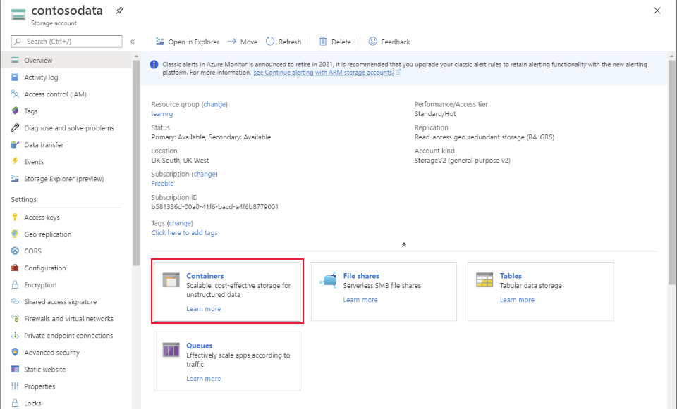
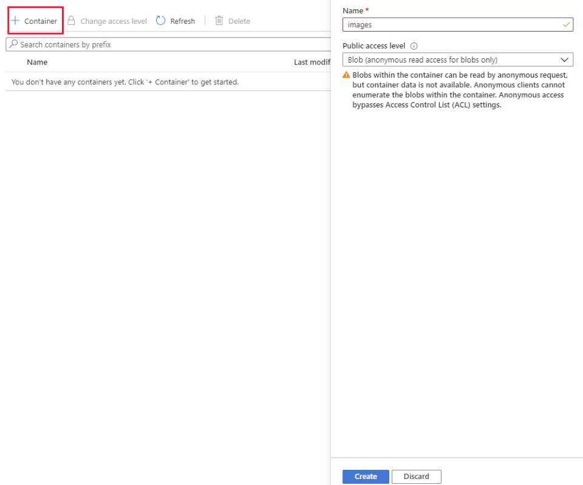
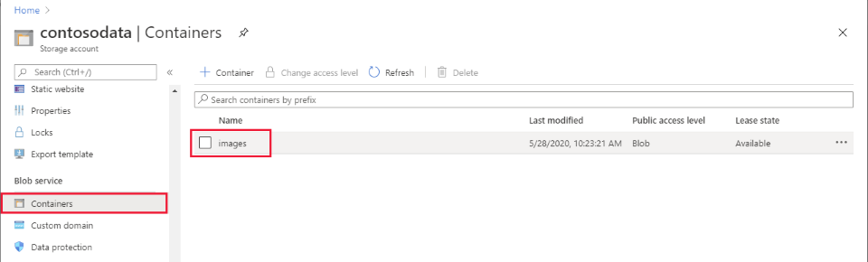
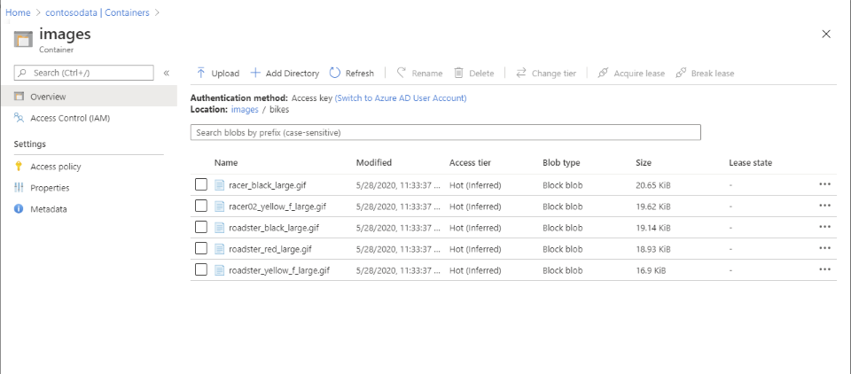
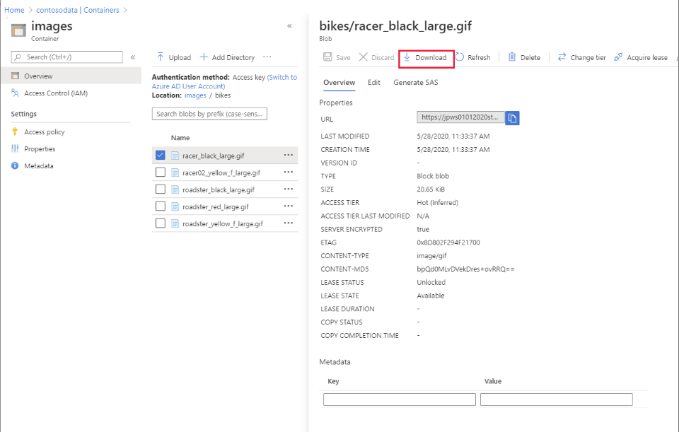
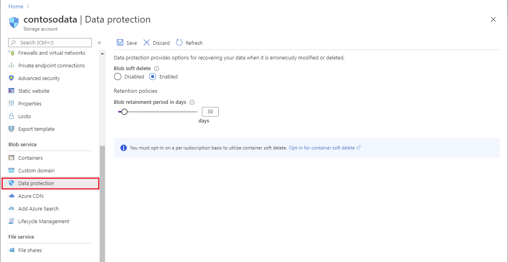
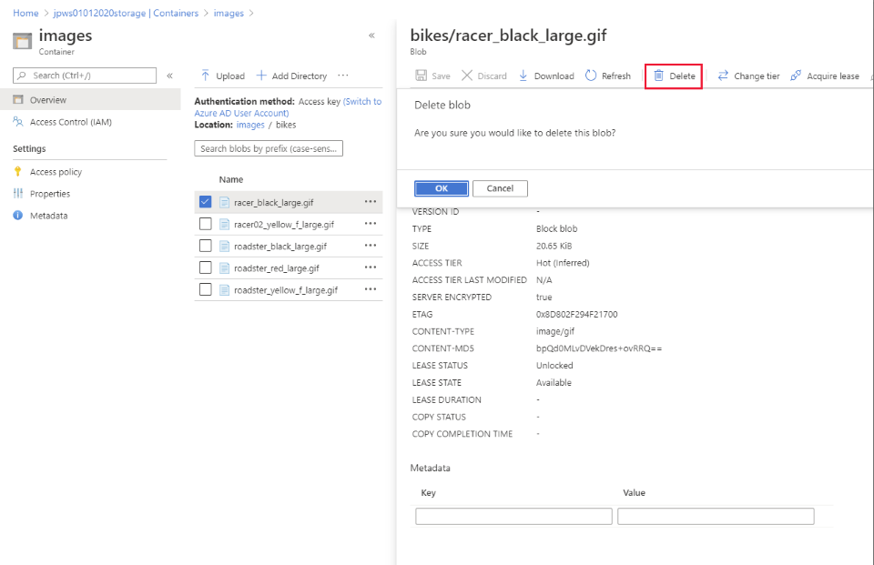
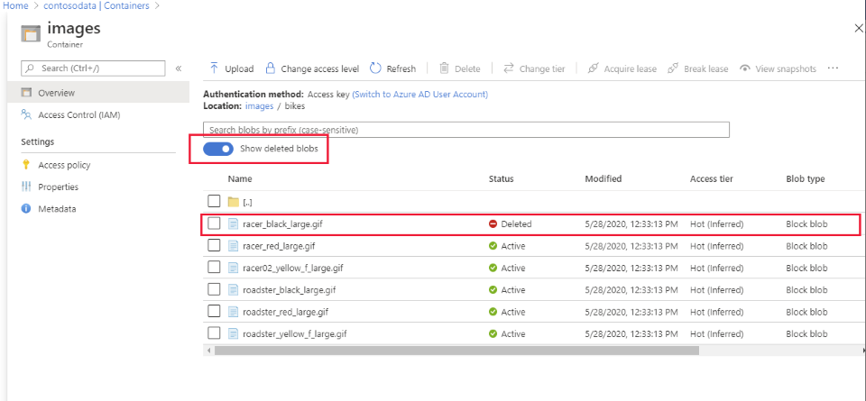
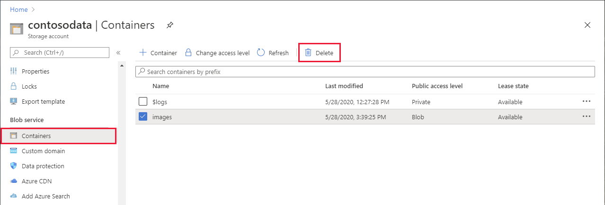

Azure Blob storage is a suitable repository for holding large binary objects, such as images, video, and audio files. In the Contoso scenario, you've created a blob container for holding images of the products the company manufactures. 

Azure currently supports three different types of blobs; *Block blobs*, *Page blobs*, and *Append blobs*. You typically use page blobs to implement virtual disk storage for Azure virtual machines; they're optimized to support random read and write operations. Append blobs are suitable for storing data that grows in chunks, such as logs or other archive data. Block blobs are best for static data, and are the most appropriate type of storage for holding the image data held by Contoso.

In this unit, you'll learn how to create and manage blobs, and the containers that hold them.

> [!NOTE]
> This unit concentrates on using the Azure portal, the Azure CLI, and Azure PowerShell for managing blobs and blob storage. You can also use the **AzCopy** utility to upload and download files, including blobs. The next unit describes how to use **AzCopy**.

## Create an Azure Storage container

In an Azure storage account, you store blobs in *containers*. A container provides a convenient way of grouping related blobs together, and you can organize blobs in a hierarchy of folders inside a container, similar to files in a file system on disk.

You create a container in an Azure Storage account. You can do this using the Azure portal, or using the Azure CLI or Azure PowerShell from the command line. 

### Use the Azure portal

In the Azure portal, go to the **Overview** page for your Azure Storage account, and select **Containers**.

> [!div class="mx-imgBorder"]
> 

On the **Containers** page, select **+ Container**, and provide a name for the new container. You can also specify the public access level. For a container that will be used to hold blobs, the most appropriate access level is **Blob**. This setting supports anonymous read-only access for blobs. However, unauthenticated clients can't list the blobs in the container. This means they can only download a blob if they know its name and location within the container.

> [!div class="mx-imgBorder"]
> 

### Use the Azure CLI

If you prefer to use the Azure CLI, the `az storage container create` command creates a new container. This command takes a number of optional parameters, and you can find the full details on the [az storage container create](https://docs.microsoft.com/cli/azure/storage/container?view=azure-cli-latest#az-storage-container-create) page on the Microsoft website. The example below creates a container named *images* for storing blobs. The container is created in a storage account named *contosodata*. The container provides anonymous blob access.

```azurecli
az storage container create \
  --name images \
  --account-name contosodata \
  --resource-group contoso-group \
  --public-access blob
```

### Use Azure PowerShell

You can use the `New-AzStorageContainer` PowerShell cmdlet to create a new storage container. The details are available on the [New-AzStorageContainer](https://docs.microsoft.com/powershell/module/az.storage/new-azstoragecontainer) page on the Microsoft website. You must first obtain a reference to the storage account using the `Get-AzStorageAccount` command. The code below shows an example:

```PowerShell
Get-AzStorageAccount `
  -ResourceGroupName "contoso-group" `
  -Name "contosodata" | New-AzStorageContainer `
    -Name "images" `
    -Permission Blob
```

## Upload a blob to Azure Storage

After you've created a container, you can upload blobs. Depending on how you want to organize your blobs, you can also create folders in the container.

### Use the Azure portal

If you're using the Azure portal, go to the page for your storage account and select **Containers** under **Blob service**. On the **Containers** page, select the container you want to use. 

> [!NOTE]
> If you created the storage account with support for hierarchical namespaces (for Data Lake Storage), the **Blob service** section doesn't appear in the Azure portal. Instead, select **Containers** under **Data Lake Storage**.

> [!div class="mx-imgBorder"]
> 

On the page for the container, in the toolbar, select **Upload**. In the **Upload blob** dialog box, browse to the file container the data to upload. The **Advanced** drop-down section provides options you can modify the default options. For example, you can specify the name of a folder in the container (the folder will be created if it doesn't exist), the type of blob, and the access tier. The blob that is created is named after the file you uploaded.

> [!div class="mx-imgBorder"]
> 

> [!NOTE]
> You can select multiple files. They will each be uploaded into seperate blobs.

### Use the Azure CLI

Use the `az storage blob upload` command to upload a file to a blob in a container. The details describing the parameters for this command are available on the [az storage blob upload](https://docs.microsoft.com/cli/azure/storage/blob?view=azure-cli-latest#az-storage-blob-upload) page on the Microsoft website. The following example uploads a local file named *racer_green_large.gif* in the *data* folder to a blob called *racer_green* in the **bikes* folder in the *images* container in the *contosodata* storage account.

```azurecli
az storage blob upload \
  --container-name images \
  --account-name contosodata \
  --file "\data\racer_green_large.gif" \
  --name "bikes\racer_green"
```

If you need to upload several files, use the `az storage blob upload-batch` command. This command takes the name of a local folder rather than a file name, and uploads the files in that folder to separate blobs. The example below uploads all *gif* files in the *data* folder to the *bikes* folder in the *images* container.

```azurecli
az storage blob upload-batch \
  --account-name contosodata \
  --source "\data" \
  --pattern "*.gif" \
  --destination "images\bikes"
```

### Use Azure PowerShell

Azure PowerShell provides the [`Set-AzStorageBlobContent`](https://docs.microsoft.com/powershell/module/azure.storage/set-azurestorageblobcontent) cmdlet to upload blob data to Azure storage, as follows:

```PowerShell
Get-AzStorageAccount `
  -ResourceGroupName "contoso-group" `
  -Name "contosodata" | Set-AzStorageBlobContent `
    -Container "images" `
    -File "\data\racer_green_large.gif" `
    -Blob "bikes\racer_green"
```

Azure PowerShell doesn't currently include a batch blob upload command. If you need to upload multiple files, you can write your own PowerShell script (use the `Get-ChildItem` cmdlet) to iterate through the files and upload each one individually.

## List the blobs in a container

If you've been granted the appropriate access rights, you can view the blobs in a container.

### Use the Azure portal

If you're using the Azure portal, go to the page for your storage account and select **Containers** under **Blob service**. On the **Containers** page, select the container holding your blobs. If the container has a folder structure, move to the folder containing the blobs you want to see. The blobs in that folder should be displayed.

> [!div class="mx-imgBorder"]
> 

### Use the Azure CLI

In the Azure CLI, you can use the [`az storage blob list`](https://docs.microsoft.com/cli/azure/storage/blob?view=azure-cli-latest#az-storage-blob-list) command to view the blobs in a container. This command iterates recursively through any folders in the container. The example below lists the blobs previously uploaded to the images container:

```azurecli
az storage blob list \
  --account-name contosodata \
  --container-name "images"
```

### Use Azure PowerShell

From Azure PowerShell, run the [`Get-AzStorageBlob`](https://docs.microsoft.com/powershell/module/az.storage/Get-AzStorageBlob) cmdlet, as illustrated in the following example:

```PowerShell
Get-AzStorageAccount `
  -ResourceGroupName "contoso-group" `
  -Name "contosodata" | Get-AzStorageBlob `
    -Container "images"
```

## Download a blob from a container

You can retrieve a blob from Azure Storage and save it in a local file on your computer.

### Use the Azure portal

If you're using the Azure portal, go to the page for your storage account and select **Containers** under **Blob service**. On the **Containers** page, select the container holding your blobs. If the container has a folder structure, move to the folder containing the blobs you want to download. Select the blob to view its details. On the details page, select **Download**.

> [!div class="mx-imgBorder"]
> 

### Use the Azure CLI

The Azure CLI provides the [`az storage blob download`](https://docs.microsoft.com/cli/azure/storage/blob?view=azure-cli-latest#az-storage-blob-download) and [`az storage blob download-batch`](https://docs.microsoft.com/cli/azure/storage/blob?view=azure-cli-latest#az-storage-blob-download-batch) commands. These commands are analogous to those available for uploading blobs. The example below retrieves the *racer_green"* blob from the *bikes* folder in the *images* container.

```azurecli
az storage blob download \
  --container-name images \
  --account-name contosodata \
  --file "racer_green_large.gif" \
  --name "bikes\racer_green"
```
### Use Azure PowerShell

In Azure PowerShell, use the [`Get-AzStorageBlobContent`](https://docs.microsoft.com/powershell/module/az.storage/get-azstorageblobcontent) cmdlet.

```PowerShell
Get-AzStorageAccount `
  -ResourceGroupName "contoso-group" `
  -Name "contosodata" | Get-AzStorageBlobContent `
    -Container "images" `
    -Blob "bikes\racer_green_large.gif" `
    -Destination "racer_green_large.gif" 
```

## Delete a blob from a container

Deleting a blob can reclaim the resources used in the storage container. However, if you've enabled the soft delete option for the storage account, the blob is hidden rather than removed, and you can restore it later. You can enable or disable soft delete in the Azure portal, and specify the time for which the blob is retained. Select the **Data protection** page under **Blob service**. If the blob isn't restored by the end of the retention period, it will be removed from storage.

> [!div class="mx-imgBorder"]
> 

> [!WARNING] 
> If you created the storage account with support for hierarchical namespaces (for Data Lake Storage), the soft delete option isn't available. All blob delete operations will be final.

### Use the Azure portal

If you're using the Azure portal, go to the page for your storage account and select **Containers** under **Blob service**. On the **Containers** page, select the container holding your blobs. If the container has a folder structure, move to the folder containing the blobs you want to download. Select the blob to view its details. On the details page, select **Delete**. You'll be prompted to confirm the operation.

> [!div class="mx-imgBorder"]
> 

If you've enabled soft delete for the storage account, the blobs page listing the blobs in a container includes the option **Show deleted blobs**. If you select this option, you can view and *undelete* a deleted blob.

> [!div class="mx-imgBorder"]
> 

### Use the Azure CLI

You can delete a single blob with the [`az storage blob delete`](https://docs.microsoft.com/cli/azure/storage/blob?view=azure-cli-latest#az-storage-blob-delete) command, or a set of blobs with the [`az storage blob delete-batch`](https://docs.microsoft.com/cli/azure/storage/blob?view=azure-cli-latest#az-storage-blob-delete-batch) command. The command below removes the *racer-green* blob from the *bikes* folder in the *images* container:

```azurecli
az storage blob delete ^
  --account-name contosodata ^
  --container-name "images" ^
  --name "bikes\racer_green"
```

### Use Azure PowerShell

Use the [`Remove-AzStorageBlob`](https://docs.microsoft.com/powershell/module/az.storage/remove-azstorageblob) cmdlet to delete a storage blob from Azure PowerShell. By default, deletion runs without prompts. You can add the `-Confirm` flag to prompt the user to confirm that they really want to delete the blob:

```PowerShell
Get-AzStorageAccount `
  -ResourceGroupName "contoso-group" `
  -Name "contosodata" | Remove-AzStorageBlob `
    -Container "images" `
    -Blob "bikes\racer_green" `
    -Confirm
```

## Delete an Azure Storage container

Removing a container automatically deletes all blobs held in that container. If you aren't careful, you can lose a great deal of data.

### Use the Azure portal

In the Azure portal, select **Containers** under **Blob service**, select the container to delete, and then select **Delete** in the toolbar.

> [!div class="mx-imgBorder"]
> 

### Use the Azure CLI

In the Azure CLI, use the [`az storage container delete`](https://docs.microsoft.com/cli/azure/storage/container?view=azure-cli-latest#az-storage-container-delete) command. The following example deletes the *images* container referenced in previous examples.

```azurecli
az storage container delete \
  --account-name contosodata \
  --name "images"
```

### Use Azure PowerShell

The [`Remove-AzStorageContainer`](https://docs.microsoft.com/powershell/module/az.storage/remove-azstoragecontainer) cmdlet deletes a storage container. The `-Confirm` flag prompts the user to confirm the delete operation. The code below shows an example:

```PowerShell
Get-AzStorageAccount `
  -ResourceGroupName "contoso-group" `
  -Name "contosodata" | Remove-AzStorageContainer `
    -Name "images" `
    -Confirm
```