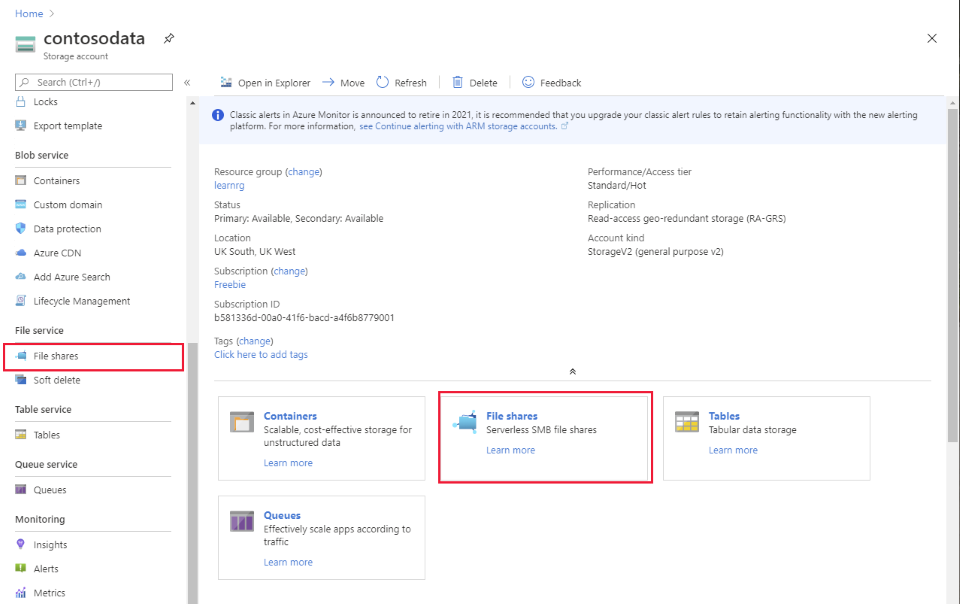
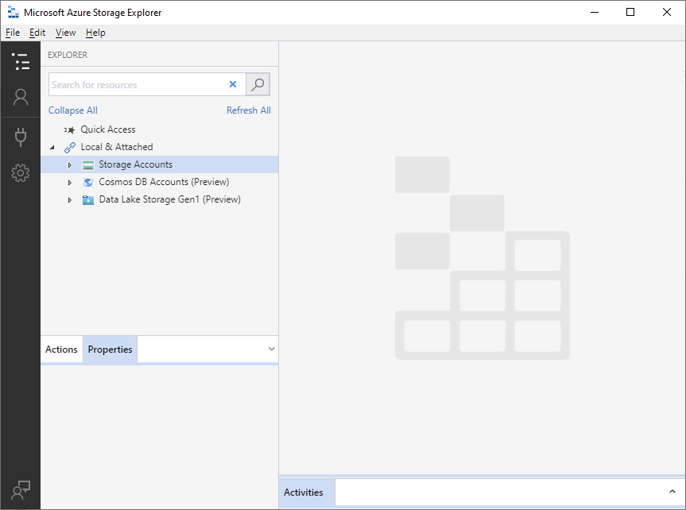
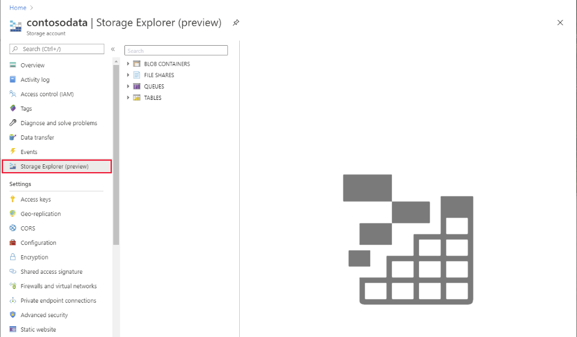
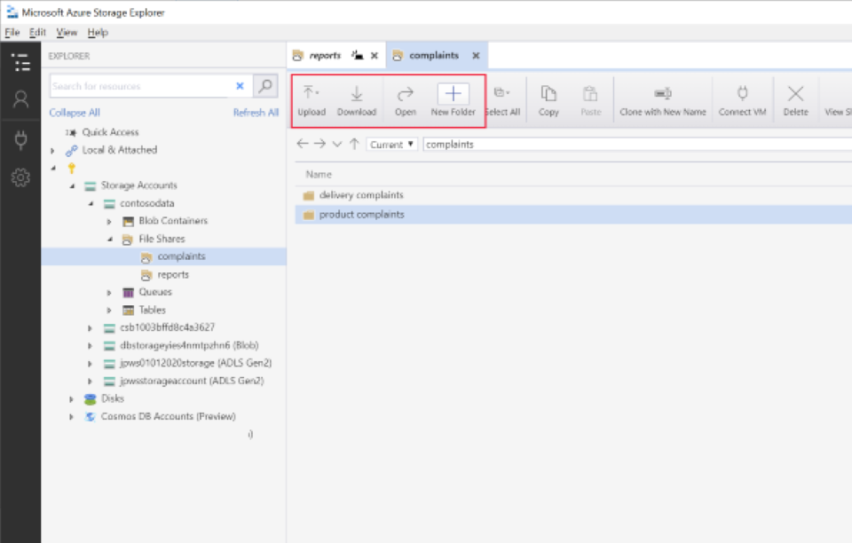
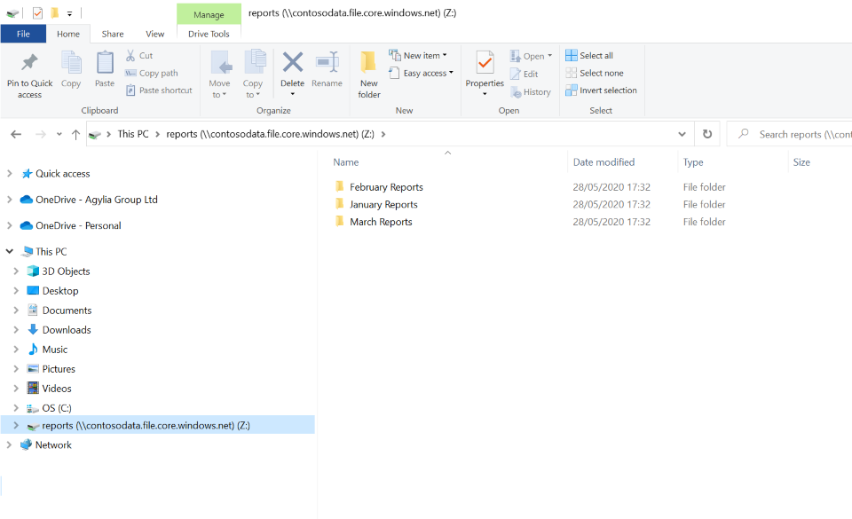
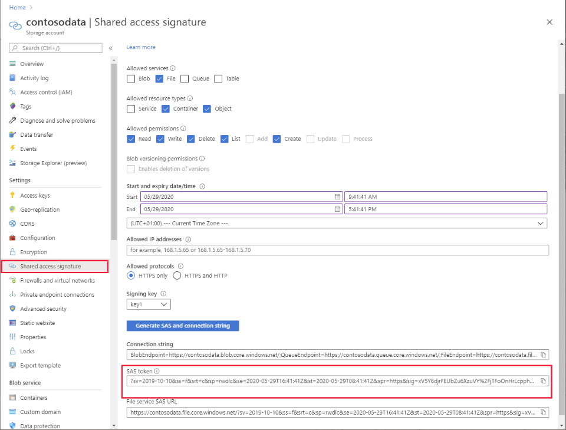

You can use Azure File storage to store shared files. Users can connect to a shared folder (also known as a *file share*) and read and write files (if they have the appropriate privileges) in much the same way as they would use a folder on a local machine. In the Contoso scenario, Azure File storage is used to hold reports and product documentation that users across the company need to be able to read. 

In this unit, you'll learn how to create and manage file shares, and upload and download files in Azure File storage.

> [!NOTE]
> Files in a file share tend to be handled in a different manner from blobs. In many cases, users simply read and write files as though they were local objects. For this reason, although the Azure CLI and Azure PowerShell both provide programmatic access to Azure File storage, this unit concentrates on the the tools available in the Azure portal, and the [AzCopy](https://docs.microsoft.com/azure/storage/common/storage-use-azcopy-v10) command.

## Create a file share

Microsoft provides two graphical tools you can use to create and manage file shares in Azure Storage: the Azure portal, and Azure Storage Explorer.

### Use the Azure portal

Select **File shares** in the main pane of the **Overview** page for an Azure Storage account (this is also available in the **File service** section of the command bar):

> [!div class="mx-imgBorder"]
> 

On the **File shares** page, select **+ File share**. Give the file share a name, and optionally specify a quota. Azure allows you to store up to 5 PiB of files across all files shares in a storage account. A quota enables you to limit the amount of space an individual file share consumes, to prevent it from starving other file shares of file storage. If you have only one file share, you can leave the quota empty.

> [!div class="mx-imgBorder"]
> 

After you've created a share, you can use the Azure portal to add directories to the share, upload files to the share, and delete the share. The **Connect** command generates a PowerShell script that you can run to attach to the share from your local computer. You can then use the share as though it was a local disk drive.

> [!div class="mx-imgBorder"]
> 

### Use Azure Storage Explorer

Azure Storage Explorer is a utility that enables you to manage Azure Storage accounts from your desktop computer. You can download it from the [Azure Storage Explorer](https://azure.microsoft.com/features/storage-explorer/) page on the Microsoft website. You can use Storage Explorer to create blob containers and file shares, as well as upload and download files.

> [!div class="mx-imgBorder"]
> 

A version of this utility is also available in the Azure portal, on the **Overview** page for an Azure Storage account. 

> [!div class="mx-imgBorder"]
> 

To create a new file share, right-click **File Shares**, and then select **Create file share**. In the Azure portal, Storage Explorer displays the same dialog box that you saw earlier. In the desktop version, you simply enter a name for the new file share; you don't get the option to set a quota at this point.

As with the Azure portal, once you have created a new share, you can use Storage Explorer to create folders, and upload and download files.

> [!div class="mx-imgBorder"]
> 

## Upload and download files

You can upload and download individual files to and from Azure File storage manually, by using Storage Explorer, the Azure portal, or by connecting the file share to your desktop computer and dragging and dropping files in File Explorer.

> [!div class="mx-imgBorder"]
> 

However, if you need to transfer a significant number of files in and out of Azure File storage, you should use the AzCopy utility. AzCopy is a command-line utility optimized for transferring large files (and blobs) between your local computer and Azure File storage. It can detect transfer failures, and restart a failed transfer at the point an error occurred - you don't have to repeat the entire operation.

### Generate an SAS token

Before you can use AzCopy, you generate a *Shared access signature (SAS) token*. A SAS token provides controlled, time-limited, anonymous access to services and resources in a storage account; users don't have to provide any additional credentials. SAS tokens are useful in situations where you don't know in advance which users will require access to your resources.

> [!NOTE]
> The AzCopy command also supports authentication using Azure Active Directory, but this approach requires adding all of your users to Azure Active Directory first.

You can create an SAS token for connecting to Azure File storage using the Azure portal. On the page for your storage account, under **Settings**, select **Shared access signature**. On the **Shared access signature** page, under **Allowed services**, select **File**. Under **Allowed resource types**, select **Container** and **Object**. Under **Permissions**, select the privileges that you want to grant to users. Set the start and end time for the SAS token, and specify the IP address range of the computers your users will be using. Select **Generate SAS and connection string** to create the SAS token. Copy the value in the **SAS token** field somewhere safe.

> [!div class="mx-imgBorder"]
> 

### Upload files

To transfer a single file into File Storage using AzCopy, use the form of the command shown in the following example. Run this command from the command line. In this example, replace *\<storage-account-name\>* with the name of the storage account, replace *\<file-share\>* with the name of a file share in this account, and replace *\<SAS-token\>* with the token you created using the Azure portal. You must include the quotes where shown.

> [!NOTE]
> Don't forget to include the *copy* keyword after the *azcopy* command. AzCopy supports other operations, such as deleting files and blobs, listing files and blobs, and creating new file shares. Each of these operations has its own keyword.

```bash
azcopy copy "myfile.txt" "https://<storage-account-name>.file.core.windows.net/<file-share-name>/myfile.txt<SAS-token>"
```

You can transfer the entire contents of a local folder to Azure File storage using a similar command. You replace the file name ("myfile.txt") with the name of the folder. If the folder contains subfolders that you want to copy, add the *--recursive* flag.

```bash
azcopy copy "myfolder" "https://<storage-account-name>.file.core.windows.net/<file-share-name>/myfolder<SAS-token>" --recursive
```

As the process runs, AzCopy displays a progress report:

```text
INFO: Scanning...
INFO: Any empty folders will be processed, because source and destination both support folders

Job b86eeb8b-1f24-614e-6302-de066908d4a2 has started
Log file is located at: C:\Users\User\.azcopy\b86eeb8b-1f24-614e-6302-de066908d4a2.log

11.5 %, 126 Done, 0 Failed, 48 Pending, 0 Skipped, 174 Total, 2-sec Throughput (Mb/s): 8.2553
```

When the transfer is complete, you'll see a summary of the work performed.

```text
Job b86eeb8b-1f24-614e-6302-de066908d4a2 summary
Elapsed Time (Minutes): 0.6002
Number of File Transfers: 161
Number of Folder Property Transfers: 13
Total Number of Transfers: 174
Number of Transfers Completed: 174
Number of Transfers Failed: 0
Number of Transfers Skipped: 0
TotalBytesTransferred: 43686370
Final Job Status: Completed
```

The *AzCopy copy* command has other options as well. For more information, see the page [Upload files](https://docs.microsoft.com/azure/storage/common/storage-use-azcopy-files?toc=/azure/storage/files/toc.json#upload-files) on the Microsoft website.

### Download files

You can also use the *AzCopy copy* command to transfer files and folders from Azure File Storage to your local computer. The command is similar to that for uploading files, except that you switch the order of the arguments; specify the files and folders in the file share first, and the local files and folders second. For example, to download the files from a folder named *myfolder* in a file share named *myshare* to a local folder called *localfolder*, use the following command:

```bash
azcopy copy "https://<storage-account-name>.file.core.windows.net/myshare/myfolder<SAS-token>" "localfolder" --recursive
```

For full details on downloading files using AzCopy, see [Download files](https://docs.microsoft.com/azure/storage/common/storage-use-azcopy-files?toc=/azure/storage/files/toc.json#download-files).