In the sample scenario, suppose that you've created the following data stores: 

- A Cosmos DB database for holding information about the products that Contoso manufactures.
- A blob container in Azure Storage for holding the images of products.

In this exercise, you'll run a script to upload data to these data stores. You'll perform queries against the data in the Cosmos DB database. Then, you'll download and view the images held in Azure Storage.

You'll perform this exercise using the Azure portal and the Azure Cloud Shell.

## Setup

1. In the Cloud Shell window on the right, run the following command:

    ```bash
    git clone https://github.com/MicrosoftLearning/DP-900T00A-Azure-Data-Fundamentals dp-900
    ```

    This command copies the scripts and data required to set up the sample Cosmos DB database and Azure Storage account used by this exercise.

2. Move to the **dp-900/nosql** folder.

    ```bash
    cd dp-900/nosql
    ```

3. Run the following command.

    ```bash
    bash setup.sh
    ```

    This command creates the Cosmos DB database and Azure Storage account and populates them with sample data. It takes as long as 10 minutes to run. When the script has finished, make a note of the values for the Cosmos DB account, database, container, and Storage account names.

## Query product data in Cosmos DB

1. Sign in to the [Azure portal](https://portal.azure.com/learn.docs.microsoft.com?azure-portal=true).

2. On the Azure Home page, select the drop-down menu at the top of the left-hand pane, and then select **All resources**.

    > [!div class="mx-imgBorder"]
    > 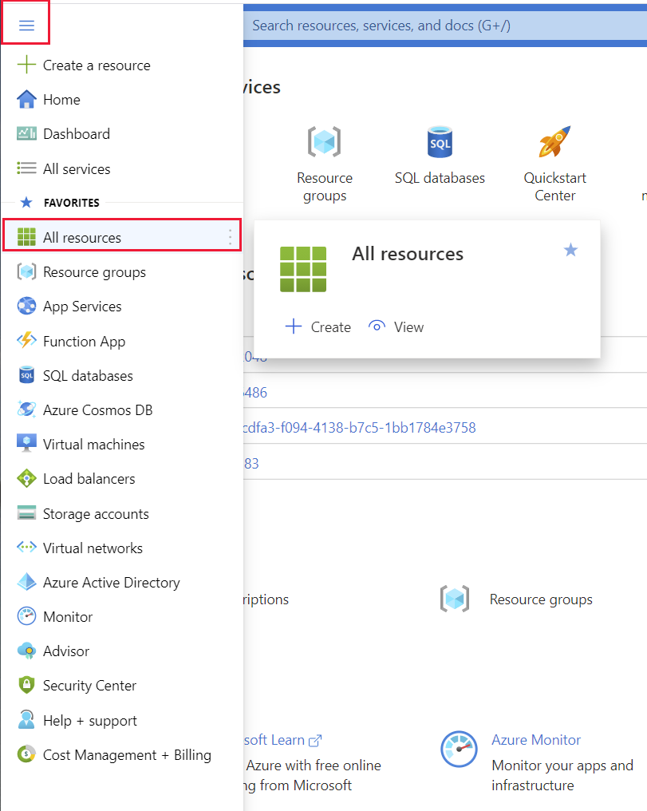

3. On the **All resources** page, select the Cosmos DB account that was created by the setup script. The account name will be *cosmos* followed by a random number:

    > [!div class="mx-imgBorder"]
    > 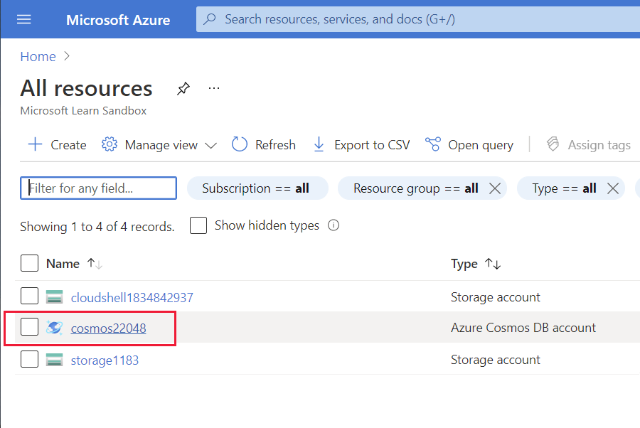

4. On the Cosmos DB account page, select **Data Explorer**. On the **Data Explorer** page, expand the **ProductData** database, expand the **ProductCatalog** container, and then select **Items**. Verify that the **Items** pane contains a list of products.

    > [!div class="mx-imgBorder"]
    > 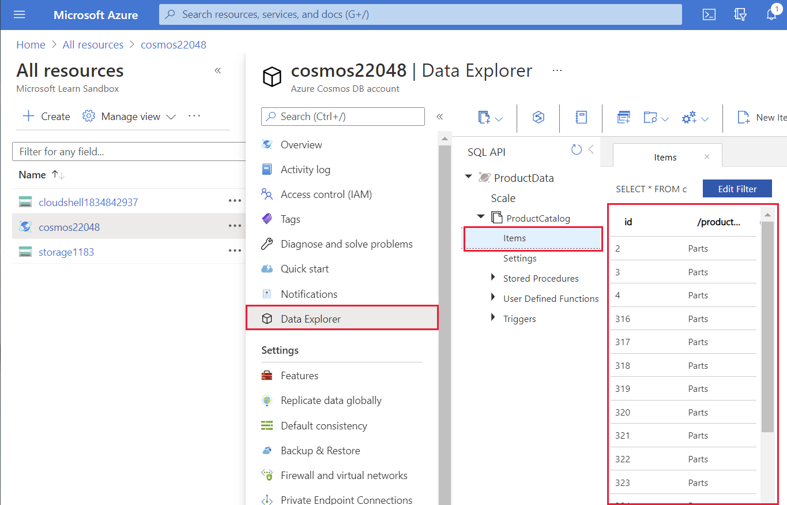

5. Select the item with ID 316. A JSON document containing the details for product 316 should appear in the right-hand pane.

    > [!div class="mx-imgBorder"]
    > 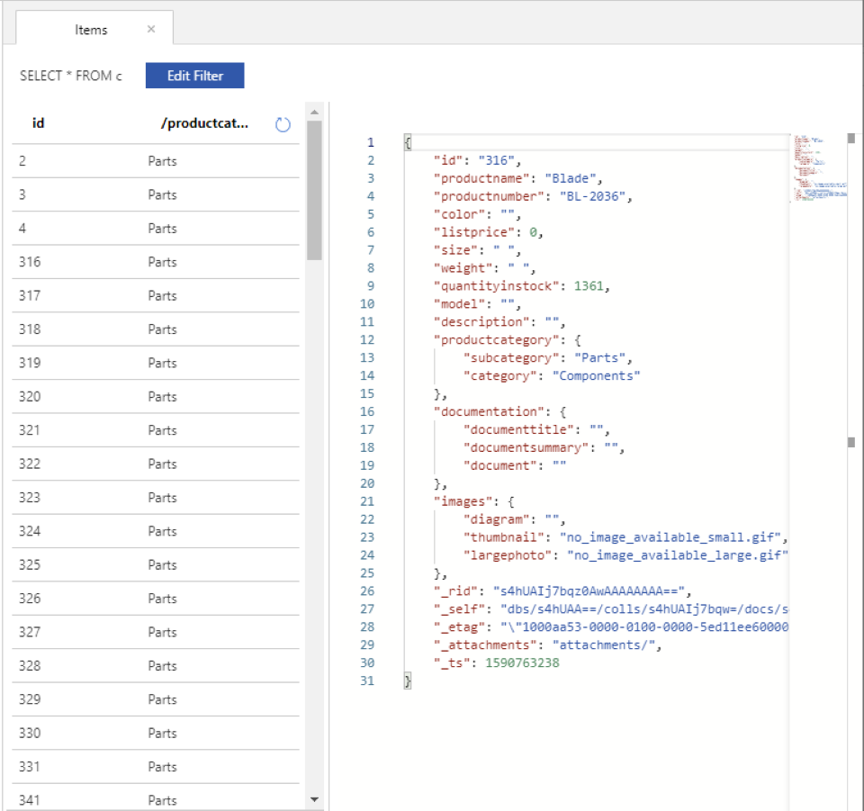

6. In the toolbar, select **New SQL Query**.

    > [!div class="mx-imgBorder"]
    > 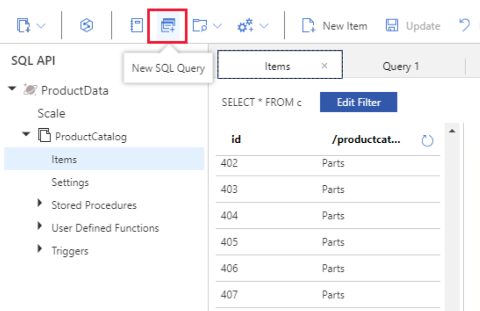

7. In the **Query 1** pane, enter the following query, and then select **Execute Query**. This query returns the name, color, listprice, description, and file name of the image for each model of mountain bike that Contoso make. The query should return 32 documents.

    ```SQL
    SELECT p.productname, p.color, p.listprice, p.description, p.images.thumbnail
    FROM products p
    WHERE p.productcategory.subcategory = "Mountain Bikes"
    ```

    > [!div class="mx-imgBorder"]
    > 

8. Modify the query to return information about Road Bikes, and then click **Execute Query**.

    ```SQL
    SELECT p.productname, p.color, p.listprice, p.description, p.images.thumbnail
    FROM products p
    WHERE p.productcategory.subcategory = "Road Bikes"
    ```

    The query should return 43 documents.

9. Replace the query with the following text. This query counts the number of Touring Bikes.

    ```SQL
    SELECT COUNT(p.productname)
    FROM products p
    WHERE p.productcategory.subcategory = "Touring Bikes"
    ```

    The data is returned as a document with a field named "$1" that has the value 22.

    ```text
    [
        {
            "$1": 22
        }
    ]
    ```

10. Modify the query, and add the **VALUE** keyword as shown below.  

    ```SQL
    SELECT VALUE COUNT(p.productname)
    FROM products p
    WHERE p.productcategory.subcategory = "Touring Bikes"
    ```

    This time the query just returns the value 22, and doesn't generate a field name.

    ```text
    [
        22
    ]
    ```

11. Run the following query:

    ```SQL
    SELECT VALUE SUM(p.quantityinstock)
    FROM products p
    WHERE p.productcategory.subcategory = "Touring Bikes"
    ```

    This query returns the total number of touring bikes currently in stock. It should return the value 3477.

12. If you have time, experiment with some queries of your own.

## View uploaded images in Azure Blob storage

1. In the Azure portal, in the left-hand navigation menu, select **Home**

    > [!div class="mx-imgBorder"]
    > 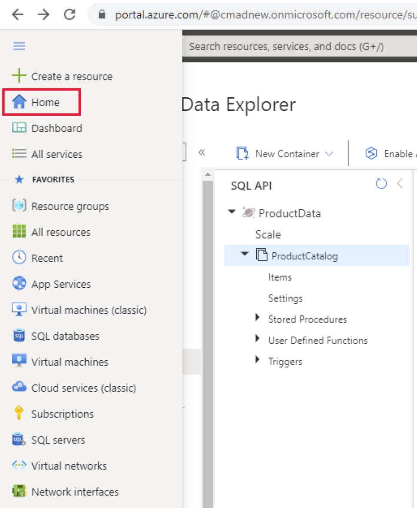

2. On the **Home** page, select **All resources**, and then select the storage account created by the setup script.

    > [!div class="mx-imgBorder"]
    > 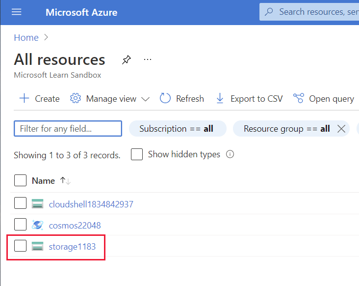

3. On the storage account page, select **Storage Explorer**.

    > [!div class="mx-imgBorder"]
    > 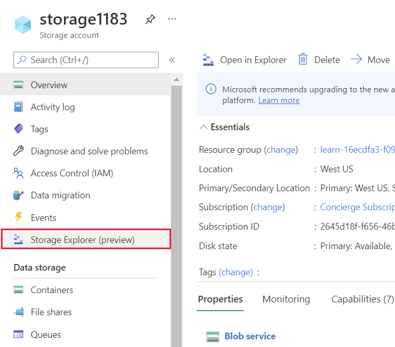

4. In the Storage Explorer pane, expand **BLOB CONTAINERS** and then click **images**. The Images blob contains the image files uploaded by the setup script.

    > [!div class="mx-imgBorder"]
    > 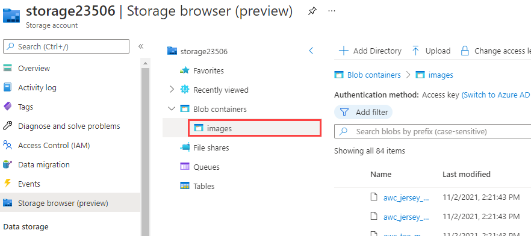

5. Select any image , and then select **Open** in the toolbar.

    > [!div class="mx-imgBorder"]
    > 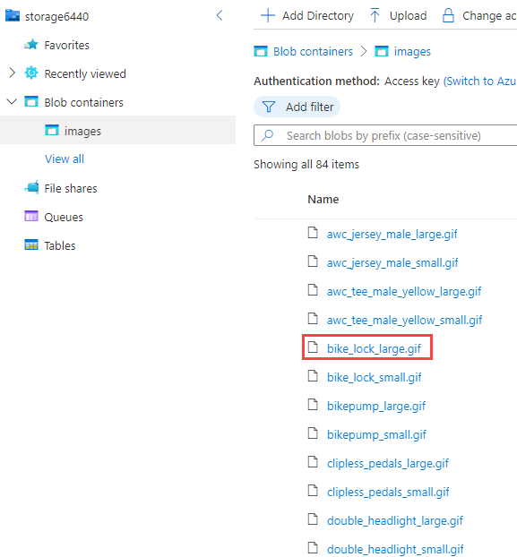

6. In the **File download** window, select **Click here to begin download**.

    > [!div class="mx-imgBorder"]
    > 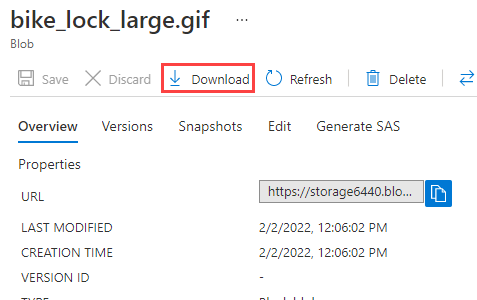

7. The file should be downloaded by the browser. Select the file and open it to display the contents.

    > [!div class="mx-imgBorder"]
    > 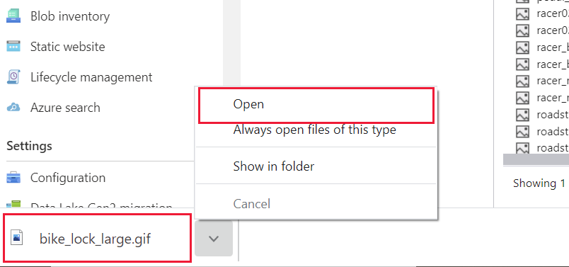

8. The image should be displayed. By default, Windows will use the Photo Viewer app, but if you have a different configuration then an alternative application might be used. 

    > [!div class="mx-imgBorder"]
    > 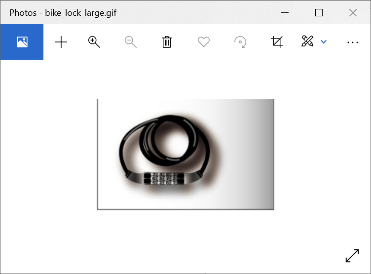

9. If time allows, try downloading and displaying other images.

## Summary

In this exercise, you investigated using Cosmos DB and Azure Storage to store and retrieve data. You ran a script that created a Cosmos DB database and a storage account, and uploaded sample data. You used Data Explorer in Cosmos DB to run simple queries against the data. You used Storage Explorer for the storage account to browse blob storage and download files.