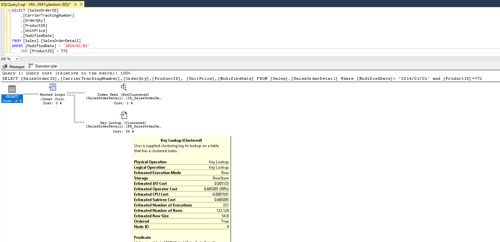
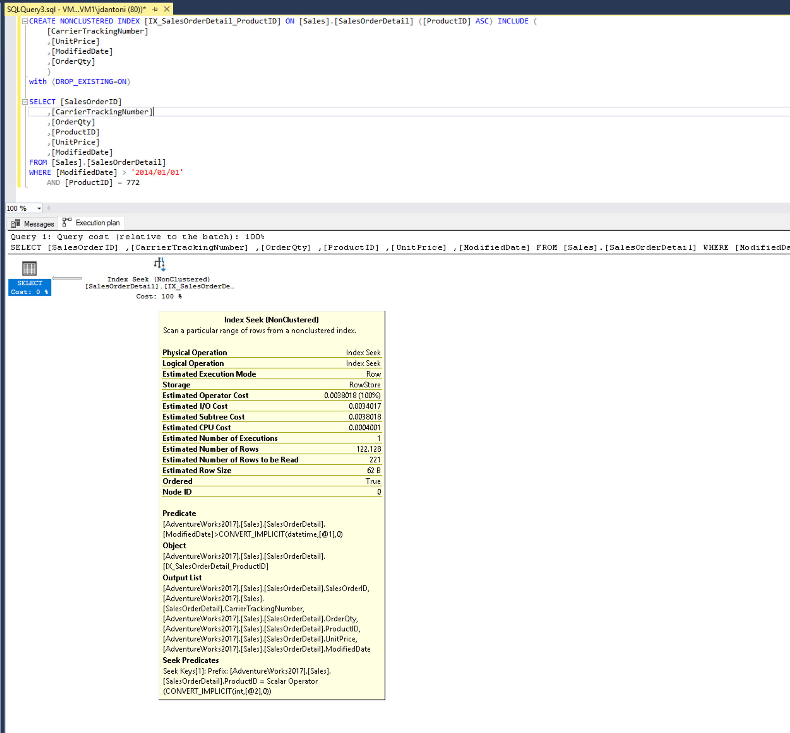

SQL Server has several index types to support different types of workloads. At a high level, an index can be thought of as an on-disk structure that is associated with a table or a view, that enables SQL Server to more easily find the row or rows associated with the index key (which consists of one or more columns in the table or view), compared to scanning the entire table.

## Clustered indexes

A common DBA job interview question is to ask the candidate the difference between a clustered and nonclustered index, as indexes are a fundamental data storage technology in SQL Server. A clustered index is the underlying table, stored in sorted order based on the key value. There can only be one clustered index on a given table, because the rows can be stored in one order. A table without a clustered index is called a heap, and heaps are typically only used as staging tables. An important performance design principle is to keep your clustered index key as narrow as possible. When considering the key column(s) for your clustered index, you should consider columns that are unique or that contain many distinct values. Another property of a good clustered index key is for records that are accessed sequentially, and are used frequently to sort the data retrieved from the table. Having the clustered index on the column used for sorting can prevent the cost of sorting every time that query executes, because the data will be already stored in the desired order.

> [!NOTE]
> When we say that the table is ‘stored’ in a particular order, we are referring to the logical order, not necessarily the physical, on-disk order. Indexes have pointers between pages, and the pointers help create the logical order. When scanning an index ‘in order’, SQL Server follows the pointers from page to page. Immediately after creating an index, it is most likely also stored in physical order on the disk, but after you start making modifications to the data, and new pages need to be added to the index, the pointers will still give us the correct logical order, but the new pages will most like not be in physical disk order.

## Nonclustered indexes

Nonclustered indexes are a separate structure from the data rows. A nonclustered index contains the key values defined for the index, and a pointer to the data row that contains the key value. You can add another nonkey column to the leaf level of the nonclustered index to cover more columns using the included columns feature in SQL Server. You can create multiple nonclustered indexes on a table.

An example of when you need to add an index or add columns to an existing nonclustered index is shown below:

[](../media/module-55-optimize-queries-final-12.png#lightbox)

The query plan indicates that for each row retrieved using the index seek, more data will need to be retrieved from the clustered index (the table itself). There's a nonclustered index, but it only includes the product column. If you add the other columns in the query to a nonclustered index as shown below, you can see the execution plan change to eliminate the key lookup.

[](../media/module-55-optimize-queries-final-13.png#lightbox)

The index created above is an example of a covering index, where in addition to the key column you're including extra columns to cover the query and eliminate the need to access the table itself.

Both nonclustered and clustered indexes can be defined as unique, meaning there can be no duplication of the key values. Unique indexes are automatically created when you create a PRIMARY KEY or UNIQUE constraint on a table.

The focus of this section is on b-tree indexes in SQL Server—these are also known as row store indexes. The general structure of a b-tree is shown below:

:::image type="content" source="../media/module-55-optimize-queries-final-14.png" alt-text="The B-tree architecture of an index in SQL Server and Azure SQL":::

Each page in an index b-tree is a called an index node, and the top node of b-tree is called the root node. The bottom nodes in an index are called leaf nodes and the collection of leaf nodes is the leaf level.

Index design is a mixture of art and science. A narrow index with few columns in its key requires less time to update and has lower maintenance overhead; however it may not be useful for as many queries as a wider index that includes more columns. You may need to experiment with several indexing approaches based on the columns selected by your application’s queries. The query optimizer will generally choose what it considers to be the best existing index for a query; however, that doesn't mean that there isn't a better index that could be built.

Properly indexing a database is a complex task. When planning your indexes for a table, you should keep a few basic principles in mind:

* Understand the workloads of the system. A table that is used mainly for insert operations will benefit far less from extra indexes than a table used for data warehouse operations that are 90% read activity.
* Understand what queries are run most frequently, and optimize your indexes around those queries.
* Understand the data types of the columns used in your queries. Indexes are ideal for integer data types, or unique or non-null columns.
* Create nonclustered indexes on columns that are frequently used in predicates and join clauses, and keep those indexes as narrow as possible to avoid overhead.
* Understand your data size/volume – A table scan on a small table will be a relatively cheap operation and SQL Server may decide to do a table scan simply because it's easy (trivial) to do. A table scan on a large table would be costly.

Another option SQL Server provides is the creation of filtered indexes. Filtered indexes are best suited to columns in large tables where a large percentage of the rows has the same value in that column. A practical example would be an employee table, as shown below, that stored the records of all employees, including ones who had left or retired.

```sql
CREATE TABLE [HumanResources].[Employee](
     [BusinessEntityID] [int] NOT NULL,
     [NationalIDNumber] [nvarchar](15) NOT NULL,
     [LoginID] [nvarchar](256) NOT NULL,
     [OrganizationNode] [hierarchyid] NULL,
     [OrganizationLevel] AS ([OrganizationNode].[GetLevel]()),
     [JobTitle] [nvarchar](50) NOT NULL,
     [BirthDate] [date] NOT NULL,
     [MaritalStatus] [nchar](1) NOT NULL,
     [Gender] [nchar](1) NOT NULL,
     [HireDate] [date] NOT NULL,
     [SalariedFlag] [bit] NOT NULL,
     [VacationHours] [smallint] NOT NULL,
     [SickLeaveHours] [smallint] NOT NULL,
     [CurrentFlag] [bit] NOT NULL,
     [rowguid] [uniqueidentifier] ROWGUIDCOL NOT NULL,
     [ModifiedDate] [datetime] NOT NULL)
```

In this table, there's a column called CurrentFlag, which indicates if an employee is currently employed. This example uses the bit datatype, indicating only two values, one for currently employed and zero for not currently employed. A filtered index with a `WHERE CurrentFlag = 1`, on the *CurrentFlag* column would allow for efficient queries of current employees.

You can also create indexes on views, which can provide significant performance gains when views contain query elements like aggregations and/or table joins.

## Columnstore indexes

Columnstore offers improved performance for queries that run large aggregation workloads. This type of index was originally targeted at data warehouses, but over time columnstore indexes have been used in many other workloads in order to help solve query performance issues on large tables. As of SQL Server 2014, there are both nonclustered and clustered columnstore indexes. Like b-tree indexes, a clustered columnstore index is the table itself stored in a special way, and nonclustered columnstore indexes are stored independently of the table. Clustered columnstore indexes inherently include all the columns in a given table. However, unlike rowstore clustered indexes, clustered columnstore indexes are NOT sorted.

Nonclustered columnstore indexes are typically used in two scenarios, the first is when a column in the table has a data type that isn't supported in a columnstore index. Most data types are supported but XML, CLR, sql_variant, ntext, text, and image aren't supported in a columnstore index. Since a clustered columnstore always contains all the columns of the table (because it IS the table), a nonclustered is the only option. The second scenario is a filtered index—this scenario is used in an architecture called hybrid transactional analytic processing (HTAP), where data is being loaded into the underlying table, and at the same time reports are being run on the table. By filtering the index (typically on a date field), this design allows for both good insert and reporting performance.

Columnstore indexes are unique in their storage mechanism, in that each column in the index is stored independently. It offers a two-fold benefit. A query using a columnstore index only needs to scan the columns needed to satisfy the query, reducing the total IO performed, and it allows for greater compression, since data in the same column is likely to be similar in nature.

Columnstore indexes perform best on analytic queries that scan large amounts of data, like fact tables in a data warehouse. Starting with SQL Server 2016 you can augment a columnstore index with another b-tree nonclustered index, which can be helpful if some of your queries do lookups against singleton values.

Columnstore indexes also benefit from batch execution mode, which refers to processing a set of rows (typically around 900) at a time versus the database engine processing those rows one at time. Instead of loading each record independently and processing them, the query engine computes the calculation in that group of 900 records. This processing model reduces the number of CPU instructions dramatically.

```sql
SELECT SUM(Sales) FROM SalesAmount;
```

Batch mode can provide significant performance increase over traditional row processing. SQL Server 2019 also includes batch mode for rowstore data. While batch mode for rowstore doesn't have the same level of read performance as a columnstore index, analytical queries may see up to a 5x performance improvement.

The other benefit columnstore indexes offer to data warehouse workloads is an optimized load path for bulk insert operations of 102,400 rows or more. While 102,400 is the minimum value to load directly into the columnstore, each collection of rows, called a rowgroup, can be up to approximately 1,024,000 rows. Having fewer, but fuller, rowgroups makes your SELECT queries more efficient, because fewer row groups need to be scanned to retrieve the requested records. These loads take place in memory and are directly loaded to the index. For smaller volumes, data is written to a b-tree structure called a delta store, and asynchronously loaded into the index.

:::image type="content" source="../media/module-55-optimize-queries-final-15.png" alt-text="Columnstore Index Load Example":::

In this example, the same data is being loaded into two tables, *FactResellerSales_CCI_Demo* and *FactResellerSales_Page_Demo*. The *FactResellerSales_CCI_Demo* has a clustered columnstore index, and the *FactResellerSales_Page_Demo* has a clustered b-tree index with two columns and is page compressed. As you can see each table is loading 1,024,000 rows from the *FactResellerSalesXL_CCI* table. When `SET STATISTICS TIME` is `ON`, SQL Server keeps track of the elapsed time of the query execution. Loading the data into the columnstore table took roughly 8 seconds, where loading into the page compressed table took nearly 20 seconds. In this example, all the rows going into the columnstore index are loaded into a single rowgroup.

If you load less than 102,400 rows of data into a columnstore index in a single operation, it's loaded in a b-tree structure known as a delta store. The database engine moves this data into the columnstore index using an asynchronous process called the tuple mover. Having open delta stores can affect the performance of your queries, because reading those records is less efficient than reading from the columnstore. You can also reorganize the index with the `COMPRESS_ALL_ROW_GROUPS` option in order to force the delta stores to be added and compressed into the columnstore indexes.
