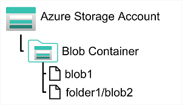

Azure Blob Storage is a service that enables you to store massive amounts of unstructured data as binary large objects, or *blobs*, in the cloud. Blobs are an efficient way to store data files in a format that is optimized for cloud-based storage, and applications can read and write them by using the Azure blob storage API.

In an Azure storage account, you store blobs in *containers*. A container provides a convenient way of grouping related blobs together. You control who can read and write blobs inside a container at the container level.

 Within a container, you can organize blobs in a hierarchy of virtual folders, similar to files in a file system on disk. However, by default, these folders are simply a way of using a "/" character in a blob name to organize the blobs into namespaces. The folders are purely virtual, and you can't perform folder-level operations to control access or perform bulk operations.

Azure Blob Storage supports three different types of blob:

- **Block blobs**. A block blob is handled as a set of blocks. Each block can vary in size, up to 4000 MiB. A block blob can contain up to 190.7 TiB (4000 MiB X 50,000 blocks), giving a maximum size of over 5000 MiB. The block is the smallest amount of data that can be read or written as an individual unit. Block blobs are best used to store discrete, large, binary objects that change infrequently.
- **Page blobs**. A page blob is organized as a collection of fixed size 512-byte pages. A page blob is optimized to support random read and write operations; you can fetch and store data for a single page if necessary. A page blob can hold up to 8 TB of data. Azure uses page blobs to implement virtual disk storage for virtual machines.
- **Append blobs**. An append blob is a block blob optimized to support append operations. You can only add blocks to the end of an append blob; updating or deleting existing blocks isn't supported. Each block can vary in size, up to 4 MB. The maximum size of an append blob is just over 195 GB.

Blob storage provides three access tiers, which help to balance access latency and storage cost:

- The *Hot* tier is the default. You use this tier for blobs that are accessed frequently. The blob data is stored on high-performance media.
- The *Cool* tier has lower performance and incurs reduced storage charges compared to the Hot tier. Use the Cool tier for data that is accessed infrequently. It's common for newly created blobs to be accessed frequently initially, but less so as time passes. In these situations, you can create the blob in the Hot tier, but migrate it to the Cool tier later. You can migrate a blob from the Cool tier back to the Hot tier.
- The *Archive* tier provides the lowest storage cost, but with increased latency. The Archive tier is intended for historical data that mustn't be lost, but is required only rarely. Blobs in the Archive tier are effectively stored in an offline state. Typical reading latency for the Hot and Cool tiers is a few milliseconds, but for the Archive tier, it can take hours for the data to become available. To retrieve a blob from the Archive tier, you must change the access tier to Hot or Cool. The blob will then be rehydrated. You can read the blob only when the rehydration process is complete.

You can create lifecycle management policies for blobs in a storage account. A lifecycle management policy can automatically move a blob from Hot to Cool, and then to the Archive tier, as it ages and is used less frequently (policy is based on the number of days since modification). A lifecycle management policy can also arrange to delete outdated blobs.
