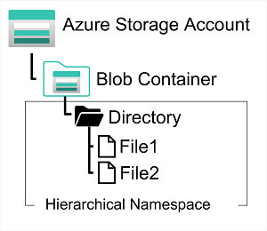

Azure Data Lake Store (Gen1) is a separate service for hierarchical data storage for analytical data lakes, often used by so-called *big data* analytical solutions that work with structured, semi-structured, and unstructured data stored in files. Azure Data Lake Storage Gen**2** is a newer version of this service that is integrated into Azure Storage; enabling you to take advantage of the scalability of blob storage and the cost-control of storage tiers, combined with the hierarchical file system capabilities and compatibility with major analytics systems of Azure Data Lake Store.

Systems like Hadoop in Azure HDInsight, Azure Databricks, and Azure Synapse Analytics can mount a distributed file system hosted in Azure Data Lake Store Gen2 and use it to process huge volumes of data.

To create an Azure Data Lake Store Gen2 files system, you must enable the **Hierarchical Namespace** option of an Azure Storage account. You can do this when initially creating the storage account, or you can upgrade an existing Azure Storage account to support Data Lake Gen2. Be aware however that upgrading is a one-way process – after upgrading a storage account to support a hierarchical namespace for blob storage, you can’t revert it to a flat namespace.
