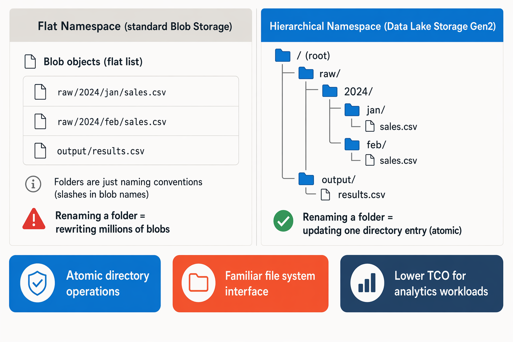

Azure Data Lake Storage Gen2 is a cloud-scale data lake solution built into Azure Storage. It combines the scalability and cost-control of Azure Blob Storage—including storage tiers and lifecycle management—with a hierarchical file system that is compatible with major analytics systems.

Systems like Azure Databricks can mount a distributed file system hosted in Azure Data Lake Storage Gen2 and use it to process huge volumes of data. Microsoft Fabric tenants automatically provision OneLake, which is built on top of Azure Data Lake Storage Gen2.

To create an Azure Data Lake Storage Gen2 file system, you must enable the **Hierarchical Namespace** option of an Azure Storage account. You can do this when initially creating the storage account, or you can upgrade an existing Azure Storage account to support a hierarchical namespace. Be aware that upgrading is a one-way process — after upgrading, you can’t revert the storage account to a flat namespace.