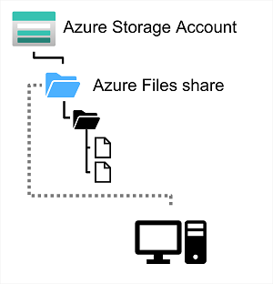

Many on-premises systems comprising a network of in-house computers make use of file shares. A file share enables you to store a file on one computer, and grant access to that file to users and applications running on other computers. This strategy can work well for computers in the same local area network, but doesn't scale well as the number of users increases, or if users are located at different sites.

Azure Files is essentially a way to create cloud-based network shares, such as you typically find in on-premises organizations to make documents and other files available to multiple users. By hosting file shares in Azure, organizations can eliminate hardware costs and maintenance overhead, and benefit from high availability and scalable cloud storage for files.

You create Azure File storage in a storage account. Azure Files enables you to share up to 100 TB of data in a single storage account. This data can be distributed across any number of file shares in the account. The maximum size of a single file is 1 TB, but you can set quotas to limit the size of each share below this figure. Currently, Azure File Storage supports up to 2000 concurrent connections per shared file.

After you've created a storage account, you can upload files to Azure File Storage using the Azure portal, or tools such as the *AzCopy* utility. You can also use the Azure File Sync service to synchronize locally cached copies of shared files with the data in Azure File Storage.

Azure File Storage offers two performance tiers. The *Standard* tier uses hard disk-based hardware in a datacenter, and the *Premium* tier uses solid-state disks. The *Premium* tier offers greater throughput, but is charged at a higher rate.

Azure Files supports two common network file sharing protocols:

- *Server Message Block* (SMB) file sharing is commonly used across multiple operating systems (Windows, Linux, macOS).
- *Network File System* (NFS) shares are used by some Linux and macOS versions. To create an NFS share, you must use a premium tier storage account and create and configure a virtual network through which access to the share can be controlled.
