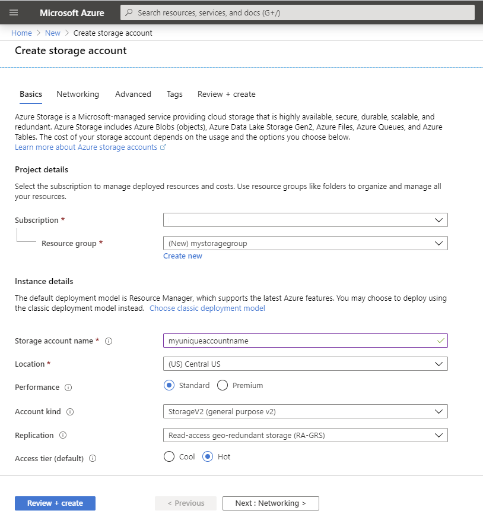
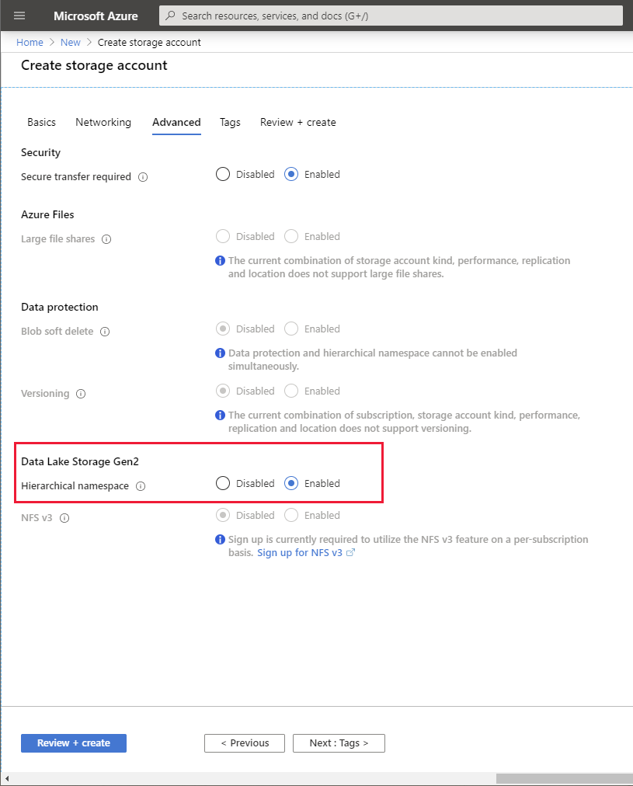
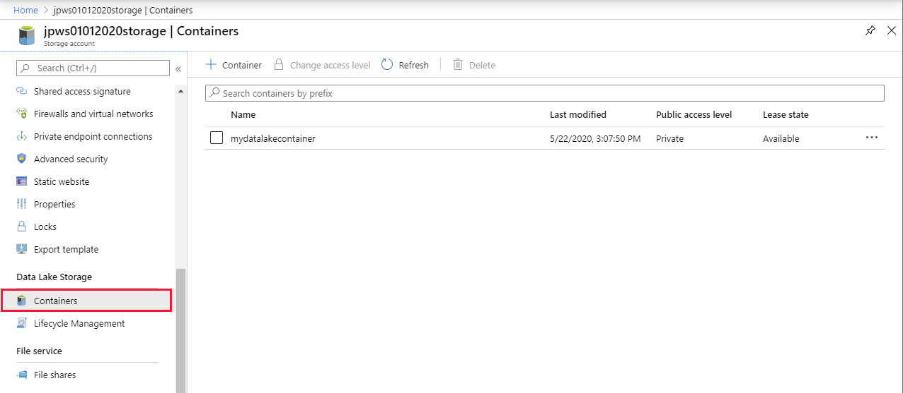
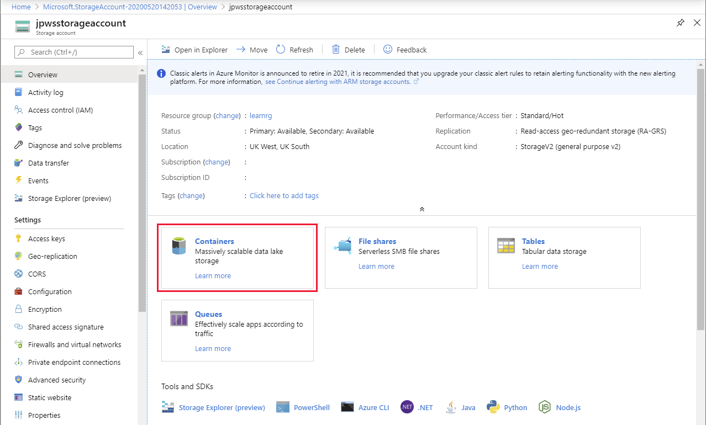
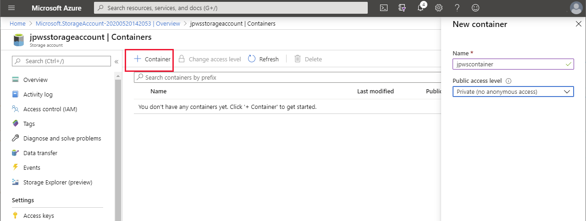
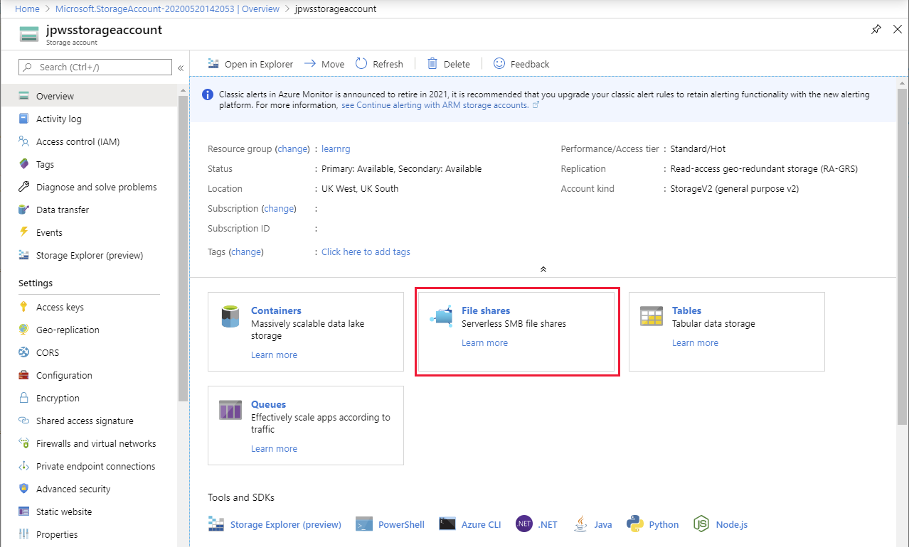
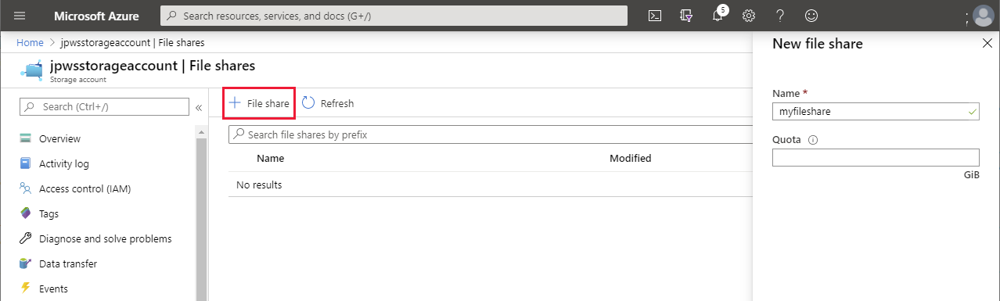

Besides Cosmos DB, Azure supports other non-relational data services. These services are optimized for more specific cases than a generalized document database store.

In the sample scenario, Contoso wants to use Azure Blob storage to store video and audio files, Azure Data Lake storage to support large volumes of data, and Azure File storage to create file shares.

This unit describes how to provision Data Lake storage, Blob storage, and File Storage. As with Cosmos DB, you can provision these services using the Azure portal, the Azure CLI, Azure PowerShell, and Azure Resource Manager templates.
Data Lake storage, Blob storage, and File Storage, all require that you first create an Azure storage account.

## How to create a storage account

### Use the Azure portal

Use the **Create storage account** page to set up a new storage account using the Azure portal.

> [!div class="mx-imgBorder"]
> 

On the **Basics** tab, provide for the following details:

- **Subscription**. Select your Azure subscription.

- **Resource Group**. Either select an existing resource group, or create a new one, as appropriate.

- **Storage account name**. As with a Cosmos DB account, each storage account must have a unique name that hasn't already been used by someone else.

- **Location**. Select the region that is nearest to you if you're in the process of developing a new application, or the region nearest to your users if you're deploying an existing application.

- **Performance**. This setting has two options: 

    - **Standard** storage accounts are based on hard disks. They're the lowest cost of the two storage options, but have higher latency. This type of storage account is suitable for applications that require bulk storage that is accessed infrequently, such as archives.

    - **Premium** storage uses solid-state drives, and has much lower latency and better read/write performance than standard storage. Solid-state drives are best used for I/O intensive applications, such as databases. You can also use premium storage to hold Azure virtual machine disks. A premium storage account is more expensive than a standard account.

    > [!NOTE]
    > Data Lake storage is only available with a standard storage account, not premium.

- **Account kind**. Azure storage supports several different types of account:

    - **General-purpose v2**. You can use this type of storage account for blobs, files, queues, and tables, and is recommended for most scenarios that require Azure Storage. If you want to provision Azure Data Lake Storage, you should specify this account type.

    - **General-purpose v1**. This is a legacy account type for blobs, files, queues, and tables. Use general-purpose v2 accounts when possible.

    - **BlockBlobStorage**. The type of storage account is only available for premium accounts. You use this account type for block blobs and append blobs. It's recommended for scenarios with high transaction rates, or that use smaller objects, or require consistently low storage latency.

    - **FileStorage**. This type is also only available for premium accounts. You use it to create files-only storage accounts with premium performance characteristics. It's recommended for enterprise or high-performance scale applications. Use this type if you're creating an account to support File Storage.

    - **BlobStorage**. This is another legacy account type that can only hold blobs. Use general-purpose v2 accounts instead, when possible. You can use this account type for Azure Data Lake storage, but the General-purpose v2 account type is preferable.

- **Replication**. Data in an Azure Storage account is always replicated three times in the region you specify as the primary location for the account. Azure Storage offers two options for how your data is replicated in the primary region:

    - **Locally redundant storage (LRS)** copies your data synchronously three times within a single physical location in the region. LRS is the least expensive replication option, but isn't recommended for applications requiring high availability.

    - **Geo-redundant storage (GRS)** copies your data synchronously three times within a single physical location in the primary region using LRS. It then copies your data asynchronously to a single physical location in the secondary region. This form of replication protects you against regional outages.

    - **Read-access geo-redundant storage (RA-GRS)** replication is an extension of GRS that provides direct read-only access to the data in the secondary location. In contrast, the GRS option doesn't expose the data in the secondary location, and it's only used to recover from a failure in the primary location. RA-GRS replication enables you to store a read-only copy of the data close to users that are located in a geographically distant location, helping to reduce read latency times. 

    > [!NOTE]
    > To maintain performance, premium storage accounts only support LRS replication. This is because replication is performed synchronously to maintain data integrity. Replicating data to a distant region can increase latency to the point at which any advantages of using premium storage are lost.

- **Access tier**. This option is only available for standard storage accounts. You can select between **Hot** and **Cool**.

    The hot access tier has higher storage costs than cool and archive tiers, but the lowest access costs. Example usage scenarios for the hot access tier include:

    - Data that's in active use or expected to be accessed (read from and written to) frequently.
    - Data that's staged for processing and eventual migration to the cool access tier.

    The cool access tier has lower storage costs and higher access costs compared to hot storage. This tier is intended for data that will remain in the cool tier for at least 30 days. Example usage scenarios for the cool access tier include:

    - Short-term backup and disaster recovery datasets.
    - Older media content not viewed frequently anymore but is expected to be available immediately when accessed.
    - Large data sets that need to be stored cost effectively while more data is being gathered for future processing. For example, long-term storage of scientific data, or raw telemetry data from a manufacturing facility.

### Use the Azure CLI

If you're using the Azure CLI, run the **az storage account** command to create a new storage account. The example below summarizes the options available:

```azurecli
az storage account create \
  --name <storage-account-name> \
  --resource-group <resource-group> \
  --location <your-location> \
  --sku <sku> \
  --kind <kind> \
  --access-tier <tier>
```

The **sku** is combination of the performance tier and replication options. It can be one of Premium_LRS, Premium_ZRS, Standard_GRS, Standard_GZRS, Standard_LRS, Standard_RAGRS, Standard_RAGZRS, or Standard_ZRS.

> [!NOTE]
> ZRS in some of these skus stands for *Zone redundant storage*. Zone-redundant storage replicates your Azure Storage data synchronously across three Azure availability zones in the primary region. Each availability zone is a separate physical location with independent power, cooling, and networking. This is useful for applications requiring high availability. 
>


The **kind** parameter should be one of BlobStorage, BlockBlobStorage, FileStorage, Storage, or StorageV2.

The **access-tier** parameter can either be Cool or Hot.

### Use Azure PowerShell

You use the **New-AzStorageAccount** PowerShell cmdlet to create a new storage account, as follows:

```PowerShell
New-AzStorageAccount `
  -Name "<storage-account-name>" `
  -ResourceGroupName "<resource-group-name>" `
  -Location "<your-location>" `
  -SkuName "<sku>" `
  -Kind "<kind>" `
  -AccessTier "<tier>"
```

The values for *SkuName*, *Kind*, and *AccessTier* are the same as those in the Azure CLI command.

## How to provision Data Lake storage in a storage account

### Use the Azure portal

> [!IMPORTANT]
> If you're provisioning a Data Lake storage, you **must** specify the appropriate configuration settings when you create the storage account. You can't configure Data Lake storage after the storage account has been set up. 

In the Azure portal, on the **Advanced** tab of the **Create storage account** page, in the **Data Lake Storage Gen2** section, select **Enabled** for the **Hierarchical namespace** option.

> [!div class="mx-imgBorder"]
> 

After the storage account has been created, you can add one or more Data Lake Storage containers to the account. Each container supports a directory structure for storing Data Lake files.

> [!div class="mx-imgBorder"]
> 

### Use the Azure CLI

Run the **az storage account** command with the **enable-hierarchical-namespace** parameter to create a new storage account that supports Data Lake Storage:

```azurecli
az storage account create \
  --name <storage-account-name> \
  --resource-group <resource-group> \
  --location <your-location> \
  --sku <sku> \
  --kind <kind> \
  --access-tier <tier> \
  --enable-hierarchical-namespace true
```

### Use Azure PowerShell

Use the **New-AzStorageAccount** PowerShell cmdlet with the **EnableHierarchicalNamespace** parameter, as follows:

```PowerShell
New-AzStorageAccount `
  -Name "<storage-account-name>" `
  -ResourceGroupName "<resource-group-name>" `
  -Location "<your-location>" `
  -SkuName "<sku>" `
  -Kind "<kind>" `
  -AccessTier "<tier>" `
  -EnableHierarchicalNamespace $True
```

## How to provision Blob storage in a storage account

### Use the Azure portal

Blobs are stored in containers, and you create containers **after** you've created a storage account. In the Azure portal, you can add a container using the features on the **Overview** page for your storage account.

> [!div class="mx-imgBorder"]
> 

The **Containers** page enables you to create and manage containers. Each container must have a unique name within the storage account. You can also specify the access level. By default, data held in a container is only accessible by the container owner. You can set the access level to **Blob** to enable public read access to any blobs created in the container, or **Container** to allow read access to the entire contents of the container, including the ability to list all blobs. You can also configure role-based access control for a blob if you need a more granular level of security. 

> [!div class="mx-imgBorder"]
> 

Once you've provisioned a container, your applications can upload blobs into the container.

### Use the Azure CLI

The **az storage container create** command establishes a new blob container in a storage account.

```azurecli
az storage container create \
  --name <container-name> \
  --account-name <storage-account-name> \
  --public-access <access>
```

The **public-access** parameter can be **blob**, **container**, or **off** (for private access only).

### Use Azure PowerShell

Use the **New-AzStorageContainer** cmdlet to add a container to a storage account. You must first retrieve a storage account object with the **Get-AzStorageAccount** cmdlet. The code below shows an example:

```PowerShell
Get-AzStorageAccount `
  -ResourceGroupName "<resource-group>" `
  -Name "<storage-account-name>" | New-AzStorageContainer `
    -Name "<container-name>" `
    -Permission <permission>
```

The **Permission** parameter accepts the values **Blob**, **Container**, or **Off**. 

## How to provision File storage in a storage account

### Use the Azure portal

You provision File storage by creating one or more file shares in the storage account. In the Azure portal, select **File shares** on the **Overview** page for the account.

> [!div class="mx-imgBorder"]
> 

Using the **File shares** page, create a new file share. Give the file share a name, and optionally set a quota to limit the size of files on the share. The total size of all files across all file shares in a storage account can't exceed 5120 GB. 

> [!div class="mx-imgBorder"]
> 

After you've created the file share, applications can read and write shared files using the file share.

### Use the Azure CLI

The Azure CLI provides the **az storage share create** to create a new file share in a storage account:

```azurecli
az storage share create \
  --name <share-name> \
  --account-name <storage-account-name>
```

### Use Azure PowerShell

The **New-AzStorageShare** cmdlet creates a new file share in a storage account. You must retrieve the storage account details first.

```PowerShell
Get-AzStorageAccount `
  -ResourceGroupName "<resource-group>" `
  -Name "<storage-account-name>" |New-AzStorageShare `
    -Name "<share-name>"
``` 