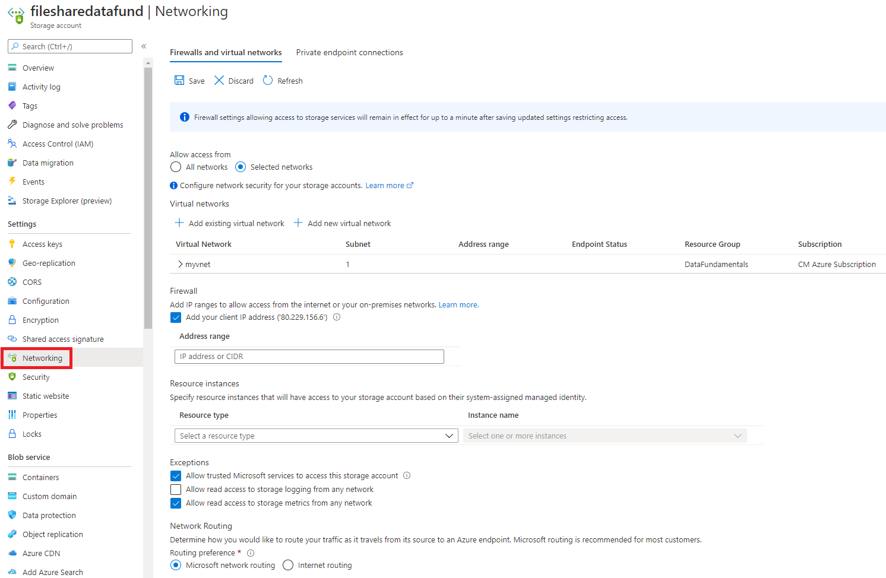
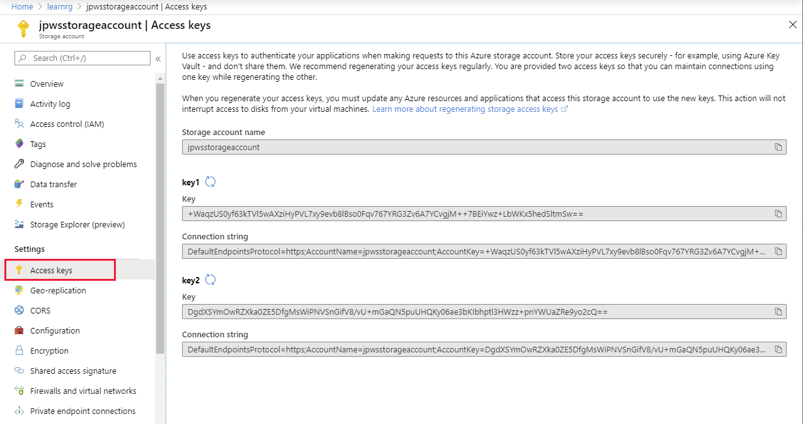
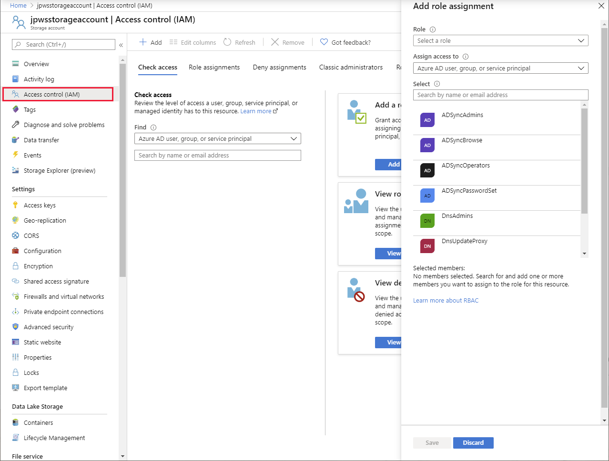
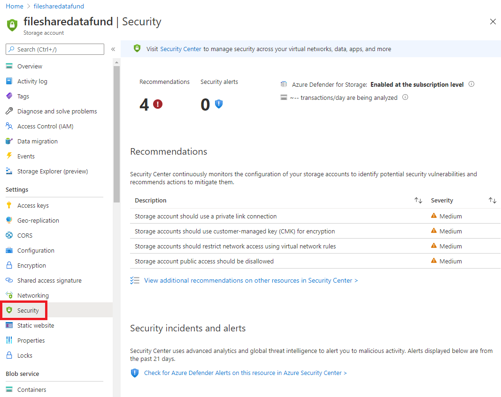

After you've provisioned a resource, you'll often need to configure it to meet the needs of your applications and environment. For example, you might need to set up network access, or open a firewall port to enable your applications to connect to the resource. 

In this unit, you'll learn how to enable network access to your resources, and how you can prevent accidental exposure of your resources to third parties. You'll see how to use authentication and access control to protect the data managed by your resources. 

## Configure connectivity and firewalls

The default connectivity for Azure Cosmos DB and Azure Storage is to enable access to the world at large. You can connect to these services from an on-premises network, the internet, or from within an Azure virtual network. Although this level of access sounds risky, most Azure services mitigate this risk by requiring authentication before granting access. Authentication is described later in this unit.

> [!NOTE]
> An Azure Virtual Network is a representation of your own network in the cloud. A virtual network enables you to connect virtual machines and Azure services together, in much the same way that you might use a physical network on-premises. Azure ensures that each virtual network is isolated from other virtual networks created by other users, and from the Internet. Azure enables you to specify which machines (real and virtual), and services, are allowed to access resources on the virtual network, and which ports they can use.

### Configure connectivity to virtual networks and on-premises computers

To restrict connectivity, use the **Firewalls and virtual networks** page for a service. To limit connectivity, choose **Selected networks**. Three further sections will appear, labeled **Virtual Network**, **Firewall**, and **Exceptions**.

In the **Virtual networks** section, you can specify which virtual networks are allowed to route traffic to the service. When you create items such as web applications and virtual machines, you can add them to a virtual network. If these applications and virtual machines require access to your resource, add the virtual network containing these items to the list of allowed networks.

If you need to connect to the service from an on-premises computer, in the **Firewall** section, add the IP address of the computer. This setting creates a firewall rule that allows traffic from that address to reach the service.

The **Exceptions** setting allows you to enable access to any other of your services created in your Azure subscription. 

For detailed information read [Configure Azure Storage firewalls and virtual networks](https://docs.microsoft.com/azure/storage/common/storage-network-security).

The image below shows the **Firewalls and virtual networks** page for an Azure Storage account. Other services have the same, or similar, page.

> [!div class="mx-imgBorder"]
> 

### Configure connectivity from private endpoints

**Azure Private Endpoint** is a network interface that connects you privately and securely to a service powered by Azure Private Link. Private Endpoint uses a private IP address from your VNet, effectively bringing the service into your VNet. The service could be an Azure service such as Azure Storage, Azure Cosmos DB, SQL, or your own Private Link Service. For detailed information, read [What is Azure Private Endpoint?](https://docs.microsoft.com/azure/private-link/private-endpoint-overview).

The  **Private endpoint connections** page for a service allows you to specify which private endpoints, if any, are permitted access to your service. You can use the settings on this page, together with the **Firewalls and virtual networks** page, to completely lock down users and applications from accessing public endpoints to connect to your Cosmos DB account. 

## Configure authentication

Many services include an access key that you can specify when you attempt to connect to the service. If you provide an incorrect key, you'll be denied access. The image below shows how to find the access key for an Azure Storage account; you select **Access Keys** under **Settings** on the main page for the account. Many other services allow you to view the access key in the same way from the Azure portal. If your key is compromised, you can generate a new access key.

> [!div class="mx-imgBorder"]
> 

> [!NOTE]
> Azure services actually provide two keys, labeled **key1** and **key2**. An application can use either key to connect to the service.

Any user or application that knows the access key for a resource can connect to that resource. However, access keys provide a rather coarse-grained level of authentication. Additionally, if you need to regenerate an access key (after accidental disclosure, for example), you may need to update all applications that connect using that key.

Azure Active Directory (Azure AD) provides superior security and ease of use over access key authorization. Microsoft recommends using Azure AD authorization when possible to minimize potential security vulnerabilities inherent in using access keys.

Azure AD is a separate Azure service. You add users and other security principals (such as an application) to a *security domain* managed by Azure AD. The following video describes how authentication works with Azure.

> [!VIDEO https://www.microsoft.com/videoplayer/embed/RE4A94T]

For detailed information on using Azure AD, visit the page [What is Azure Active Directory?](https://docs.microsoft.com/azure/active-directory/fundamentals/active-directory-whatis) on the Microsoft website.

## Configure access control

Azure AD enables you to specify who, or what, can access your resources. Access control defines what a user or application can do with your resources after they've been authenticated.

Access management for cloud resources is a critical function for any organization that is using the cloud. Azure role-based access control (Azure RBAC) helps you manage who has access to Azure resources, and what they can do with those resources. For example, using RBAC you could:

- Allow one user to manage virtual machines in a subscription and another user to manage virtual networks.
- Allow a database administrator group to manage SQL databases in a subscription.
- Allow a user to manage all resources in a resource group, such as virtual machines, websites, and subnets.
- Allow an application to access all resources in a resource group.

You control access to resources using Azure RBAC to create role assignments. A role assignment consists of three elements: a security principal, a role definition, and a scope.

- A **security principal** is an object that represents a user, group, service, or managed identity that is requesting access to Azure resources.

- A **role definition**, often abbreviated to *role*, is a collection of permissions. A role definition lists the operations that can be performed, such as read, write, and delete. Roles can be given high-level names, like owner, or specific names, like virtual machine reader. Azure includes several built-in roles that you can use, including:

    - **Owner** - Has full access to all resources including the right to delegate access to others.

    - **Contributor** - Can create and manage all types of Azure resources but can't grant access to others.

    - **Reader**- Can view existing Azure resources.

    - **User Access Administrator** - Lets you manage user access to Azure resources.

    You can also create your own custom roles. For detailed information, see [Create or update Azure custom roles using the Azure portal](https://docs.microsoft.com/azure/role-based-access-control/custom-roles-portal) on the Microsoft website.

- A **scope** lists the set of resources that the access applies to. When you assign a role, you can further limit the actions allowed by defining a scope. This is helpful if, for example, you want to make someone a Website Contributor, but only for one resource group.

You add role assignments to a resource in the Azure portal using the **Access control (IAM)** page. The **Role assignments** tab enables you to associate a role with a security principal, defining the level of access the role has to the resource. For further information, read [Add or remove Azure role assignments using the Azure portal](https://docs.microsoft.com/azure/role-based-access-control/role-assignments-portal).

> [!div class="mx-imgBorder"]
> 

## Configure advanced security

Apart from authentication and authorization, many services provide additional protection through advanced security.

Advanced security implements threat protection and assessment. Threat protection adds security intelligence to your service. This intelligence monitors the service and detects unusual patterns of activity that could be harmful, or compromise the data managed by the service. Assessment identifies potential security vulnerabilities and recommends actions to mitigate them. 

You're charged an additional fee for this feature. The image below shows the **Advanced security** page for Azure storage. The corresponding page for other non-relational services, such as Cosmos DB, is similar.

> 

