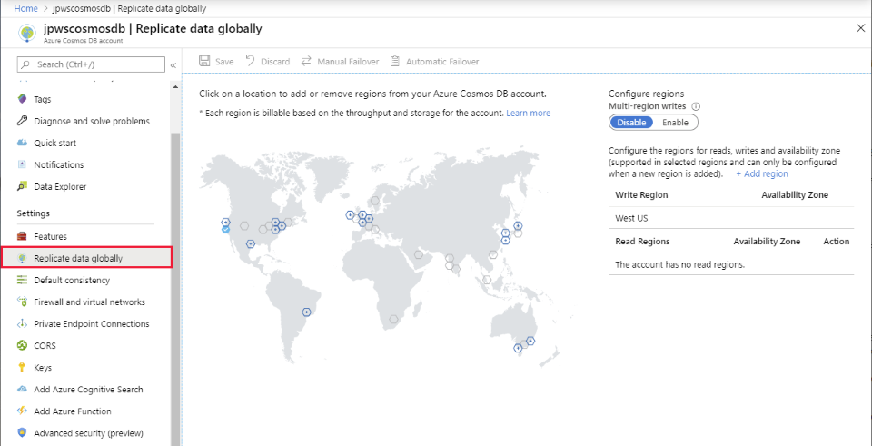
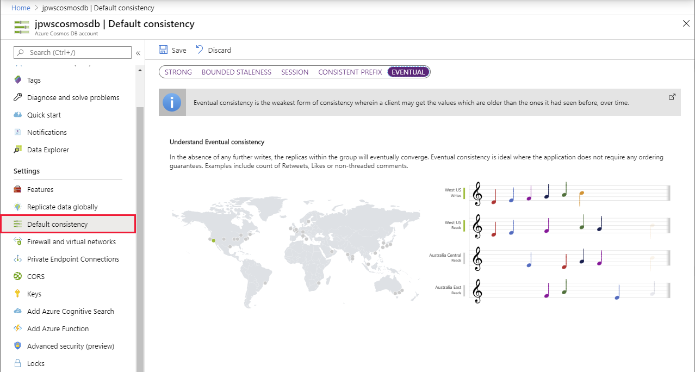
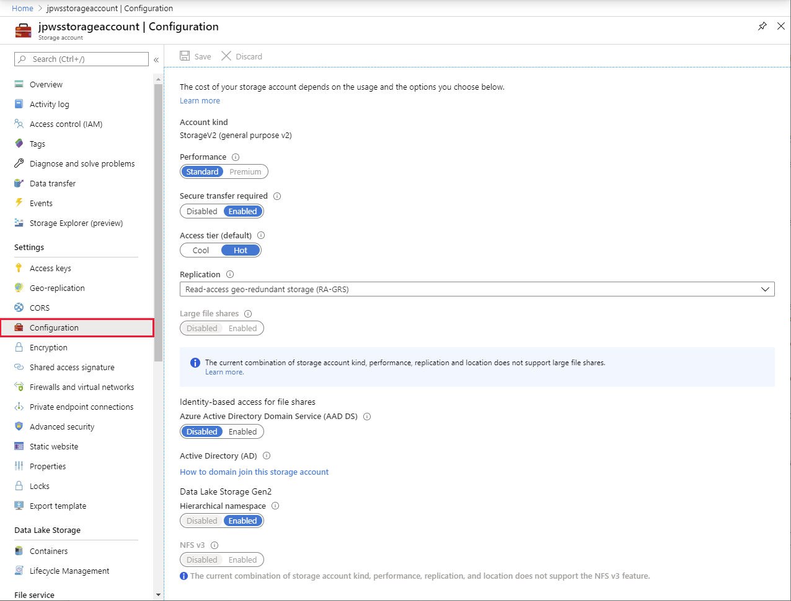
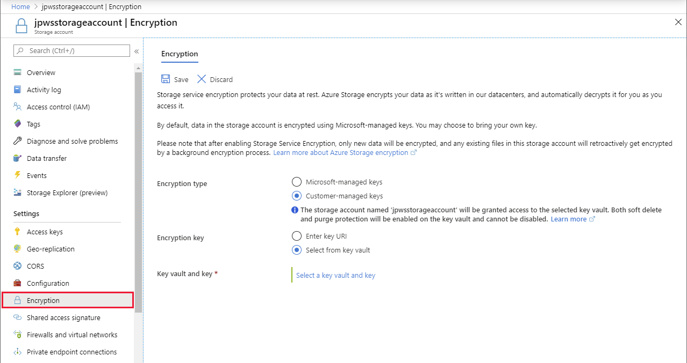
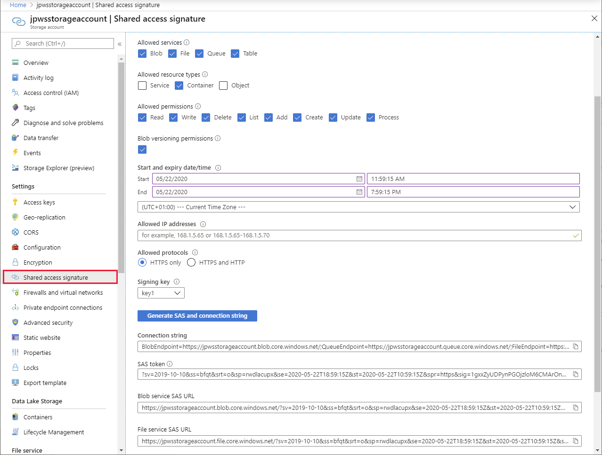

Apart from the general configuration settings applicable to many services, most services also have specific features that you can set up. For example, in the sample scenario, after you've provisioned a Cosmos DB account, you may need to configure replication, or database consistency settings.

In this unit, you'll look at specific configuration settings for Azure Cosmos DB and Azure Storage accounts.

## Configure Cosmos DB

### Configure replication

Azure Cosmos DB enables you to replicate the databases and containers in your account across multiple regions. When you initially provision an account, you can specify that you want to copy data to another region. You don't have control over which region is used as the next nearest region is automatically selected. The **Replicate data globally** page enables you to configure replication in more detail. You can replicate to multiple regions, and you select the regions to use. In this way, you can pick the regions that are closest to your consumers, to help minimize the latency of requests made by those consumers. 

You can also use this page to configure automatic failover to help ensure high availability. If the databases in the primary region (the region in which you created the account) become unavailable, one of the replicated regions will take over processing and become the new primary region.

By default, only the region in which you created the account supports write operations; the replicas are all read-only. However, you can enable multi-region writes. Multi-region writes can cause conflicts though, if applications running in different regions modify the same data. In this case, the most recent write will overwrite changes made earlier when data is replicated, although you can write your own code to apply a different strategy.

Replication is asynchronous, so there's likely to be a lag between a change made in one region, and that change becoming visible in other regions.

> [!div class="mx-imgBorder"]
> 

> [!NOTE]
> Each replica increases the cost of the Cosmos DB service. For example, if you replicate your account to two regions, your costs will be three times that of a non-replicated account.

### Configure consistency

Within a single region, Cosmos DB uses a cluster of servers. This approach helps to improve scalability and availability. A copy of all data is held in each server in the cluster. The following video explains how this works, and the effects it can have on consistency:

> [!VIDEO https://www.microsoft.com/videoplayer/embed/RE4AbG9]

Cosmos DB enables you to specify how such inconsistencies should be handled. It provides the following options:

- **Eventual**. This option is the least consistent. It's based on the situation just described. Changes won't be lost, they'll appear *eventually*, but they might not appear immediately. Additionally, if an application makes several changes, some of those changes might be immediately visible, but others might be delayed; changes could appear out of order.

- **Consistent Prefix**. This option ensures that changes will appear in order, although there may be a delay before they become visible. In this period, applications may see old data.

- **Session**. If an application makes a number of changes, they'll all be visible to that application, and in order. Other applications may see old data, although any changes will appear in order, as they did for the **Consistent Prefix** option. This form of consistency is sometimes known as *read your own writes*.

- **Bounded Staleness**. There's a lag between writing and then reading the updated data. You specify this staleness either as a period of time, or number of previous versions the data will be inconsistent for. 

- **Strong**: In this case, all writes are only visible to clients after the changes are confirmed as written successfully to all replicas. This option is unavailable if you need to distribute your data across multiple global regions.

Eventual consistency provides the lowest latency and least consistency. Strong consistency results in the highest latency but also the greatest consistency. You should select a default consistency level that balances the performance and requirements of your applications.

You can change the default consistency for a Cosmos DB account using the **Default consistency** page in the Azure portal. Applications can override the default consistency level for individual read operations. However, they can't increase the consistency above that specified on this page; they can only decrease it.

> [!div class="mx-imgBorder"]
> 

## Configure Storage accounts

### General configuration

The **Configuration** page for a storage account enables you to modify some general settings of the account. You can:

- Enable or disable secure communications with the service. By default, all requests and responses are encrypted by using the HTTPS protocol as they traverse the Internet. You can disable encryption if required, although this isn't recommended.

- Switch the default access tier between Cool and Hot.

- Change the way in which the account is replicated.

- Enable or disable integration with Azure AD for requests that access file shares.

Other options, such as the account kind and performance tier, are displayed on this page for information only; you can't change them.

> [!div class="mx-imgBorder"]
> 

### Configure encryption

All data held in an Azure Storage account is automatically encrypted. By default, encryption is performed using keys managed and owned by Microsoft. If you prefer, you can provide your own encryption keys. 

To use your own keys, add them to Azure Key Vault. You then provide the details of the vault and key, or the URI of the key in the vault. All new data will be encrypted as it's written. Existing data will be encrypted using a process running in the background; this process may take a little time. 

> [!div class="mx-imgBorder"]
> 

### Configure shared access signatures

You can use shared access signatures (SAS) to grant limited rights to resources in an Azure storage account for a specified time period. This feature enables applications to access resources such as blobs and files, without requiring that they're authenticated first. You should only use SAS for data that you intend to make public.

A SAS is a token that an application can use to connect to the resource. The application appends the token to the URL of the resource. The application can then send requests to read or write data using this URL and token. 

You can create a token that grants temporary access to the entire service, containers in the service, or individual objects such as blobs and files.

Use the **Shared access signature** page in the Azure portal to generate SAS tokens. You specify the permissions (you could provide read-only access to a blob, for example), the period for which the SAS token is valid, and the IP address range of computers allowed to use the SAS token. The SAS token is encrypted using one of the access keys; you specify which key to use (key1 or key2).

> [!div class="mx-imgBorder"]
> 

