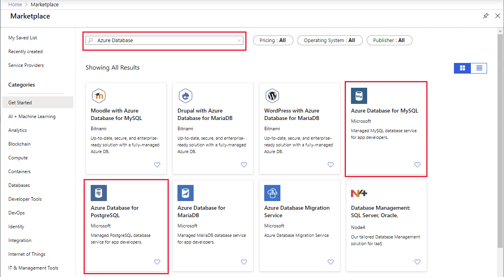
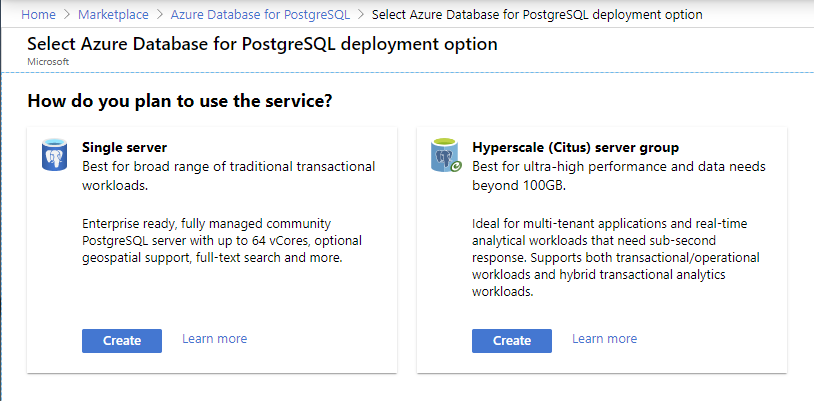
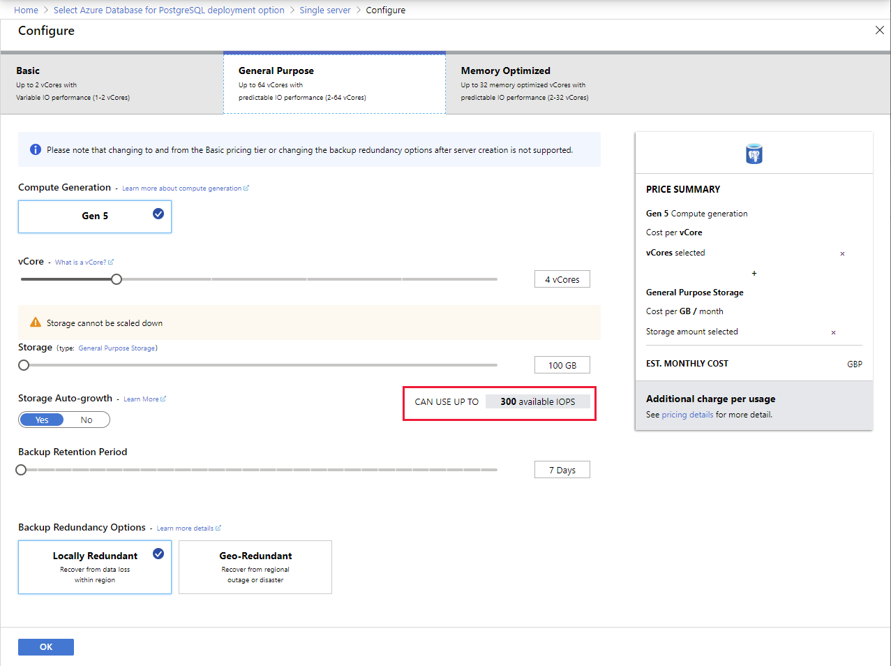

Azure relational data services enable you to work with other leading relational database providers, such as PostgreSQL and MySQL. These services are called Azure Database for PostgreSQL and Azure Database for MySQL.

In this unit, you'll see how to provision these data stores in Azure.

## How to provision Azure Database for PostgreSQL and Azure Database for MySQL

As with Azure SQL Database, you can provision a PostgreSQL or MySQL database interactively using the Azure portal. You can find both of these services in the Azure Marketplace:

> [!div class="mx-imgBorder"]
> 

The processes for provisioning Azure Database for PostgreSQL and Azure Database for MySQL are very similar. 

> [!NOTE] 
> PostgreSQL also gives you the hyperscale option, which supports ultra-high performance workloads.
> [!div class="mx-imgBorder"]
> 
>
> The hyperscale deployment option supports:
>
> - Horizontal scaling across multiple machines. This option enables the service to add and remove computers as workloads increase and diminish.
> - Query parallelization across these servers. The service can split resource intensive queries into pieces which can be run in parallel on the different servers. The results from each server are aggregated back together to produce a final result. This mechanism can deliver faster responses on queries over large datasets.
> - Excellent support for multi-tenant applications, real time operational analytics, and high throughput transactional workloads

The information below summarizes the fields and settings required when provisioning a PostgreSQL or a MySQL database service:

> [!div class="mx-imgBorder"]
> 

The **Basics** tab, prompts for the following details:

- **Subscription**. Select your Azure subscription. 

- **Resource Group**. Either pick an existing resource group, or select **Create new** to build a new one.

- **Server Name**. Each MySQL or PostgreSQL database must have a unique name that hasn't already been used by someone else. The name must be between 3 and 31 characters long, and can only contain lower case letters, digits, and the "-" character.

- **Data Source**. Select **None** to create a new server from scratch. You can select **Backup** if you're creating a server from a geo-backup of an existing Azure Database for MySQL server.

- **Location**. Either select the region that is nearest to you, or the region nearest to your users.

- **Version**. The version of MySQL or PostgreSQL to deploy.

- **Compute + storage**. The compute, storage, and backup configurations for your new server. The **Configure server** link enables you to select the resources required to support you database workloads. These resources include the amount of computing power, memory, backups, and redundancy options (for high availability). 

    > [!NOTE]
    > The term *compute* refers to the amount of processor power available, but in terms of size and number of CPUs allocated to the service.

    > [!div class="mx-imgBorder"]
    > 

    You can select between three pricing tiers, each of which is designed to support different workloads:

    - **Basic**. This tier is suitable for workloads that require light compute and I/O performance. Examples include servers used for development or testing or small-scale, infrequently used applications.

    - **General Purpose**. Use this pricing tier for business workloads that require balanced compute and memory with scalable I/O throughput. Examples include servers for hosting web and mobile apps and other enterprise applications.

    - **Memory Optimized**	This tier supports high-performance database workloads that require in-memory performance for faster transaction processing and higher concurrency. Examples include servers for processing real-time data and high-performance transactional or analytical apps.

    You can fine-tune the resources available for the selected tier. You can scale these resources up later, if necessary.

    > [!NOTE]
    > The **Configure** page displays the performance that General Purpose and Memory Optimized configurations provide in terms of **IOPS**. IOPS is an acronym for *Input/Output Operations per seconds*, and is a measure of the read and write capacity available using the configured resources.

- **Admin username**. A sign-in account to use when you're connecting to the server. The admin sign-in name can't be **azure_superuser**, **admin**, **administrator**, **root**, **guest**, or **public**.

- **Password**. Provide a new password for the server admin account. It must contain from 8 to 128 characters. Your password must contain characters from three of the following categories: English uppercase letters, English lowercase letters, numbers (0-9), and non-alphanumeric characters (!, $, #, %, and so on).

After you've specified the appropriate settings, select **Review + create** to provision the server.
