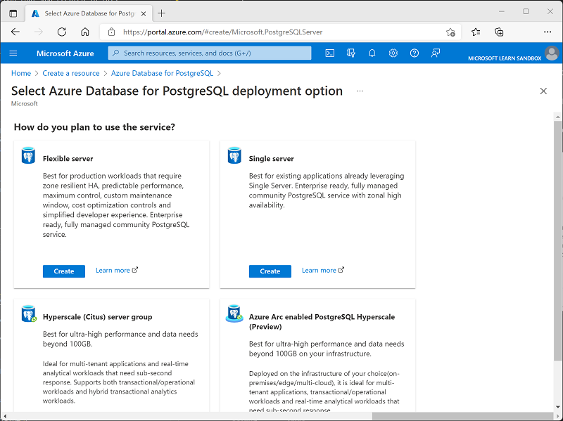
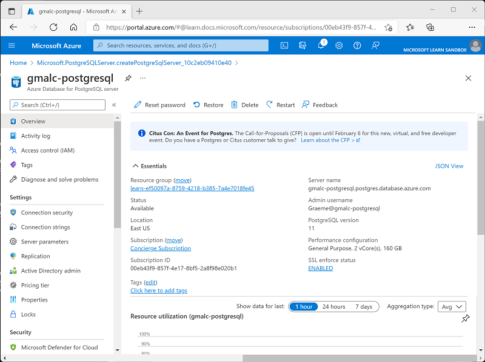
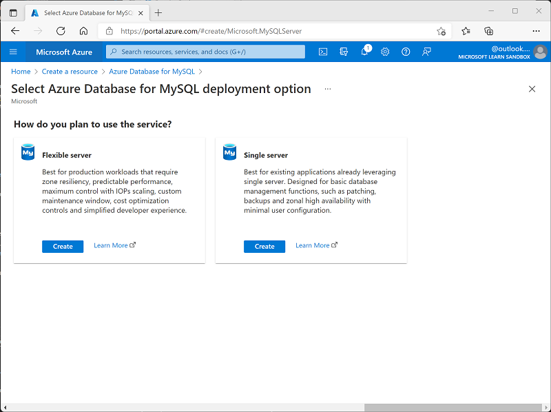

Now it's your opportunity to explore relational database services in Azure.

This exercise can be completed using a Microsoft Learn *sandbox*, which provides a temporary Azure subscription. To activate the sandbox subscription, you must sign in using a Microsoft account. The sandbox subscription will be automatically deleted when you complete this module. After the sandbox has been activated, [sign into the Azure portal using the credentials for your sandbox subscription](https://portal.azure.com/learn.docs.microsoft.com?azure-portal=true). Ensure you're working in the **Microsoft Learn Sandbox** directory - indicated at the top right of the portal under your user ID. If not, select the user icon and switch directory.

[!include[](../../../includes/azure-sandbox-regions-first-mention-note-friendly.md)]

> [!TIP]
> If you prefer, you can use your own Azure subscription. To do so, [sign into the Azure portal using credentials for your subscription](https://portal.azure.com?azure-portal=true). Ensure you are working in the directory containing your subscription - indicated at the top right under your user ID. If not, select the user icon and switch directory.

::: zone pivot="azuresql"

## Provision an Azure SQL Database resource

In this exercise, you'll provision and test an Azure SQL Database resource.

1. In the Azure portal, select **&#65291; Create a resource** from the upper left-hand corner and search for *Azure SQL*. Then in the resulting **Azure SQL** page, select **Create**.

1. Review the Azure SQL options that are available, and then in the **SQL databases** tile, ensure **Single database** is selected and select **Create**.

    > [!div class="mx-imgBorder"]
    > 

1. Enter the following values on the **Create SQL Database** page:
    - **Subscription**: If you're using a *sandbox*, select *Concierge Subscription*. Otherwise, select your Azure subscription.
    - **Resource group**:  If you're using a *sandbox* subscription, select the existing resource group (which will have a name like *learn-xxxx...*). Otherwise, create a new resource group with a name of your choice.
    - **Database name**: *AdventureWorks*
    - **Server**:  Select **Create new** and create a new server with a unique name in any available location. Use **SQL authentication** and specify your name as the server admin login and a suitably complex password (remember the password - you'll need it later!)
    - **Want to use SQL elastic pool?**: *No*
    - **Compute + storage**: Leave unchanged
    - **Backup storage redundancy**: *Locally-redundant backup storage*

1. On the **Create SQL Database** page, select **Next :Networking >**, and on the **Networking** page, in the **Network connectivity** section, select **Public endpoint**. Then select **Yes** for both options in the **Firewall rules** section to allow access to your database server from Azure services and your current client IP address.

1. Select **Next: Security >** and set the **Enable Microsoft Defender for SQL** option to **Not now**.

1. Select **Next: Additional Settings >** and on the **Additional settings** tab, set the **Use existing data** option to **Sample** (this will create a sample database that you can explore later).

1. Select **Review + Create**, and then select **Create** to create your Azure SQL database.

1. Wait for deployment to complete. Then go to the resource that was deployed, which should look like this:

    > [!div class="mx-imgBorder"]
    > 

1. In the pane on the left side of the page, select **Query editor (preview)**, and then sign in using the administrator login and password you specified for your server.

    *If an error message stating that the client IP address isn't allowed is displayed, select the **Allowlist IP ...** link at the end of the message to allow access and try to sign in again (you previously added you own computer's client IP address to the firewall rules, but the query editor may connect from a different address depending on your network configuration.)*

    The query editor looks like this:

    > [!div class="mx-imgBorder"]
    > 

1. Expand the **Tables** folder to see the tables in the database.

1. In the **Query 1** pane, enter the following SQL code:

    ```sql
    SELECT * FROM SalesLT.Product;
    ```

1. Select **&#9655; Run** above the query to run it and view the results, which should include all columns for all rows in the **SalesLT.Product** table as shown here:

    > [!div class="mx-imgBorder"]
    > 

1. Replace the SELECT statement with the following code, and then select **&#9655; Run** to run the new query and review the results (which includes only the **ProductID**, **Name**, **ListPrice**, **ProductCategoryID** columns):

    ```sql
    SELECT ProductID, Name, ListPrice, ProductCategoryID
    FROM SalesLT.Product;
    ```

1. Now try the following query, which uses a JOIN to get the category name from the **SalesLT.ProductCategory** table:

    ```sql
    SELECT p.ProductID, p.Name AS ProductName,
           c.Name AS Category, p.ListPrice
    FROM SalesLT.Product AS p
    JOIN [SalesLT].[ProductCategory] AS c
        ON p.ProductCategoryID = c.ProductCategoryID;
    ```

1. Close the query editor pane, discarding your edits.

> [!TIP]
> If you used your own Azure subscription, and you have finished exploring Azure SQL Database, you can delete the resource group that you created in this exercise.

::: zone-end

::: zone pivot="postgresql"

## Provision an Azure Database for PostgreSQL resource

In this exercise, you'll provision an Azure Database for PostgreSQL resource.

1. In the Azure portal, select **&#65291; Create a resource** from the upper left-hand corner and search for *Azure Database for PostgreSQL*. Then in the resulting **Azure Database for PostgreSQL** page, select **Create**.

1. Review the Azure Database for PostgreSQL options that are available, and then in the **Single server** tile, select **Create**, and decline the offer to switch to a Flexible server if prompted.

    > [!div class="mx-imgBorder"]
    > 

1. Enter the following values on the **Create SQL Database** page:
    - **Subscription**: If you're using a *sandbox*, select *Concierge Subscription*. Otherwise, select your Azure subscription.
    - **Resource group**:  If you're using a *sandbox* subscription, select the existing resource group (which will have a name like *learn-xxxx...*). Otherwise, create a new resource group with a name of your choice.
    - **Server name**: Enter a unique name
    - **Data source**: None
    - **Location**: Any available location
    - **Version**: Leave unchanged
    - **Compute + storage**: Select **Configure server**, and then change **vCore** to two cores, leave the other server settings as they are, and select **OK**.
    - **Admin username**: Your name
    - **Password** and **Confirm password**: A suitably complex password

1. Select **Review + Create**, and then select **Create** to create your Azure PostgreSQL database.

1. Wait for deployment to complete. Then go to the resource that was deployed, which should look like this:

    > [!div class="mx-imgBorder"]
    > 

1. Review the options for managing your Azure Database for PostreSQL resource.

> [!TIP]
> If you used your own Azure subscription, and you have finished exploring Azure Database for PostreSQL, you can delete the resource group that you created in this exercise.

::: zone-end

::: zone pivot="mysql"

## Provision an Azure Database for MySQL resource

In this exercise, you'll provision an Azure Database for MySQL resource.

1. In the Azure portal, select **&#65291; Create a resource** from the upper left-hand corner and search for *Azure Database for MySQL*. Then in the resulting **Azure Database for MySQL** page, select **Create**.

1. Review the Azure Database for MySQL options that are available, and then in the **Single server** tile, select **Create**.

    > [!div class="mx-imgBorder"]
    > 

1. Enter the following values on the **Create SQL Database** page:
    - **Subscription**: If you're using a *sandbox*, select *Concierge Subscription*. Otherwise, select your Azure subscription.
    - **Resource group**:  If you're using a *sandbox* subscription, select the existing resource group (which will have a name like *learn-xxxx...*). Otherwise, create a new resource group with a name of your choice.
    - **Server name**: Enter a unique name
    - **Data source**: None
    - **Location**: Any available location
    - **Version**: Leave unchanged
    - **Compute + storage**: Select **Configure server**, and then change **vCore** to two cores, leave the other server settings as they are, and select **OK**.
    - **Admin username**: Your name
    - **Password** and **Confirm password**: A suitably complex password

1. Select **Review + Create**, and then select **Create** to create your Azure MySQL database.

1. Wait for deployment to complete. Then go to the resource that was deployed, which should look like this:

    > [!div class="mx-imgBorder"]
    > 

1. Review the options for managing your Azure Database for MySQL resource.

> [!TIP]
> If you used your own Azure subscription, and you have finished exploring Azure Database for MySQL, you can delete the resource group that you created in this exercise.

::: zone-end
