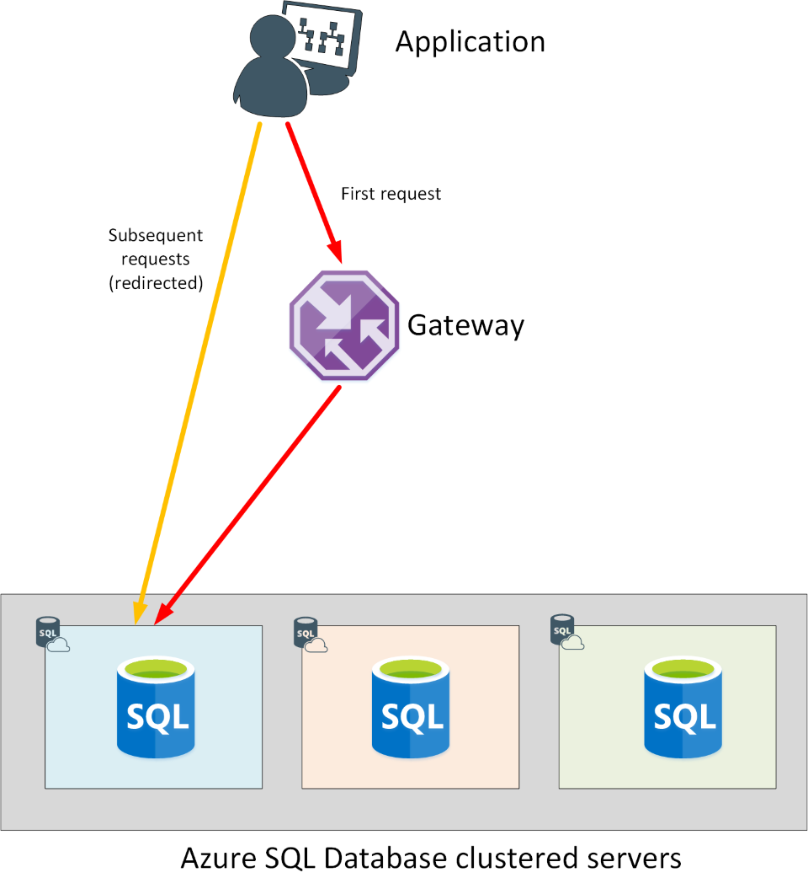
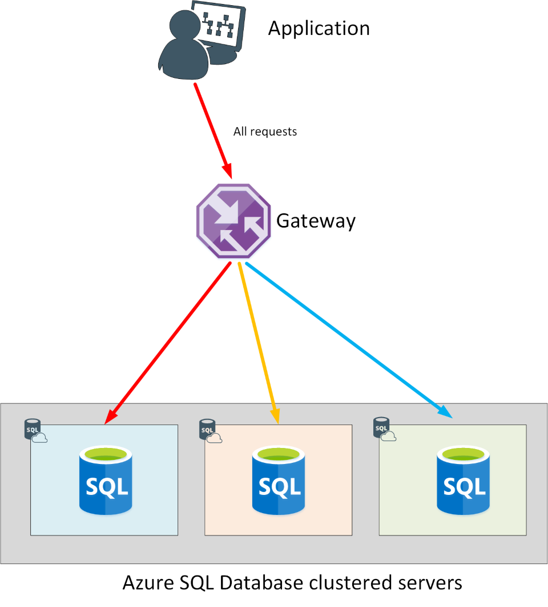
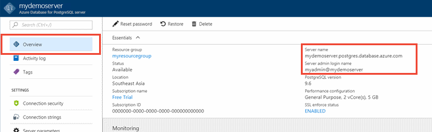
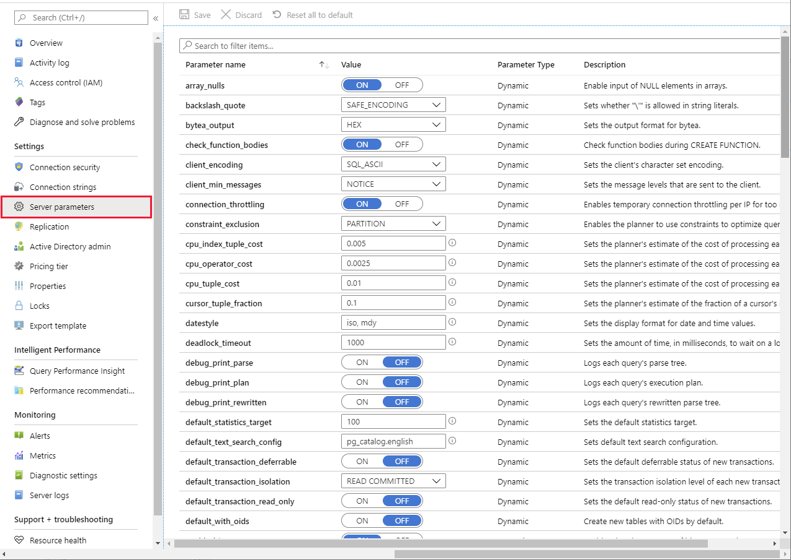
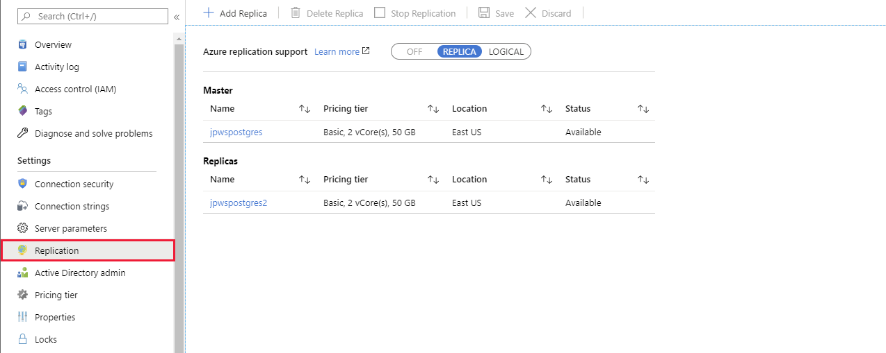
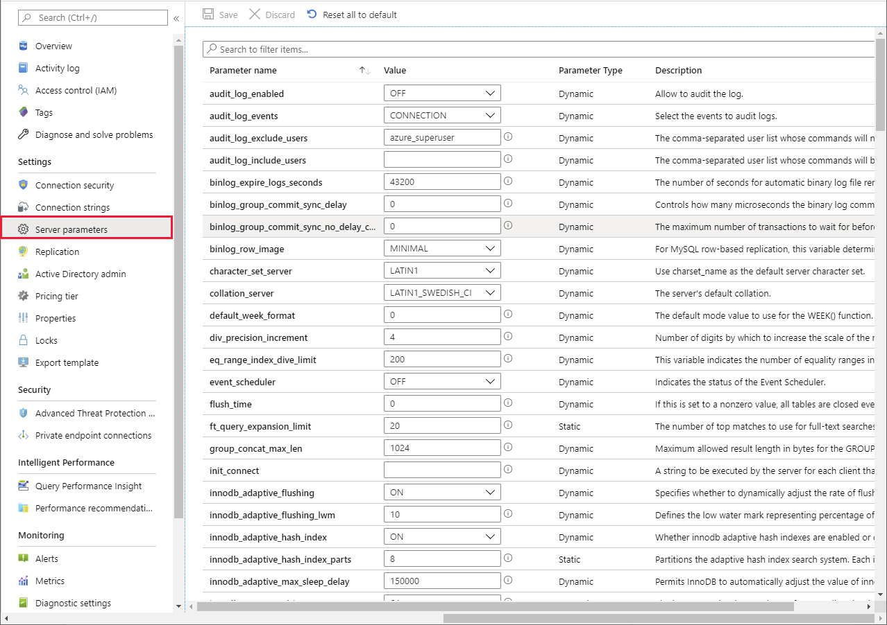

This unit explores the specific configuration options available to each type of data store within Azure relational data services.

## Configure Azure SQL Database

The overarching principle for network security of the Azure SQL Database offering is to allow only the connection and communication that is necessary to allow the service to operate. All other ports, protocols, and connections are blocked by default. Virtual local area networks (VLANs) and access control lists (ACLs) are used to restrict network communications by source and destination networks, protocols, and port numbers.

> [!NOTE]
> An ACL contains a list of resources, and the objects (users, computers, and applications) that are allowed to access those resources. When an object attempts to use a resource that is protected by an ACL, if it's not in the list, it won't be given access.

Items that implement network-based ACLs include routers and load balancers. You control traffic flow through these items by defining firewall rules.

The following steps describe how a connection is established to an Azure SQL database:

- Clients connect to a *gateway* that has a public IP address and listens on port 1433.
- Depending on the effective connection policy, the gateway either redirects traffic to the database cluster, or acts as a proxy for the database cluster.

    > [!NOTE]
    > Azure SQL Database uses a clustered topology to provide high availability. Each server and database is transparently replicated to ensure that a server is always accessible, even in the event of a database or server failure.

- Inside the database cluster, traffic is forwarded to the appropriate Azure SQL database.

### Connectivity from within Azure

If you're connecting from within another Azure service, such as a web application running under Azure App Service, your connections have a connection policy of Redirect by default. A policy of Redirect means that after your application establishes a connection to the Azure SQL database through the gateway, all following requests from your application will go directly to the database rather than through the gateway. If connectivity to the database subsequently fails, your application will have to reconnect through the gateway, when it might be directed to a different copy of the database running on another server in the cluster.

> [!div class="mx-imgBorder"]
> 

### Connectivity from outside of Azure

If you're connecting from outside Azure, such as an on-premises application, your connections have a connection policy of Proxy by default. A policy of Proxy means the connection is established via the gateway, and all subsequent requests flow through the gateway. Each request could (potentially) be serviced by a different database in the cluster.

> [!div class="mx-imgBorder"]
> 

### Configure DoSGuard

Denial of service (DoS) attacks are reduced by a SQL Database gateway service called DoSGuard. DoSGuard actively tracks failed logins from IP addresses. If there are multiple failed logins from a specific IP address within a period of time, the IP address is blocked from accessing any resources in the service for a short while.

In addition, the Azure SQL Database gateway performs the following tasks:

- It validates all connections to the database servers, to ensure that they are from genuine clients.
- It encrypts all communications between a client and the database servers.
- It inspects each network packet sent over a client connection. The gateway validates the connection information in the packet, and forwards it to the appropriate physical server based on the database name that's specified in the connection string.

## Configure Azure Database for PostgreSQL

When you create your Azure Database for PostgreSQL server, a default database named *postgres* is created. To connect to your database server, you need your full server name and admin sign-in credentials. You can easily find the server name and sign in information on the server **Overview** page in the portal. This page contains the Server name and the Server admin sign-in name. 

> [!div class="mx-imgBorder"]
> 

> [!NOTE]
> Connections to your Azure Database for PostgreSQL server communicate over port 5432. When you try to connect from within a corporate network, outbound traffic over port 5432 might not be allowed by your network's firewall. If so, you can't connect to your server unless your IT department opens port 5432.

### Configure server parameters and extensions

A PostgreSQL database server has a number of configuration parameters that you can set. These parameters support fine-tuning of the database, and debugging of code in the database. You can modify these parameters using the **Server parameters** page in the Azure portal.

> [!div class="mx-imgBorder"]
> 

If you're familiar with PostgreSQL, you'll find that not all parameters are supported in Azure. The [Server parameters](https://docs.microsoft.com/azure/postgresql/concepts-servers#server-parameters) page on the Microsoft website describes the PostgreSQL parameters that are available.

PostgreSQL also provides the ability to extend the functionality of your database using extensions. Extensions bundle multiple related SQL objects together in a single package that can be loaded or removed from your database with a single command. After being loaded in the database, extensions function like built-in features. You install an extension in your database before you can use it. To install a particular extension, run the *CREATE EXTENSION* command from psql tool to load the packaged objects into your database. Not all PostgreSQL extensions are supported in Azure. For a full list, read [PostgreSQL extensions in Azure Database for PostgreSQL - Single Server](https://docs.microsoft.com/azure/postgresql/concepts-extensions).

### Configure read replicas

You can replicate data from an Azure Database for PostgreSQL server to a read-only server. Azure Database for PostgreSQL supports replication from the master server to up to five replicas. Replicas are updated asynchronously with the PostgreSQL engine native replication technology.

Read replicas help to improve the performance and scale of read-intensive workloads. Read workloads can be isolated to the replicas, while write workloads can be directed to the master.

A common scenario is to have BI and analytical workloads use read replicas as the data source for reporting.

Because replicas are read-only, they don't directly reduce the burden of write operations on the master. This feature isn't targeted at write-intensive workloads.

Replicas are new servers that you manage similar to regular Azure Database for PostgreSQL servers. For each read replica, you're billed for the provisioned compute in vCores and storage in GB/month.

Use the **Replication** page for a PostgreSQL server in the Azure portal to add read replicas to your database:

> [!div class="mx-imgBorder"]
> 

## Configure Azure Database for MySQL

In order to connect to the MySQL database you've provisioned, you'll need to enter the connection information. This information includes fully qualified server name and sign-in credentials. You can find this information on the **Overview** page for your server:

> [!div class="mx-imgBorder"]
> 

> [!NOTE]
> Connections to your Azure Database for MySQL server communicate over port 3306. When you try to connect from within a corporate network, outbound traffic over port 3306 might not be allowed by your network's firewall. If so, you can't connect to your server unless your IT department opens port 3306.

> [!IMPORTANT]
> By default, SSL connection security is required and enforced on your Azure Database for MySQL server.

### Configure server parameters

Like PostgreSQL, a MySQL database server has a number of configuration parameters that you can set. You can modify these parameters using the **Server parameters** page in the Azure portal.

> [!div class="mx-imgBorder"]
> 

You can find more information about the parameters available for MySQL in Azure on the [How to configure server parameters in Azure Database for MySQL by using the Azure portal](https://docs.microsoft.com/azure/mysql/howto-server-parameters) page on the Microsoft website.

### Configure read replicas

This feature is similar to that available for PostgreSQL. You can create up to five read replicas for a MySQL database. This feature enables you to geo-replicate data across regions and distribute the overhead associated with read-intensive workloads. Replication is asynchronous from the master server, so there may be some lag between records being written at the master and becoming available across all replicas.

Read replication isn't intended to support write-heavy workloads. 

Use the **Replication** page for a MySQL server in the Azure portal to add read replicas to your database.