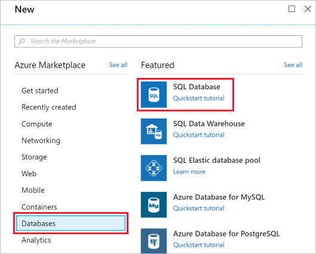
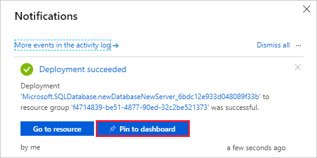
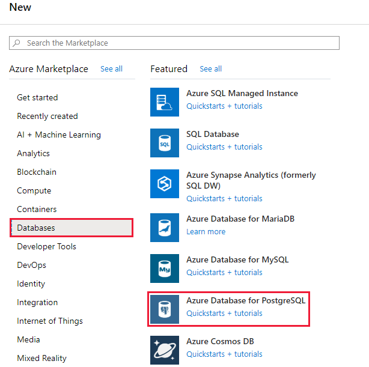
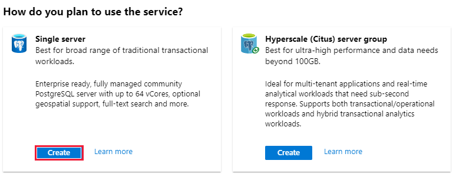
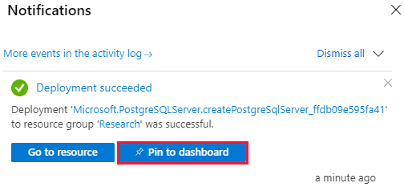
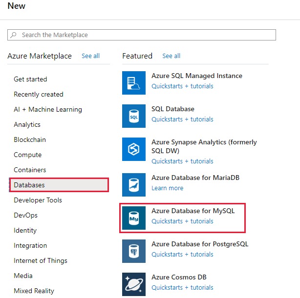
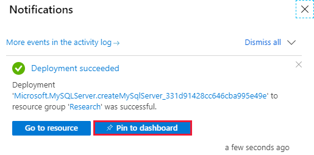

As part of your role at Contoso as a data engineer, you've been asked to create and configure SQL Server, PostgreSQL, and MySQL servers for Azure.

[!include]

::: zone pivot="azuresql"

## Create your Azure SQL Database service

In this exercise you'll set up your Azure SQL Database instance, which includes creating your server. 

Over time if you realize you need additional compute power to keep up with demand, you can adjust performance options or even switch between the DTU and vCore performance models.

1. Sign into the [Azure portal](https://portal.azure.com/learn.docs.microsoft.com?azure-portal=true) using the same account you activated the sandbox with.

1. In the portal, select **Create a resource** from the upper left-hand corner. Select **Databases**, then select **SQL Database**.

   

1. Enter the following values into the form:

    | Setting      | Value |
    | ------------ | ----- |
    | **Subscription** | *Concierge Subscription* |
    | **Resource group** | *<rgn>[sandbox resource group name]</rgn>* |
    | **Database name** | *Contoso* |
    | **Want to use SQL elastic pool?** | *No* |

1. Under **Server**, select **Create new**, fill out the form with the following values, and then select **OK**:

    | Setting      | Value |
    | ------------ | ----- |
    | **Server name** | Use your initials and the date in numeric format. For example, *jpws01012020* |
    | **Server admin login** | *azureadmin* |
    | **Password** | *Pa55w.rd* |
    | **Confirm password** | *Pa55w.rd* |
    | **Location** | Select the default location |

1. Under **Compute + storage**, select **Configure database**.

1. On the **General Purpose** tab, leave **vCores** set to 2, change **Data max size** to **50 GB**, and then select **Apply**

1. Back on the **Create SQL Database** page, select **Additional settings**.

1. Use these values to fill out the form.

    | Setting      | Value |
    | ------------ | ----- |
    | **Use existing data** | *None* |
    | **Database Collation** | *SQL_Latin1_General_CP1_CI_AS* |
    | **Advanced Data Security** | *Not now* |

1. Select **Review + Create**, and then select **Create** to create your Azure SQL database.

1. On the toolbar, select **Notifications** to monitor the deployment process.

    When the process completes, select **Pin to dashboard** to pin your database server to the dashboard so that you have quick access when you need it later.

   

::: zone-end

::: zone pivot="postgresql"

## Create your Azure Database for PostgreSQL service

In this exercise, you'll set up Azure Database for PostgreSQL

1. Sign into the [Azure portal](https://portal.azure.com/learn.docs.microsoft.com?azure-portal=true) using the same account you activated the sandbox with.

1. In the portal, select **Create a resource** from the upper left-hand corner. Select **Databases**, then select **Azure Database for PostgreSQL**.

    > [!div class="mx-imgBorder"]
    > 

1. You will be presented with the choice of a Single server or Hyperscale. Select **Create** for the **Single server** option

    > [!div class="mx-imgBorder"]
    > 

1. Use these values to start filling out the form.

    | Setting      | Value |
    | ------------ | ----- |
    | **Subscription** | *Concierge Subscription* |
    | **Resource group** | *<rgn>[sandbox resource group name]</rgn>* |

1. Under **Server details**, use these values

    | Setting      | Value |
    | ------------ | ----- |    
    | **Server name** | Enter *postgres*, followed by your initials and date in numeric format. For example, *postgresjpws01012020* |
    | **Data source** | *None* |
    | **Location** | Select the default location |
    | **Version** | Keep default setting |

1. Under **Compute + storage**, select **Configure server**.

1. Change **vCore** to two cores, increase the storage to **160 GB**, set the **Backup Retention Period** to **14 days**, and then select **OK**.15

1. Back on the **Single server** page, under **Administrator account**, specify these values:

    | Setting      | Value |
    | ------------ | ----- |    
    | **Admin username** | *azureadmin* |
    | **Password** | *Pa55w.rd* |
    | **Confirm password** | *Pa55w.rd* |

1. Select **Review + Create**, and then select **Create** to create your Azure PostgreSQL database.

1. On the toolbar, select **Notifications** to monitor the deployment process.

    When the process completes, select **Pin to dashboard** to pin your database server to the dashboard so that you have quick access when you need it later.

    > [!div class="mx-imgBorder"]
    > 

::: zone-end

::: zone pivot="mysql"

## Create your Azure Database for MySQL service

In this exercise you'll set up Azure Database for MySQL

1. Sign into the [Azure portal](https://portal.azure.com/learn.docs.microsoft.com?azure-portal=true) using the same account you activated the sandbox with.

1. From the portal, select **Create a resource** from the upper left-hand corner. Select **Databases**, then select **Azure Database for MySQL**.

    > [!div class="mx-imgBorder"]
    > 
   

1. Use these values to fill out the first section of the form.

    | Setting      | Value |
    | ------------ | ----- |
    | **Subscription** | *Concierge Subscription* |
    | **Resource group** | *<rgn>[sandbox resource group name]</rgn>* |

1. Under **Server details**, use these values

    | Setting      | Value |
    | ------------ | ----- |    
    | **Server name** | Enter *mysql* followed by your initials and the date in numeric format. For example, *mysqljpws01012020* |
    | **Data source** | *None* |
    | **Location** | Select the default location |
    | **Version** | Keep default setting |

1. Under **Compute + storage**, select **configure server**.

1. On the **Pricing tier** page, reduce **vCore** to two cores, set **Storage** to **160 GB**, change **Backup Retention Period** to 14 days, and then select **OK**.

1. Back on the **Create MySQL server** page, under **Administrator account**, use these values

    | Setting      | Value |
    | ------------ | ----- |    
    | **Admin username** | azureadmin |
    | **Password** | Pa55w.rd |
    | **Confirm password** | Pa55w.rd |

1. Select **Review + Create**, and then select **Create** to create your Azure MySQL database.

1. On the toolbar, select **Notifications** to monitor the deployment process.

    When the process completes, select **Pin to dashboard** to pin your database server to the dashboard so that you have quick access when you need it later.

    > [!div class="mx-imgBorder"]
    > 

::: zone-end

