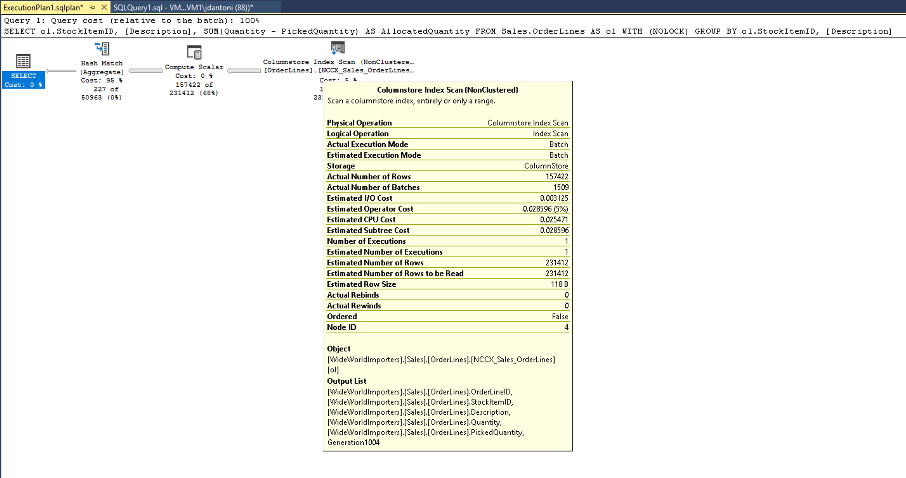

Actual versus estimated execution plans can be confusing. The difference is that the actual plan includes runtime statistics that aren't captured in the estimated plan. The operators used and the order of execution will be the same as the estimated plan in nearly all cases. Another consideration is that capturing an actual execution plan requires the query to be executed, which can be time-consuming or not possible. For example, an `UPDATE` statement can only be run once. However, if you need to see query results and the plan, you need to use one of the actual plan options.

:::image type="content" source="../media/module-55-optimize-queries-final-01.png" alt-text="Screenshot of an estimated execution plan generated in SQL Server Management Studio.":::

As shown, you can generate an estimated plan in SSMS by clicking the button indicated by the estimated query plan box (or using the keyboard command **Control+L**). You can generate the actual plan by clicking the icon shown (or using the keyboard command **Control+M**), and then executing the query. The two option buttons work differently. The *Include Estimated Query Plan* button responds immediately to any query highlighted (or the entire workspace, if nothing is highlighted), whereas the *Include Actual Query Plan* button requires the query to be executed.

There's overhead to both executing a query and generating an estimated execution plan, so viewing execution plans should be done carefully in a production environment.

Typically, you can use the estimated execution plan while writing your query to understand its performance characteristics, identify missing indexes, or detect query anomalies. The actual execution plan is best used to understand the runtime performance of the query and, most importantly, gaps in statistical data that cause the query optimizer to make suboptimal choices based on the data it has available.

## Read a query plan

Execution plans show you what tasks the database engine is performing while retrieving the data needed to satisfy a query. Let’s dive into the plan.

```tsql
SELECT [stockItemName]
 ,[UnitPrice] * [QuantityPerOuter] AS CostPerOuterBox
 ,[QuantityonHand]

FROM [Warehouse].[StockItems] s
 JOIN [Warehouse].[StockItemHoldings] sh ON s.StockItemID = sh.StockItemID
ORDER BY CostPerOuterBox;
```

This query is joining the *StockItems* table to the *StockItemHoldings* table where the values in the column *StockItemID* are equal. The database engine has to first identify those rows before it can process the rest of the query.

:::image type="content" source="../media/module-55-optimize-queries-final-02.png" alt-text="Screenshot of a query execution plan.":::

Each icon in the plan represents a specific operation, which corresponds to the various actions and decisions that make up an execution plan. The SQL Server database engine has over 100 query operators that can be part of an execution plan. Under each operator icon, there's a cost percentage relative to the total cost of the query. Even an operation showing a cost of 0% still represents some cost. In fact, 0% is due to rounding, as graphical plan costs are always shown as whole numbers, and the real percentage is something less than 0.5%.

The flow of execution in an execution plan is from right to left, and top to bottom, so in this plan, the Clustered Index Scan operation on the *StockItemHoldings.PK_Warehouse_StockItemHoldings* clustered index is the first operation in the query. The widths of the lines that connect the operators are based on the estimated number of rows of data that flow onward to the next operator. A thick arrow is an indicator of large operator to operator transfer and may be indicative of an opportunity to tune a query. You can also hold your mouse over an operator and see additional information in a ToolTip.

:::image type="content" source="../media/module-55-optimize-queries-final-03.png" alt-text="Screenshot of a tooltip for the Clustered Index Scan operation on the StockItems table.":::

The tooltip highlights the cost and estimates for the estimated plan, and for an actual plan, it includes comparisons to the actual rows and costs. Each operator also has properties that provide more details than the tooltip. By right-clicking on a specific operator, you can select the Properties option from the context menu to see the full property list. This option opens a separate Properties pane in SQL Server Management Studio, which by default is on the right side. Once the Properties pane is open, clicking on any operator populates the Properties list with details for that operator. Alternatively, you can open the Properties pane by clicking on View in the main SQL Server Management Studio menu and choosing Properties.

:::image type="content" source="../media/module-55-optimize-queries-final-04.png" alt-text="Screenshot of the properties for the operator.":::

The Properties pane includes additional information and shows the output list, detailing the columns being passed to the next operator. These columns may indicate that a nonclustered index is needed to improve query performance when analyzed with a clustered index scan. Since a clustered index scan operation reads the entire table, a nonclustered index on the *StockItemID* column in each table could be more efficient in this scenario.

## Lightweight query profiling

When you generate actual execution plans, whether using SSMS or the Extended Events monitoring infrastructure, it can introduce significant overhead. Therefore, this process is typically reserved for live site troubleshooting efforts. Observer overhead, as it's known, is the cost of monitoring a running application. In some scenarios, this cost can be just a few percentage points of CPU utilization, but in other cases, like capturing actual execution plans, it can significantly slow down individual query performance. The legacy profiling in SQL Server’s engine could produce up to 75% overhead for capturing query information, whereas the lightweight profiling has a maximum overhead of around 2%.

In the first version of lightweight profiling, it collected row count and I/O utilization information (the number of logical and physical reads and writes performed by the database engine to satisfy a given query). Additionally, a new extended event called *query_thread_profile* was introduced to allow data from each operator in a query plan to be inspected. In the initial version of lightweight profiling, using the feature requires trace flag 7412 to be enabled globally.

If lightweight profiling isn't enabled globally, you can use the `USE HINT` query hint with `QUERY_PLAN_PROFILE` to enable lightweight profiling at the query level. When a query with this hint completes execution, a *query_plan_profile* extended event is generated, providing an actual execution plan. Here's an example of a query with this hint:

```tsql
SELECT [stockItemName]
 ,[UnitPrice] * [QuantityPerOuter] AS CostPerOuterBox
 ,[ QuantityonHand]
FROM [Warehouse].[StockItems] s
    JOIN [Warehouse].[StockItems] sh ON s.StockItemID = sh.StockItemID
ORDER BY CostPerOuterBox 
OPTION(USE HINT ('QUERY_PLAN_PROFILE'));
```

## Last query plans stats

Lightweight profiling is enabled by default in both SQL Server 2019 and Azure SQL Database and managed instance. Lightweight profiling is also available as a database scoped configuration option, called `LIGHTWEIGHT_QUERY_PROFILING`. With the database scoped option, you can disable the feature for any of your user databases independent of each other.

Also, there's a dynamic management function called `sys.dm_exec_query_plan_stats`, which can show you the last known actual query execution plan for a given plan handle. In order to see the last known actual query plan through the function, you can enable trace flag 2451 server-wide.  Alternatively, you can enable this functionality using a database scoped configuration option called `LAST_QUERY_PLAN_STATS`.

You can combine this function with other objects to get the last execution plan for all cached queries:

```sql
SELECT *
FROM sys.dm_exec_cached_plans AS cp
    CROSS APPLY sys.dm_exec_sql_text(plan_handle) AS st
    CROSS APPLY sys.dm_exec_query_plan_stats(plan_handle) AS qps; 
GO
```

This functionality lets you quickly identify the runtime stats for the last execution of any query in your system, with minimal overhead. The following image shows how to retrieve the plan. If you select the execution plan XML, which will be the first column of results, it displays the execution plan shown in the second image below.

:::image type="content" source="../media/module-55-optimize-queries-final-05.png" alt-text="Screenshot of retrieving the actual execution plan for a query.":::

As you can see from the properties of the *Columnstore Index Scan* in the following image, the plan retrieved from the cache has actual number of rows retrieved in the query.

[](../media/module-55-optimize-queries-final-06.png#lightbox)

