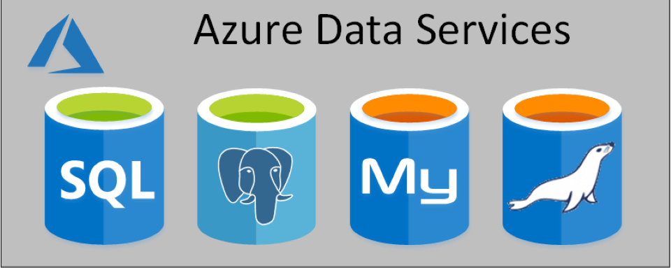
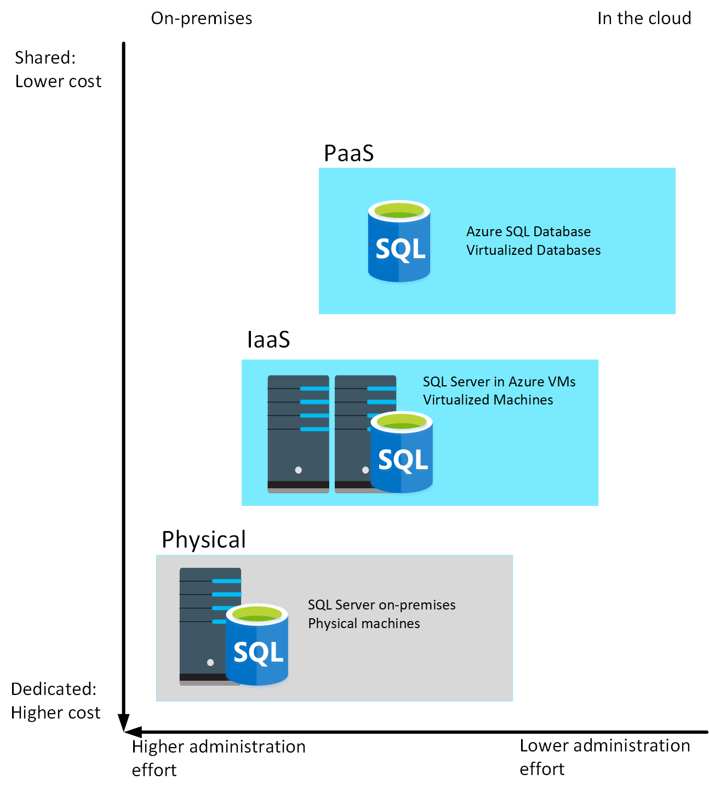

Azure offers a range of options for running a database management system in the cloud. For example, you can migrate your on-premises systems to a collection of Azure virtual machines. This approach still requires that you manage your DBMS carefully. Alternatively, you can take advantage of the various Azure relational data services available. These data services manage the DBMS for you, leaving you free to concentrate on the data they contain and the applications that use them. 

## Understand IaaS, PaaS, and SaaS

Before delving into Azure Data Services, you need to understand some common terms used to describe the different ways in which you can host a database in Azure.

**IaaS** is an acronym for *Infrastructure-as-a-Service*. Azure enables you to create a virtual infrastructure in the cloud that mirrors the way an on-premises data center might work. You can create a set of virtual machines, connect them together using a virtual network, and add a range of virtual devices. You take responsibility for installing and configuring the software, such as the DBMS, on these virtual machines. In many ways, this approach is similar to the way in which you run your systems inside an organization, except that you don't have to concern yourself with buying or maintaining the hardware.

> [!NOTE]
> An Azure Virtual Network is a representation of your own network in the cloud. A virtual network enables you to connect virtual machines and Azure services together, in much the same way that you might use a physical network on-premises. Azure ensures that each virtual network is isolated from other virtual networks created by other users, and from the Internet. Azure enables you to specify which machines (real and virtual), and services, are allowed to access resources on the virtual network, and which ports they can use.

**PaaS** stands for *Platform-as-a-service*. Rather than creating a virtual infrastructure, and installing and managing the database software yourself, a PaaS solution does this for you. You specify the resources that you require (based on how large you think your databases will be, the number of users, and the performance you require), and Azure automatically creates the necessary virtual machines, networks, and other devices for you. You can usually scale up or down (increase or decrease the size and number of resources) quickly, as the volume of data and the amount of work being done varies; Azure handles this scaling for you, and you don't have to manually add or remove virtual machines, or perform any other form of configuration.

**SaaS** is short for *Software-as-a-Service*. SaaS services are typically specific software packages that are installed and run on virtual hardware in the cloud. SaaS packages are typically hosted applications rather than more generalized software such as a DBMS. Common SaaS packages available on Azure include Microsoft 365 (formerly Office 365).

|      | Example               | Includes                                                                        |
|------|-----------------------|---------------------------------------------------------------------------------|
| IaaS | Azure virtual network | Servers, storage, networking, and physical data center.                         |
| PaaS | Azure SQL Databases   | IaaS plus database management (or other server systems), and operating systems. |
| SaaS | Office 365            | PaaS plus apps.                                                                 |

:::image type="content" source="../media/2-saas-paas-iaas.png" alt-text="IaaS, PaaS, and Saas":::

## What are Azure Data Services?

Azure Data Services fall into the PaaS category. These services are a series of DBMSs managed by Microsoft in the cloud. Each data service takes care of the configuration, day-to-day management, software updates, and security of the databases that it hosts. All you do is create your databases under the control of the data service. 

Azure Data Services are available for several common relational database management systems. The most well-known service is Azure SQL Database. The others currently available are Azure Database for MySQL servers, Azure Database for MariaDB servers, and Azure Database for PostgreSQL servers. The remaining units in this module describe the features provided by these services.

> [!NOTE]
> Microsoft also provides data services for non-relational database management systems, such as Cosmos DB.

Using Azure Data Services reduces the amount of time that you need to invest to administer a DBMS. However, these services can also limit the range of custom administration tasks that you can perform, because manually performing some tasks might risk compromising the way in which the service runs. For example, some DBMSs enable you to install custom software into a database, or run scripts as part of a database operation. This software might not be supported by the data service, and allowing an application to run a script from a database could affect the security of the service. You must be prepared to work with these restrictions in mind.

Apart from reducing the administrative workload, Azure Data Services ensure that your databases are available for at least 99.99% of the time.

There are costs associated with running a database in Azure Data Services. The base price of each service covers underlying infrastructure and licensing, together with the administration charges. Additionally, these services are designed to be *always on*. This means that you can't shut down a database and restart it later. 

Not all features of a database management system are available in Azure Data Services. This is because Azure Data Services takes on the task of managing the system and keeping it running using hardware situated in an Azure datacenter. Exposing some administrative functions might make the underlying platform vulnerable to misuse, and even open up some security concerns. Therefore, you have no direct control over the platform on which the services run. If you need more control than Azure Data Services allow, you can install your database management system on a virtual machine that runs in Azure. The next unit examines this approach in more detail for SQL Server, although the same issues apply for the other database management systems supported by Azure Data Services.

The image below highlights the different ways in which you could run a DBMS such as SQL Server, starting with an on-premises system in the bottom left-hand corner, to PaaS in the upper right. The diagram illustrates the benefits of moving to the PaaS approach.

