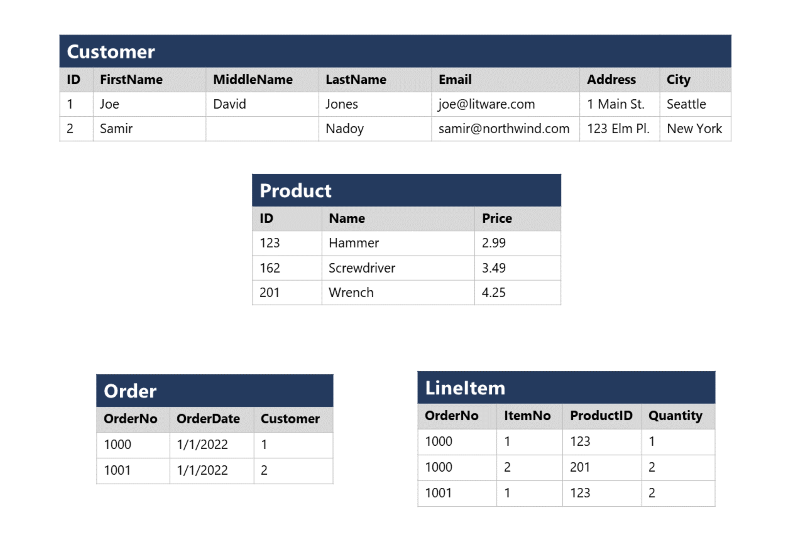

In a relational database, you model collections of entities from the real world as *tables*. An entity can be anything for which you want to record information; typically important objects and events. For example, in a retail system example, you might create tables for customers, products, orders, and line items within an order. A table contains rows, and each row represents a single instance of an entity. In the retail scenario, each row in the customer table contains the data for a single customer, each row in the product table defines a single product, each row in the order table represents an order made by a customer, and each row in the line item table represents a product that was included in an order.

> [!div class="mx-imgBorder"]
> 

Relational tables are a format for structured data, and each row in a table has the same columns; though in some cases, not all columns need to have a value – for example, a customer table might include a **MiddleName** column; which can be empty (or *NULL*) for rows that represent customers with no middle name or whose middle name is unknown.

Each column stores data of a specific datatype. For example, an **Email** column in a **Customer** table would likely be defined to store character-based (text) data (which might be fixed or variable in length), a **Price** column in a **Product** table might be defined to store decimal numeric data, while a **Quantity** column in an **Order** table might be constrained to integer numeric values; and an **OrderDate** column in the same **Order** table would be defined to store date/time values. The available datatypes that you can use when defining a table depend on the database system you are using; though there are standard datatypes defined by the American National Standards Institute (ANSI) that are supported by most database systems.
