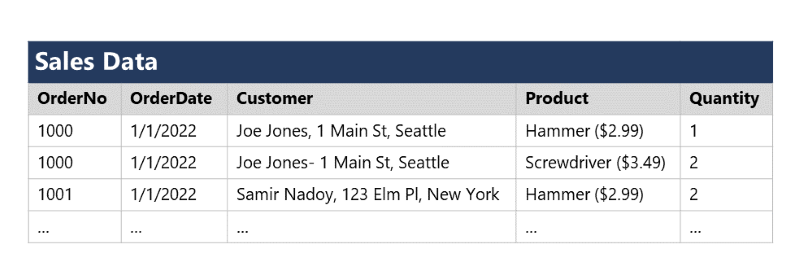
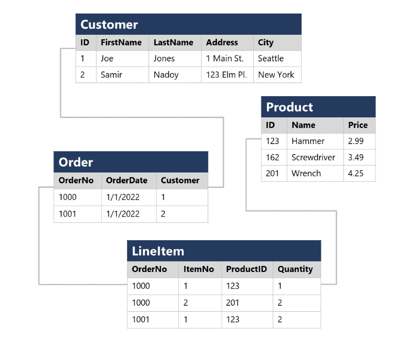

Normalization is a term used by database professionals for a schema design process that minimizes data duplication and enforces data integrity.

While there are many complex rules that define the process of refactoring data into various levels (or *forms*) of normalization, a simple definition for practical purposes is:

1. Separate each *entity* into its own table.
2. Separate each discrete *attribute* into its own column.
3. Uniquely identify each entity instance (row) using a *primary key*.
4. Use *foreign key* columns to link related entities.

To understand the core principles of normalization, suppose the following table represents a spreadsheet that a company uses to track its sales.

> [!div class="mx-imgBorder"]
> 

Notice that the customer and product details are duplicated for each individual item sold; and that the customer name and postal address, and the product name and price are combined in the same spreadsheet cells.

Now let's look at how normalization changes the way the data is stored.

> [!div class="mx-imgBorder"]
> 

Each entity that is represented in the data (customer, product, sales order, and line item) is stored in its own table, and each discrete attribute of those entities is in its own column.

Recording each instance of an entity as a row in an entity-specific table removes duplication of data. For example, to change a customer's address, you need only modify the value in a single row.

The decomposition of attributes into individual columns ensures that each value is constrained to an appropriate data type - for example, product prices must be decimal values, while line item quantities must be integer numbers. Additionally, the creation of individual columns provides a useful level of granularity in the data for querying - for example, you can easily filter customers to those who live in a specific city.

Instances of each entity are uniquely identified by an ID or other key value, known as a *primary key*; and when one entity references another (for example, an order has an associated customer), the primary key of the related entity is stored as a *foreign key*. You can look up the address of the customer (which is stored only once) for each record in the **Order** table by referencing the corresponding record in the **Customer** table. Typically, a relational database management system (RDBMS) can enforce referential integrity to ensure that a value entered into a foreign key field has an existing corresponding primary key in the related table – for example, preventing orders for non-existent customers.

In some cases, a key (primary or foreign) can be defined as a *composite* key based on a unique combination of multiple columns. For example, the **LineItem** table in the example above uses a unique combination of **OrderNo** and **ItemNo** to identify a line item from an individual order.
